# Survey completion

There are 92 total responses in the survey dataset. Of these, 46 finished the survey (50%). 

Across all 92 respondents, 77 provided consent (83.7%), including 100% of those who completed the survey.

Survey start dates ranged from 2024-05-20 to 2024-08-06. 

**Figure: Survey accrual**

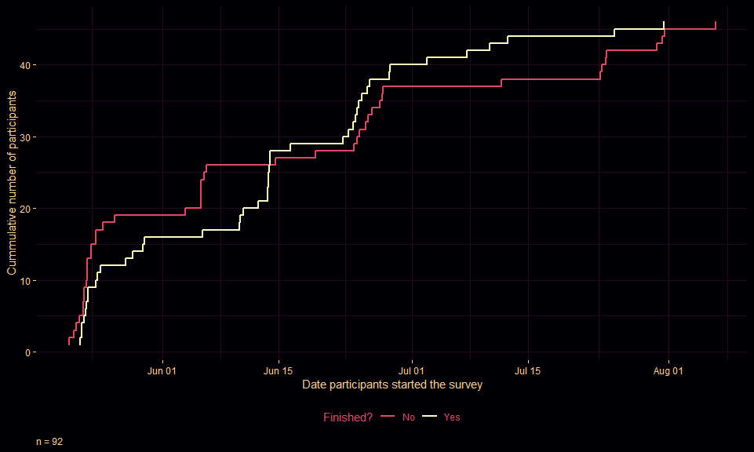<!-- -->
<br>
<br>

Survey accrual was similar for those who did vs didn't finish the survey. 

**Figure: Survey progress for those that didn't finish the survey**

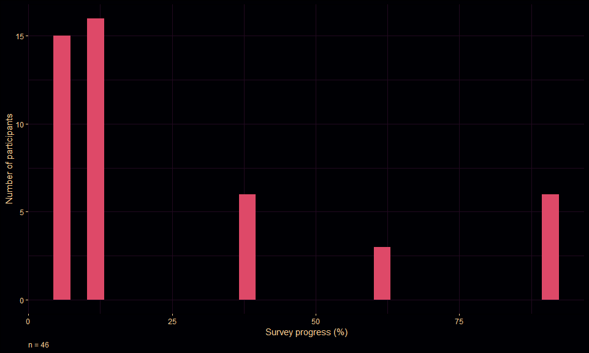<!-- -->
<br>
<br>

**Figure: Minutes spent on the survey for those that finished**

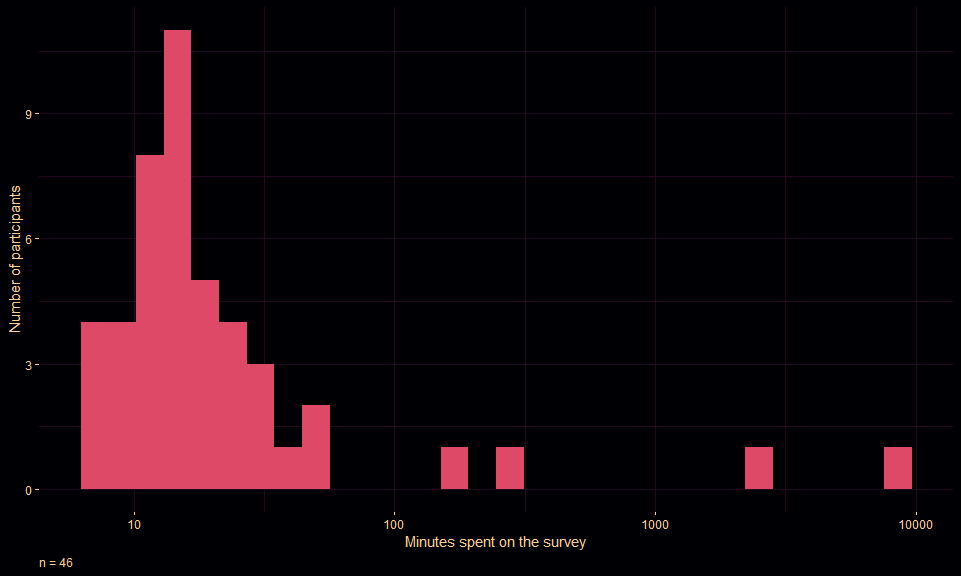<!-- -->
<br>
<br>

**Figure: Minutes spent on the survey for those that didn't finish**

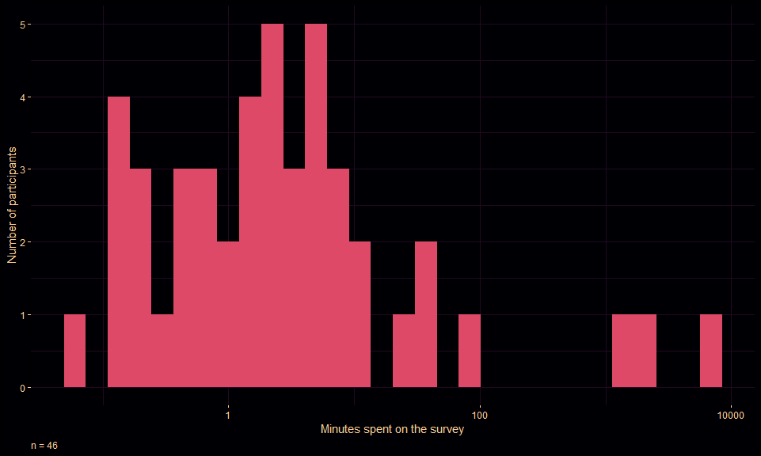<!-- -->
<br>
<br>

**Figure: Number of non-missing values across all survey variables for finishers**

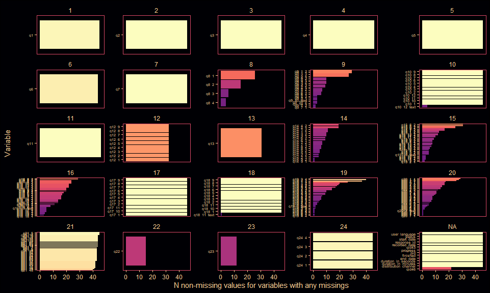<!-- -->
<br>
<br>

**Figure: Number of non-missing values across all survey variables for non-finishers**

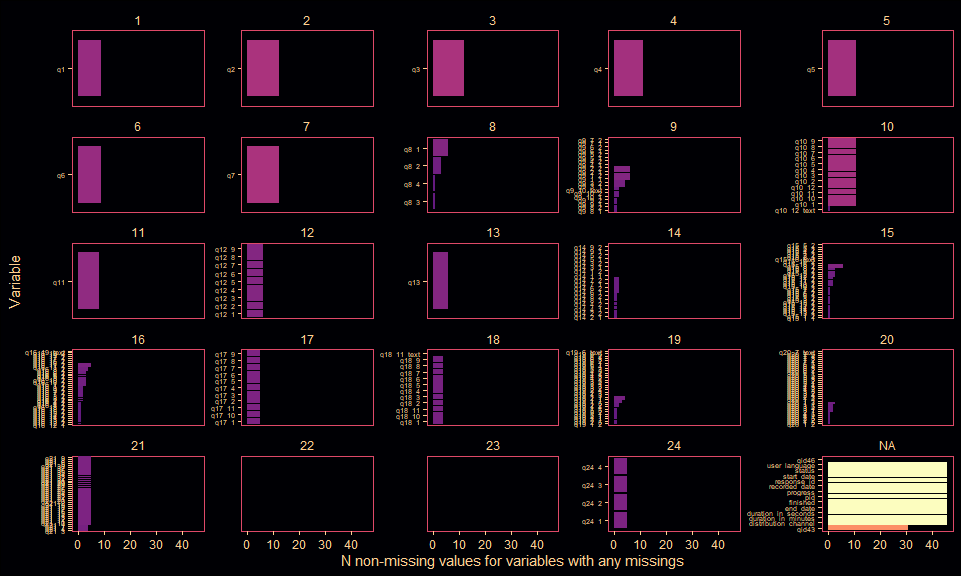<!-- -->
<br>
<br>

Finishers vs non-finishers on Q1-Q7


```{=html}
<div id="ghtjzgwwfk" style="padding-left:0px;padding-right:0px;padding-top:10px;padding-bottom:10px;overflow-x:auto;overflow-y:auto;width:auto;height:auto;">
<style>#ghtjzgwwfk table {
  font-family: system-ui, 'Segoe UI', Roboto, Helvetica, Arial, sans-serif, 'Apple Color Emoji', 'Segoe UI Emoji', 'Segoe UI Symbol', 'Noto Color Emoji';
  -webkit-font-smoothing: antialiased;
  -moz-osx-font-smoothing: grayscale;
}

#ghtjzgwwfk thead, #ghtjzgwwfk tbody, #ghtjzgwwfk tfoot, #ghtjzgwwfk tr, #ghtjzgwwfk td, #ghtjzgwwfk th {
  border-style: none;
}

#ghtjzgwwfk p {
  margin: 0;
  padding: 0;
}

#ghtjzgwwfk .gt_table {
  display: table;
  border-collapse: collapse;
  line-height: normal;
  margin-left: auto;
  margin-right: auto;
  color: #333333;
  font-size: 16px;
  font-weight: normal;
  font-style: normal;
  background-color: #FFFFFF;
  width: auto;
  border-top-style: solid;
  border-top-width: 2px;
  border-top-color: #A8A8A8;
  border-right-style: none;
  border-right-width: 2px;
  border-right-color: #D3D3D3;
  border-bottom-style: solid;
  border-bottom-width: 2px;
  border-bottom-color: #A8A8A8;
  border-left-style: none;
  border-left-width: 2px;
  border-left-color: #D3D3D3;
}

#ghtjzgwwfk .gt_caption {
  padding-top: 4px;
  padding-bottom: 4px;
}

#ghtjzgwwfk .gt_title {
  color: #333333;
  font-size: 125%;
  font-weight: initial;
  padding-top: 4px;
  padding-bottom: 4px;
  padding-left: 5px;
  padding-right: 5px;
  border-bottom-color: #FFFFFF;
  border-bottom-width: 0;
}

#ghtjzgwwfk .gt_subtitle {
  color: #333333;
  font-size: 85%;
  font-weight: initial;
  padding-top: 3px;
  padding-bottom: 5px;
  padding-left: 5px;
  padding-right: 5px;
  border-top-color: #FFFFFF;
  border-top-width: 0;
}

#ghtjzgwwfk .gt_heading {
  background-color: #FFFFFF;
  text-align: center;
  border-bottom-color: #FFFFFF;
  border-left-style: none;
  border-left-width: 1px;
  border-left-color: #D3D3D3;
  border-right-style: none;
  border-right-width: 1px;
  border-right-color: #D3D3D3;
}

#ghtjzgwwfk .gt_bottom_border {
  border-bottom-style: solid;
  border-bottom-width: 2px;
  border-bottom-color: #D3D3D3;
}

#ghtjzgwwfk .gt_col_headings {
  border-top-style: solid;
  border-top-width: 2px;
  border-top-color: #D3D3D3;
  border-bottom-style: solid;
  border-bottom-width: 2px;
  border-bottom-color: #D3D3D3;
  border-left-style: none;
  border-left-width: 1px;
  border-left-color: #D3D3D3;
  border-right-style: none;
  border-right-width: 1px;
  border-right-color: #D3D3D3;
}

#ghtjzgwwfk .gt_col_heading {
  color: #333333;
  background-color: #FFFFFF;
  font-size: 100%;
  font-weight: normal;
  text-transform: inherit;
  border-left-style: none;
  border-left-width: 1px;
  border-left-color: #D3D3D3;
  border-right-style: none;
  border-right-width: 1px;
  border-right-color: #D3D3D3;
  vertical-align: bottom;
  padding-top: 5px;
  padding-bottom: 6px;
  padding-left: 5px;
  padding-right: 5px;
  overflow-x: hidden;
}

#ghtjzgwwfk .gt_column_spanner_outer {
  color: #333333;
  background-color: #FFFFFF;
  font-size: 100%;
  font-weight: normal;
  text-transform: inherit;
  padding-top: 0;
  padding-bottom: 0;
  padding-left: 4px;
  padding-right: 4px;
}

#ghtjzgwwfk .gt_column_spanner_outer:first-child {
  padding-left: 0;
}

#ghtjzgwwfk .gt_column_spanner_outer:last-child {
  padding-right: 0;
}

#ghtjzgwwfk .gt_column_spanner {
  border-bottom-style: solid;
  border-bottom-width: 2px;
  border-bottom-color: #D3D3D3;
  vertical-align: bottom;
  padding-top: 5px;
  padding-bottom: 5px;
  overflow-x: hidden;
  display: inline-block;
  width: 100%;
}

#ghtjzgwwfk .gt_spanner_row {
  border-bottom-style: hidden;
}

#ghtjzgwwfk .gt_group_heading {
  padding-top: 8px;
  padding-bottom: 8px;
  padding-left: 5px;
  padding-right: 5px;
  color: #333333;
  background-color: #FFFFFF;
  font-size: 100%;
  font-weight: initial;
  text-transform: inherit;
  border-top-style: solid;
  border-top-width: 2px;
  border-top-color: #D3D3D3;
  border-bottom-style: solid;
  border-bottom-width: 2px;
  border-bottom-color: #D3D3D3;
  border-left-style: none;
  border-left-width: 1px;
  border-left-color: #D3D3D3;
  border-right-style: none;
  border-right-width: 1px;
  border-right-color: #D3D3D3;
  vertical-align: middle;
  text-align: left;
}

#ghtjzgwwfk .gt_empty_group_heading {
  padding: 0.5px;
  color: #333333;
  background-color: #FFFFFF;
  font-size: 100%;
  font-weight: initial;
  border-top-style: solid;
  border-top-width: 2px;
  border-top-color: #D3D3D3;
  border-bottom-style: solid;
  border-bottom-width: 2px;
  border-bottom-color: #D3D3D3;
  vertical-align: middle;
}

#ghtjzgwwfk .gt_from_md > :first-child {
  margin-top: 0;
}

#ghtjzgwwfk .gt_from_md > :last-child {
  margin-bottom: 0;
}

#ghtjzgwwfk .gt_row {
  padding-top: 8px;
  padding-bottom: 8px;
  padding-left: 5px;
  padding-right: 5px;
  margin: 10px;
  border-top-style: solid;
  border-top-width: 1px;
  border-top-color: #D3D3D3;
  border-left-style: none;
  border-left-width: 1px;
  border-left-color: #D3D3D3;
  border-right-style: none;
  border-right-width: 1px;
  border-right-color: #D3D3D3;
  vertical-align: middle;
  overflow-x: hidden;
}

#ghtjzgwwfk .gt_stub {
  color: #333333;
  background-color: #FFFFFF;
  font-size: 100%;
  font-weight: initial;
  text-transform: inherit;
  border-right-style: solid;
  border-right-width: 2px;
  border-right-color: #D3D3D3;
  padding-left: 5px;
  padding-right: 5px;
}

#ghtjzgwwfk .gt_stub_row_group {
  color: #333333;
  background-color: #FFFFFF;
  font-size: 100%;
  font-weight: initial;
  text-transform: inherit;
  border-right-style: solid;
  border-right-width: 2px;
  border-right-color: #D3D3D3;
  padding-left: 5px;
  padding-right: 5px;
  vertical-align: top;
}

#ghtjzgwwfk .gt_row_group_first td {
  border-top-width: 2px;
}

#ghtjzgwwfk .gt_row_group_first th {
  border-top-width: 2px;
}

#ghtjzgwwfk .gt_summary_row {
  color: #333333;
  background-color: #FFFFFF;
  text-transform: inherit;
  padding-top: 8px;
  padding-bottom: 8px;
  padding-left: 5px;
  padding-right: 5px;
}

#ghtjzgwwfk .gt_first_summary_row {
  border-top-style: solid;
  border-top-color: #D3D3D3;
}

#ghtjzgwwfk .gt_first_summary_row.thick {
  border-top-width: 2px;
}

#ghtjzgwwfk .gt_last_summary_row {
  padding-top: 8px;
  padding-bottom: 8px;
  padding-left: 5px;
  padding-right: 5px;
  border-bottom-style: solid;
  border-bottom-width: 2px;
  border-bottom-color: #D3D3D3;
}

#ghtjzgwwfk .gt_grand_summary_row {
  color: #333333;
  background-color: #FFFFFF;
  text-transform: inherit;
  padding-top: 8px;
  padding-bottom: 8px;
  padding-left: 5px;
  padding-right: 5px;
}

#ghtjzgwwfk .gt_first_grand_summary_row {
  padding-top: 8px;
  padding-bottom: 8px;
  padding-left: 5px;
  padding-right: 5px;
  border-top-style: double;
  border-top-width: 6px;
  border-top-color: #D3D3D3;
}

#ghtjzgwwfk .gt_last_grand_summary_row_top {
  padding-top: 8px;
  padding-bottom: 8px;
  padding-left: 5px;
  padding-right: 5px;
  border-bottom-style: double;
  border-bottom-width: 6px;
  border-bottom-color: #D3D3D3;
}

#ghtjzgwwfk .gt_striped {
  background-color: rgba(128, 128, 128, 0.05);
}

#ghtjzgwwfk .gt_table_body {
  border-top-style: solid;
  border-top-width: 2px;
  border-top-color: #D3D3D3;
  border-bottom-style: solid;
  border-bottom-width: 2px;
  border-bottom-color: #D3D3D3;
}

#ghtjzgwwfk .gt_footnotes {
  color: #333333;
  background-color: #FFFFFF;
  border-bottom-style: none;
  border-bottom-width: 2px;
  border-bottom-color: #D3D3D3;
  border-left-style: none;
  border-left-width: 2px;
  border-left-color: #D3D3D3;
  border-right-style: none;
  border-right-width: 2px;
  border-right-color: #D3D3D3;
}

#ghtjzgwwfk .gt_footnote {
  margin: 0px;
  font-size: 90%;
  padding-top: 4px;
  padding-bottom: 4px;
  padding-left: 5px;
  padding-right: 5px;
}

#ghtjzgwwfk .gt_sourcenotes {
  color: #333333;
  background-color: #FFFFFF;
  border-bottom-style: none;
  border-bottom-width: 2px;
  border-bottom-color: #D3D3D3;
  border-left-style: none;
  border-left-width: 2px;
  border-left-color: #D3D3D3;
  border-right-style: none;
  border-right-width: 2px;
  border-right-color: #D3D3D3;
}

#ghtjzgwwfk .gt_sourcenote {
  font-size: 90%;
  padding-top: 4px;
  padding-bottom: 4px;
  padding-left: 5px;
  padding-right: 5px;
}

#ghtjzgwwfk .gt_left {
  text-align: left;
}

#ghtjzgwwfk .gt_center {
  text-align: center;
}

#ghtjzgwwfk .gt_right {
  text-align: right;
  font-variant-numeric: tabular-nums;
}

#ghtjzgwwfk .gt_font_normal {
  font-weight: normal;
}

#ghtjzgwwfk .gt_font_bold {
  font-weight: bold;
}

#ghtjzgwwfk .gt_font_italic {
  font-style: italic;
}

#ghtjzgwwfk .gt_super {
  font-size: 65%;
}

#ghtjzgwwfk .gt_footnote_marks {
  font-size: 75%;
  vertical-align: 0.4em;
  position: initial;
}

#ghtjzgwwfk .gt_asterisk {
  font-size: 100%;
  vertical-align: 0;
}

#ghtjzgwwfk .gt_indent_1 {
  text-indent: 5px;
}

#ghtjzgwwfk .gt_indent_2 {
  text-indent: 10px;
}

#ghtjzgwwfk .gt_indent_3 {
  text-indent: 15px;
}

#ghtjzgwwfk .gt_indent_4 {
  text-indent: 20px;
}

#ghtjzgwwfk .gt_indent_5 {
  text-indent: 25px;
}

#ghtjzgwwfk .katex-display {
  display: inline-flex !important;
  margin-bottom: 0.75em !important;
}

#ghtjzgwwfk div.Reactable > div.rt-table > div.rt-thead > div.rt-tr.rt-tr-group-header > div.rt-th-group:after {
  height: 0px !important;
}
</style>
<table class="gt_table" data-quarto-disable-processing="false" data-quarto-bootstrap="false">
  <thead>
    <tr class="gt_col_headings gt_spanner_row">
      <th class="gt_col_heading gt_columns_bottom_border gt_left" rowspan="2" colspan="1" scope="col" id="label"><span class='gt_from_md'><strong>Characteristic</strong></span></th>
      <th class="gt_center gt_columns_top_border gt_column_spanner_outer" rowspan="1" colspan="2" scope="colgroup" id="**Finished survey?**">
        <div class="gt_column_spanner"><span class='gt_from_md'><strong>Finished survey?</strong></span></div>
      </th>
      <th class="gt_col_heading gt_columns_bottom_border gt_center" rowspan="2" colspan="1" scope="col" id="p.value"><span class='gt_from_md'><strong>p-value</strong></span><span class="gt_footnote_marks" style="white-space:nowrap;font-style:italic;font-weight:normal;line-height:0;"><sup>2</sup></span></th>
    </tr>
    <tr class="gt_col_headings">
      <th class="gt_col_heading gt_columns_bottom_border gt_center" rowspan="1" colspan="1" scope="col" id="stat_1"><span class='gt_from_md'><strong>No</strong><br />
N = 46</span><span class="gt_footnote_marks" style="white-space:nowrap;font-style:italic;font-weight:normal;line-height:0;"><sup>1</sup></span></th>
      <th class="gt_col_heading gt_columns_bottom_border gt_center" rowspan="1" colspan="1" scope="col" id="stat_2"><span class='gt_from_md'><strong>Yes</strong><br />
N = 46</span><span class="gt_footnote_marks" style="white-space:nowrap;font-style:italic;font-weight:normal;line-height:0;"><sup>1</sup></span></th>
    </tr>
  </thead>
  <tbody class="gt_table_body">
    <tr><td headers="label" class="gt_row gt_left">What is your current career stage?</td>
<td headers="stat_1" class="gt_row gt_center"><br /></td>
<td headers="stat_2" class="gt_row gt_center"><br /></td>
<td headers="p.value" class="gt_row gt_center">0.2</td></tr>
    <tr><td headers="label" class="gt_row gt_left">    Undergraduate/ Masters student</td>
<td headers="stat_1" class="gt_row gt_center">0/12 (0%)</td>
<td headers="stat_2" class="gt_row gt_center">1/46 (2.2%)</td>
<td headers="p.value" class="gt_row gt_center"><br /></td></tr>
    <tr><td headers="label" class="gt_row gt_left">    Doctoral student</td>
<td headers="stat_1" class="gt_row gt_center">0/12 (0%)</td>
<td headers="stat_2" class="gt_row gt_center">3/46 (6.5%)</td>
<td headers="p.value" class="gt_row gt_center"><br /></td></tr>
    <tr><td headers="label" class="gt_row gt_left">    Early-career researcher (&lt; 7 years post PhD)</td>
<td headers="stat_1" class="gt_row gt_center">0/12 (0%)</td>
<td headers="stat_2" class="gt_row gt_center">8/46 (17%)</td>
<td headers="p.value" class="gt_row gt_center"><br /></td></tr>
    <tr><td headers="label" class="gt_row gt_left">    Mid-career researcher (7-12 years post PhD)</td>
<td headers="stat_1" class="gt_row gt_center">4/12 (33%)</td>
<td headers="stat_2" class="gt_row gt_center">6/46 (13%)</td>
<td headers="p.value" class="gt_row gt_center"><br /></td></tr>
    <tr><td headers="label" class="gt_row gt_left">    Senior-career researcher (&gt;12 years post PhD)</td>
<td headers="stat_1" class="gt_row gt_center">8/12 (67%)</td>
<td headers="stat_2" class="gt_row gt_center">28/46 (61%)</td>
<td headers="p.value" class="gt_row gt_center"><br /></td></tr>
    <tr><td headers="label" class="gt_row gt_left">    Missing values</td>
<td headers="stat_1" class="gt_row gt_center">34</td>
<td headers="stat_2" class="gt_row gt_center">0</td>
<td headers="p.value" class="gt_row gt_center"><br /></td></tr>
    <tr><td headers="label" class="gt_row gt_left">How many years of research experience do you have in childhood obesity prevention trials?\n\n(please enter numeric values only)</td>
<td headers="stat_1" class="gt_row gt_center">10 (7, 15)</td>
<td headers="stat_2" class="gt_row gt_center">10 (5, 20)</td>
<td headers="p.value" class="gt_row gt_center">>0.9</td></tr>
    <tr><td headers="label" class="gt_row gt_left">    Missing values</td>
<td headers="stat_1" class="gt_row gt_center">34</td>
<td headers="stat_2" class="gt_row gt_center">0</td>
<td headers="p.value" class="gt_row gt_center"><br /></td></tr>
    <tr><td headers="label" class="gt_row gt_left">Have you undertaken training in trial methods?</td>
<td headers="stat_1" class="gt_row gt_center"><br /></td>
<td headers="stat_2" class="gt_row gt_center"><br /></td>
<td headers="p.value" class="gt_row gt_center">0.6</td></tr>
    <tr><td headers="label" class="gt_row gt_left">    No</td>
<td headers="stat_1" class="gt_row gt_center">1/11 (9.1%)</td>
<td headers="stat_2" class="gt_row gt_center">10/46 (22%)</td>
<td headers="p.value" class="gt_row gt_center"><br /></td></tr>
    <tr><td headers="label" class="gt_row gt_left">    Yes</td>
<td headers="stat_1" class="gt_row gt_center">10/11 (91%)</td>
<td headers="stat_2" class="gt_row gt_center">36/46 (78%)</td>
<td headers="p.value" class="gt_row gt_center"><br /></td></tr>
    <tr><td headers="label" class="gt_row gt_left">    Missing values</td>
<td headers="stat_1" class="gt_row gt_center">35</td>
<td headers="stat_2" class="gt_row gt_center">0</td>
<td headers="p.value" class="gt_row gt_center"><br /></td></tr>
    <tr><td headers="label" class="gt_row gt_left">How many trials of interventions to prevent obesity, and/or to improve child health behaviours related to childhood obesity, in children from 0 to 5 years old have you been involved in to date?</td>
<td headers="stat_1" class="gt_row gt_center"><br /></td>
<td headers="stat_2" class="gt_row gt_center"><br /></td>
<td headers="p.value" class="gt_row gt_center">0.2</td></tr>
    <tr><td headers="label" class="gt_row gt_left">    0</td>
<td headers="stat_1" class="gt_row gt_center">2/11 (18%)</td>
<td headers="stat_2" class="gt_row gt_center">1/46 (2.2%)</td>
<td headers="p.value" class="gt_row gt_center"><br /></td></tr>
    <tr><td headers="label" class="gt_row gt_left">    1</td>
<td headers="stat_1" class="gt_row gt_center">2/11 (18%)</td>
<td headers="stat_2" class="gt_row gt_center">11/46 (24%)</td>
<td headers="p.value" class="gt_row gt_center"><br /></td></tr>
    <tr><td headers="label" class="gt_row gt_left">    2</td>
<td headers="stat_1" class="gt_row gt_center">2/11 (18%)</td>
<td headers="stat_2" class="gt_row gt_center">11/46 (24%)</td>
<td headers="p.value" class="gt_row gt_center"><br /></td></tr>
    <tr><td headers="label" class="gt_row gt_left">    3</td>
<td headers="stat_1" class="gt_row gt_center">1/11 (9.1%)</td>
<td headers="stat_2" class="gt_row gt_center">10/46 (22%)</td>
<td headers="p.value" class="gt_row gt_center"><br /></td></tr>
    <tr><td headers="label" class="gt_row gt_left">    4</td>
<td headers="stat_1" class="gt_row gt_center">3/11 (27%)</td>
<td headers="stat_2" class="gt_row gt_center">2/46 (4.3%)</td>
<td headers="p.value" class="gt_row gt_center"><br /></td></tr>
    <tr><td headers="label" class="gt_row gt_left">    5</td>
<td headers="stat_1" class="gt_row gt_center">0/11 (0%)</td>
<td headers="stat_2" class="gt_row gt_center">4/46 (8.7%)</td>
<td headers="p.value" class="gt_row gt_center"><br /></td></tr>
    <tr><td headers="label" class="gt_row gt_left">    6</td>
<td headers="stat_1" class="gt_row gt_center">0/11 (0%)</td>
<td headers="stat_2" class="gt_row gt_center">2/46 (4.3%)</td>
<td headers="p.value" class="gt_row gt_center"><br /></td></tr>
    <tr><td headers="label" class="gt_row gt_left">    7</td>
<td headers="stat_1" class="gt_row gt_center">0/11 (0%)</td>
<td headers="stat_2" class="gt_row gt_center">1/46 (2.2%)</td>
<td headers="p.value" class="gt_row gt_center"><br /></td></tr>
    <tr><td headers="label" class="gt_row gt_left">    8</td>
<td headers="stat_1" class="gt_row gt_center">1/11 (9.1%)</td>
<td headers="stat_2" class="gt_row gt_center">2/46 (4.3%)</td>
<td headers="p.value" class="gt_row gt_center"><br /></td></tr>
    <tr><td headers="label" class="gt_row gt_left">    more than 10</td>
<td headers="stat_1" class="gt_row gt_center">0/11 (0%)</td>
<td headers="stat_2" class="gt_row gt_center">2/46 (4.3%)</td>
<td headers="p.value" class="gt_row gt_center"><br /></td></tr>
    <tr><td headers="label" class="gt_row gt_left">    Missing values</td>
<td headers="stat_1" class="gt_row gt_center">35</td>
<td headers="stat_2" class="gt_row gt_center">0</td>
<td headers="p.value" class="gt_row gt_center"><br /></td></tr>
    <tr><td headers="label" class="gt_row gt_left">Are you currently involved in a childhood obesity prevention trial/s?</td>
<td headers="stat_1" class="gt_row gt_center"><br /></td>
<td headers="stat_2" class="gt_row gt_center"><br /></td>
<td headers="p.value" class="gt_row gt_center">>0.9</td></tr>
    <tr><td headers="label" class="gt_row gt_left">    No</td>
<td headers="stat_1" class="gt_row gt_center">5/12 (42%)</td>
<td headers="stat_2" class="gt_row gt_center">20/46 (43%)</td>
<td headers="p.value" class="gt_row gt_center"><br /></td></tr>
    <tr><td headers="label" class="gt_row gt_left">    Yes, I am currently involved in 1 trial</td>
<td headers="stat_1" class="gt_row gt_center">4/12 (33%)</td>
<td headers="stat_2" class="gt_row gt_center">14/46 (30%)</td>
<td headers="p.value" class="gt_row gt_center"><br /></td></tr>
    <tr><td headers="label" class="gt_row gt_left">    Yes, I am currently involved in more than 1 trial</td>
<td headers="stat_1" class="gt_row gt_center">3/12 (25%)</td>
<td headers="stat_2" class="gt_row gt_center">12/46 (26%)</td>
<td headers="p.value" class="gt_row gt_center"><br /></td></tr>
    <tr><td headers="label" class="gt_row gt_left">    Missing values</td>
<td headers="stat_1" class="gt_row gt_center">34</td>
<td headers="stat_2" class="gt_row gt_center">0</td>
<td headers="p.value" class="gt_row gt_center"><br /></td></tr>
  </tbody>
  
  <tfoot class="gt_footnotes">
    <tr>
      <td class="gt_footnote" colspan="4"><span class="gt_footnote_marks" style="white-space:nowrap;font-style:italic;font-weight:normal;line-height:0;"><sup>1</sup></span> <span class='gt_from_md'>n/N Non-missing (%); Median (Q1, Q3)</span></td>
    </tr>
    <tr>
      <td class="gt_footnote" colspan="4"><span class="gt_footnote_marks" style="white-space:nowrap;font-style:italic;font-weight:normal;line-height:0;"><sup>2</sup></span> <span class='gt_from_md'>Pearson’s Chi-squared test; Wilcoxon rank sum test</span></td>
    </tr>
  </tfoot>
</table>
</div>
```

List of Countries
 
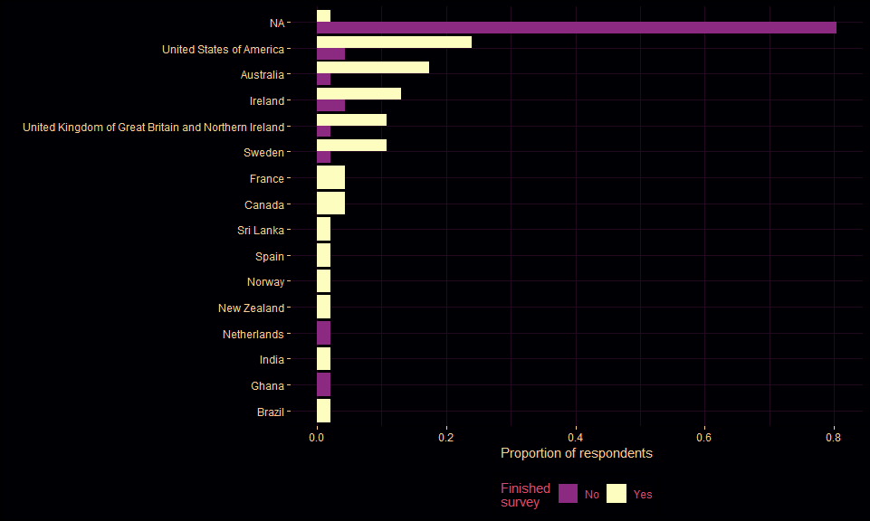<!-- -->


In what country/countries were the trials in which you are/were involved conducted?
 
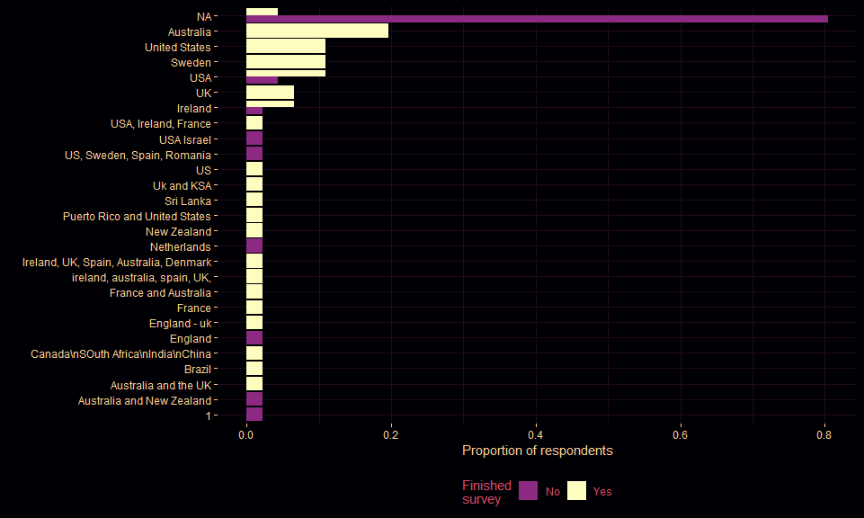<!-- -->

# Results

## (Q1-7) Repondent characteristics

From this point forward the dataset it limited to the 46 participants who completed the survey. 


#### Table: Respondent characteristics


```{=html}
<div id="jiosexojgh" style="padding-left:0px;padding-right:0px;padding-top:10px;padding-bottom:10px;overflow-x:auto;overflow-y:auto;width:auto;height:auto;">
<style>#jiosexojgh table {
  font-family: system-ui, 'Segoe UI', Roboto, Helvetica, Arial, sans-serif, 'Apple Color Emoji', 'Segoe UI Emoji', 'Segoe UI Symbol', 'Noto Color Emoji';
  -webkit-font-smoothing: antialiased;
  -moz-osx-font-smoothing: grayscale;
}

#jiosexojgh thead, #jiosexojgh tbody, #jiosexojgh tfoot, #jiosexojgh tr, #jiosexojgh td, #jiosexojgh th {
  border-style: none;
}

#jiosexojgh p {
  margin: 0;
  padding: 0;
}

#jiosexojgh .gt_table {
  display: table;
  border-collapse: collapse;
  line-height: normal;
  margin-left: auto;
  margin-right: auto;
  color: #333333;
  font-size: 16px;
  font-weight: normal;
  font-style: normal;
  background-color: #FFFFFF;
  width: auto;
  border-top-style: solid;
  border-top-width: 2px;
  border-top-color: #A8A8A8;
  border-right-style: none;
  border-right-width: 2px;
  border-right-color: #D3D3D3;
  border-bottom-style: solid;
  border-bottom-width: 2px;
  border-bottom-color: #A8A8A8;
  border-left-style: none;
  border-left-width: 2px;
  border-left-color: #D3D3D3;
}

#jiosexojgh .gt_caption {
  padding-top: 4px;
  padding-bottom: 4px;
}

#jiosexojgh .gt_title {
  color: #333333;
  font-size: 125%;
  font-weight: initial;
  padding-top: 4px;
  padding-bottom: 4px;
  padding-left: 5px;
  padding-right: 5px;
  border-bottom-color: #FFFFFF;
  border-bottom-width: 0;
}

#jiosexojgh .gt_subtitle {
  color: #333333;
  font-size: 85%;
  font-weight: initial;
  padding-top: 3px;
  padding-bottom: 5px;
  padding-left: 5px;
  padding-right: 5px;
  border-top-color: #FFFFFF;
  border-top-width: 0;
}

#jiosexojgh .gt_heading {
  background-color: #FFFFFF;
  text-align: center;
  border-bottom-color: #FFFFFF;
  border-left-style: none;
  border-left-width: 1px;
  border-left-color: #D3D3D3;
  border-right-style: none;
  border-right-width: 1px;
  border-right-color: #D3D3D3;
}

#jiosexojgh .gt_bottom_border {
  border-bottom-style: solid;
  border-bottom-width: 2px;
  border-bottom-color: #D3D3D3;
}

#jiosexojgh .gt_col_headings {
  border-top-style: solid;
  border-top-width: 2px;
  border-top-color: #D3D3D3;
  border-bottom-style: solid;
  border-bottom-width: 2px;
  border-bottom-color: #D3D3D3;
  border-left-style: none;
  border-left-width: 1px;
  border-left-color: #D3D3D3;
  border-right-style: none;
  border-right-width: 1px;
  border-right-color: #D3D3D3;
}

#jiosexojgh .gt_col_heading {
  color: #333333;
  background-color: #FFFFFF;
  font-size: 100%;
  font-weight: normal;
  text-transform: inherit;
  border-left-style: none;
  border-left-width: 1px;
  border-left-color: #D3D3D3;
  border-right-style: none;
  border-right-width: 1px;
  border-right-color: #D3D3D3;
  vertical-align: bottom;
  padding-top: 5px;
  padding-bottom: 6px;
  padding-left: 5px;
  padding-right: 5px;
  overflow-x: hidden;
}

#jiosexojgh .gt_column_spanner_outer {
  color: #333333;
  background-color: #FFFFFF;
  font-size: 100%;
  font-weight: normal;
  text-transform: inherit;
  padding-top: 0;
  padding-bottom: 0;
  padding-left: 4px;
  padding-right: 4px;
}

#jiosexojgh .gt_column_spanner_outer:first-child {
  padding-left: 0;
}

#jiosexojgh .gt_column_spanner_outer:last-child {
  padding-right: 0;
}

#jiosexojgh .gt_column_spanner {
  border-bottom-style: solid;
  border-bottom-width: 2px;
  border-bottom-color: #D3D3D3;
  vertical-align: bottom;
  padding-top: 5px;
  padding-bottom: 5px;
  overflow-x: hidden;
  display: inline-block;
  width: 100%;
}

#jiosexojgh .gt_spanner_row {
  border-bottom-style: hidden;
}

#jiosexojgh .gt_group_heading {
  padding-top: 8px;
  padding-bottom: 8px;
  padding-left: 5px;
  padding-right: 5px;
  color: #333333;
  background-color: #FFFFFF;
  font-size: 100%;
  font-weight: initial;
  text-transform: inherit;
  border-top-style: solid;
  border-top-width: 2px;
  border-top-color: #D3D3D3;
  border-bottom-style: solid;
  border-bottom-width: 2px;
  border-bottom-color: #D3D3D3;
  border-left-style: none;
  border-left-width: 1px;
  border-left-color: #D3D3D3;
  border-right-style: none;
  border-right-width: 1px;
  border-right-color: #D3D3D3;
  vertical-align: middle;
  text-align: left;
}

#jiosexojgh .gt_empty_group_heading {
  padding: 0.5px;
  color: #333333;
  background-color: #FFFFFF;
  font-size: 100%;
  font-weight: initial;
  border-top-style: solid;
  border-top-width: 2px;
  border-top-color: #D3D3D3;
  border-bottom-style: solid;
  border-bottom-width: 2px;
  border-bottom-color: #D3D3D3;
  vertical-align: middle;
}

#jiosexojgh .gt_from_md > :first-child {
  margin-top: 0;
}

#jiosexojgh .gt_from_md > :last-child {
  margin-bottom: 0;
}

#jiosexojgh .gt_row {
  padding-top: 8px;
  padding-bottom: 8px;
  padding-left: 5px;
  padding-right: 5px;
  margin: 10px;
  border-top-style: solid;
  border-top-width: 1px;
  border-top-color: #D3D3D3;
  border-left-style: none;
  border-left-width: 1px;
  border-left-color: #D3D3D3;
  border-right-style: none;
  border-right-width: 1px;
  border-right-color: #D3D3D3;
  vertical-align: middle;
  overflow-x: hidden;
}

#jiosexojgh .gt_stub {
  color: #333333;
  background-color: #FFFFFF;
  font-size: 100%;
  font-weight: initial;
  text-transform: inherit;
  border-right-style: solid;
  border-right-width: 2px;
  border-right-color: #D3D3D3;
  padding-left: 5px;
  padding-right: 5px;
}

#jiosexojgh .gt_stub_row_group {
  color: #333333;
  background-color: #FFFFFF;
  font-size: 100%;
  font-weight: initial;
  text-transform: inherit;
  border-right-style: solid;
  border-right-width: 2px;
  border-right-color: #D3D3D3;
  padding-left: 5px;
  padding-right: 5px;
  vertical-align: top;
}

#jiosexojgh .gt_row_group_first td {
  border-top-width: 2px;
}

#jiosexojgh .gt_row_group_first th {
  border-top-width: 2px;
}

#jiosexojgh .gt_summary_row {
  color: #333333;
  background-color: #FFFFFF;
  text-transform: inherit;
  padding-top: 8px;
  padding-bottom: 8px;
  padding-left: 5px;
  padding-right: 5px;
}

#jiosexojgh .gt_first_summary_row {
  border-top-style: solid;
  border-top-color: #D3D3D3;
}

#jiosexojgh .gt_first_summary_row.thick {
  border-top-width: 2px;
}

#jiosexojgh .gt_last_summary_row {
  padding-top: 8px;
  padding-bottom: 8px;
  padding-left: 5px;
  padding-right: 5px;
  border-bottom-style: solid;
  border-bottom-width: 2px;
  border-bottom-color: #D3D3D3;
}

#jiosexojgh .gt_grand_summary_row {
  color: #333333;
  background-color: #FFFFFF;
  text-transform: inherit;
  padding-top: 8px;
  padding-bottom: 8px;
  padding-left: 5px;
  padding-right: 5px;
}

#jiosexojgh .gt_first_grand_summary_row {
  padding-top: 8px;
  padding-bottom: 8px;
  padding-left: 5px;
  padding-right: 5px;
  border-top-style: double;
  border-top-width: 6px;
  border-top-color: #D3D3D3;
}

#jiosexojgh .gt_last_grand_summary_row_top {
  padding-top: 8px;
  padding-bottom: 8px;
  padding-left: 5px;
  padding-right: 5px;
  border-bottom-style: double;
  border-bottom-width: 6px;
  border-bottom-color: #D3D3D3;
}

#jiosexojgh .gt_striped {
  background-color: rgba(128, 128, 128, 0.05);
}

#jiosexojgh .gt_table_body {
  border-top-style: solid;
  border-top-width: 2px;
  border-top-color: #D3D3D3;
  border-bottom-style: solid;
  border-bottom-width: 2px;
  border-bottom-color: #D3D3D3;
}

#jiosexojgh .gt_footnotes {
  color: #333333;
  background-color: #FFFFFF;
  border-bottom-style: none;
  border-bottom-width: 2px;
  border-bottom-color: #D3D3D3;
  border-left-style: none;
  border-left-width: 2px;
  border-left-color: #D3D3D3;
  border-right-style: none;
  border-right-width: 2px;
  border-right-color: #D3D3D3;
}

#jiosexojgh .gt_footnote {
  margin: 0px;
  font-size: 90%;
  padding-top: 4px;
  padding-bottom: 4px;
  padding-left: 5px;
  padding-right: 5px;
}

#jiosexojgh .gt_sourcenotes {
  color: #333333;
  background-color: #FFFFFF;
  border-bottom-style: none;
  border-bottom-width: 2px;
  border-bottom-color: #D3D3D3;
  border-left-style: none;
  border-left-width: 2px;
  border-left-color: #D3D3D3;
  border-right-style: none;
  border-right-width: 2px;
  border-right-color: #D3D3D3;
}

#jiosexojgh .gt_sourcenote {
  font-size: 90%;
  padding-top: 4px;
  padding-bottom: 4px;
  padding-left: 5px;
  padding-right: 5px;
}

#jiosexojgh .gt_left {
  text-align: left;
}

#jiosexojgh .gt_center {
  text-align: center;
}

#jiosexojgh .gt_right {
  text-align: right;
  font-variant-numeric: tabular-nums;
}

#jiosexojgh .gt_font_normal {
  font-weight: normal;
}

#jiosexojgh .gt_font_bold {
  font-weight: bold;
}

#jiosexojgh .gt_font_italic {
  font-style: italic;
}

#jiosexojgh .gt_super {
  font-size: 65%;
}

#jiosexojgh .gt_footnote_marks {
  font-size: 75%;
  vertical-align: 0.4em;
  position: initial;
}

#jiosexojgh .gt_asterisk {
  font-size: 100%;
  vertical-align: 0;
}

#jiosexojgh .gt_indent_1 {
  text-indent: 5px;
}

#jiosexojgh .gt_indent_2 {
  text-indent: 10px;
}

#jiosexojgh .gt_indent_3 {
  text-indent: 15px;
}

#jiosexojgh .gt_indent_4 {
  text-indent: 20px;
}

#jiosexojgh .gt_indent_5 {
  text-indent: 25px;
}

#jiosexojgh .katex-display {
  display: inline-flex !important;
  margin-bottom: 0.75em !important;
}

#jiosexojgh div.Reactable > div.rt-table > div.rt-thead > div.rt-tr.rt-tr-group-header > div.rt-th-group:after {
  height: 0px !important;
}
</style>
<table class="gt_table" data-quarto-disable-processing="false" data-quarto-bootstrap="false">
  <thead>
    <tr class="gt_col_headings">
      <th class="gt_col_heading gt_columns_bottom_border gt_left" rowspan="1" colspan="1" scope="col" id="label"><span class='gt_from_md'><strong>Characteristic</strong></span></th>
      <th class="gt_col_heading gt_columns_bottom_border gt_center" rowspan="1" colspan="1" scope="col" id="stat_0"><span class='gt_from_md'><strong>N = 46</strong></span><span class="gt_footnote_marks" style="white-space:nowrap;font-style:italic;font-weight:normal;line-height:0;"><sup>1</sup></span></th>
    </tr>
  </thead>
  <tbody class="gt_table_body">
    <tr><td headers="label" class="gt_row gt_left">What is your current career stage?</td>
<td headers="stat_0" class="gt_row gt_center"><br /></td></tr>
    <tr><td headers="label" class="gt_row gt_left">    Undergraduate/ Masters student</td>
<td headers="stat_0" class="gt_row gt_center">1/46 (2.2%)</td></tr>
    <tr><td headers="label" class="gt_row gt_left">    Doctoral student</td>
<td headers="stat_0" class="gt_row gt_center">3/46 (6.5%)</td></tr>
    <tr><td headers="label" class="gt_row gt_left">    Early-career researcher (&lt; 7 years post PhD)</td>
<td headers="stat_0" class="gt_row gt_center">8/46 (17%)</td></tr>
    <tr><td headers="label" class="gt_row gt_left">    Mid-career researcher (7-12 years post PhD)</td>
<td headers="stat_0" class="gt_row gt_center">6/46 (13%)</td></tr>
    <tr><td headers="label" class="gt_row gt_left">    Senior-career researcher (&gt;12 years post PhD)</td>
<td headers="stat_0" class="gt_row gt_center">28/46 (61%)</td></tr>
    <tr><td headers="label" class="gt_row gt_left">How many years of research experience do you have in childhood obesity prevention trials?\n\n(please enter numeric values only)</td>
<td headers="stat_0" class="gt_row gt_center">10 (5, 20)</td></tr>
    <tr><td headers="label" class="gt_row gt_left">Have you undertaken training in trial methods?</td>
<td headers="stat_0" class="gt_row gt_center"><br /></td></tr>
    <tr><td headers="label" class="gt_row gt_left">    No</td>
<td headers="stat_0" class="gt_row gt_center">10/46 (22%)</td></tr>
    <tr><td headers="label" class="gt_row gt_left">    Yes</td>
<td headers="stat_0" class="gt_row gt_center">36/46 (78%)</td></tr>
    <tr><td headers="label" class="gt_row gt_left">How many trials of interventions to prevent obesity, and/or to improve child health behaviours related to childhood obesity, in children from 0 to 5 years old have you been involved in to date?</td>
<td headers="stat_0" class="gt_row gt_center"><br /></td></tr>
    <tr><td headers="label" class="gt_row gt_left">    0</td>
<td headers="stat_0" class="gt_row gt_center">1/46 (2.2%)</td></tr>
    <tr><td headers="label" class="gt_row gt_left">    1</td>
<td headers="stat_0" class="gt_row gt_center">11/46 (24%)</td></tr>
    <tr><td headers="label" class="gt_row gt_left">    2</td>
<td headers="stat_0" class="gt_row gt_center">11/46 (24%)</td></tr>
    <tr><td headers="label" class="gt_row gt_left">    3</td>
<td headers="stat_0" class="gt_row gt_center">10/46 (22%)</td></tr>
    <tr><td headers="label" class="gt_row gt_left">    4</td>
<td headers="stat_0" class="gt_row gt_center">2/46 (4.3%)</td></tr>
    <tr><td headers="label" class="gt_row gt_left">    5</td>
<td headers="stat_0" class="gt_row gt_center">4/46 (8.7%)</td></tr>
    <tr><td headers="label" class="gt_row gt_left">    6</td>
<td headers="stat_0" class="gt_row gt_center">2/46 (4.3%)</td></tr>
    <tr><td headers="label" class="gt_row gt_left">    7</td>
<td headers="stat_0" class="gt_row gt_center">1/46 (2.2%)</td></tr>
    <tr><td headers="label" class="gt_row gt_left">    8</td>
<td headers="stat_0" class="gt_row gt_center">2/46 (4.3%)</td></tr>
    <tr><td headers="label" class="gt_row gt_left">    more than 10</td>
<td headers="stat_0" class="gt_row gt_center">2/46 (4.3%)</td></tr>
    <tr><td headers="label" class="gt_row gt_left">Are you currently involved in a childhood obesity prevention trial/s?</td>
<td headers="stat_0" class="gt_row gt_center"><br /></td></tr>
    <tr><td headers="label" class="gt_row gt_left">    No</td>
<td headers="stat_0" class="gt_row gt_center">20/46 (43%)</td></tr>
    <tr><td headers="label" class="gt_row gt_left">    Yes, I am currently involved in 1 trial</td>
<td headers="stat_0" class="gt_row gt_center">14/46 (30%)</td></tr>
    <tr><td headers="label" class="gt_row gt_left">    Yes, I am currently involved in more than 1 trial</td>
<td headers="stat_0" class="gt_row gt_center">12/46 (26%)</td></tr>
  </tbody>
  
  <tfoot class="gt_footnotes">
    <tr>
      <td class="gt_footnote" colspan="2"><span class="gt_footnote_marks" style="white-space:nowrap;font-style:italic;font-weight:normal;line-height:0;"><sup>1</sup></span> <span class='gt_from_md'>n/N Non-missing (%); Median (Q1, Q3)</span></td>
    </tr>
  </tfoot>
</table>
</div>
```

#### Figure: List of Countries (Q1)
 
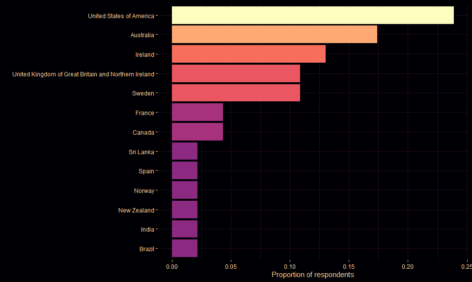<!-- -->

#### Table: List of Countries (Q1)


```{=html}
<div id="oizkbxppzt" style="padding-left:0px;padding-right:0px;padding-top:10px;padding-bottom:10px;overflow-x:auto;overflow-y:auto;width:auto;height:auto;">
<style>#oizkbxppzt table {
  font-family: system-ui, 'Segoe UI', Roboto, Helvetica, Arial, sans-serif, 'Apple Color Emoji', 'Segoe UI Emoji', 'Segoe UI Symbol', 'Noto Color Emoji';
  -webkit-font-smoothing: antialiased;
  -moz-osx-font-smoothing: grayscale;
}

#oizkbxppzt thead, #oizkbxppzt tbody, #oizkbxppzt tfoot, #oizkbxppzt tr, #oizkbxppzt td, #oizkbxppzt th {
  border-style: none;
}

#oizkbxppzt p {
  margin: 0;
  padding: 0;
}

#oizkbxppzt .gt_table {
  display: table;
  border-collapse: collapse;
  line-height: normal;
  margin-left: auto;
  margin-right: auto;
  color: #333333;
  font-size: 16px;
  font-weight: normal;
  font-style: normal;
  background-color: #FFFFFF;
  width: auto;
  border-top-style: solid;
  border-top-width: 2px;
  border-top-color: #A8A8A8;
  border-right-style: none;
  border-right-width: 2px;
  border-right-color: #D3D3D3;
  border-bottom-style: solid;
  border-bottom-width: 2px;
  border-bottom-color: #A8A8A8;
  border-left-style: none;
  border-left-width: 2px;
  border-left-color: #D3D3D3;
}

#oizkbxppzt .gt_caption {
  padding-top: 4px;
  padding-bottom: 4px;
}

#oizkbxppzt .gt_title {
  color: #333333;
  font-size: 125%;
  font-weight: initial;
  padding-top: 4px;
  padding-bottom: 4px;
  padding-left: 5px;
  padding-right: 5px;
  border-bottom-color: #FFFFFF;
  border-bottom-width: 0;
}

#oizkbxppzt .gt_subtitle {
  color: #333333;
  font-size: 85%;
  font-weight: initial;
  padding-top: 3px;
  padding-bottom: 5px;
  padding-left: 5px;
  padding-right: 5px;
  border-top-color: #FFFFFF;
  border-top-width: 0;
}

#oizkbxppzt .gt_heading {
  background-color: #FFFFFF;
  text-align: center;
  border-bottom-color: #FFFFFF;
  border-left-style: none;
  border-left-width: 1px;
  border-left-color: #D3D3D3;
  border-right-style: none;
  border-right-width: 1px;
  border-right-color: #D3D3D3;
}

#oizkbxppzt .gt_bottom_border {
  border-bottom-style: solid;
  border-bottom-width: 2px;
  border-bottom-color: #D3D3D3;
}

#oizkbxppzt .gt_col_headings {
  border-top-style: solid;
  border-top-width: 2px;
  border-top-color: #D3D3D3;
  border-bottom-style: solid;
  border-bottom-width: 2px;
  border-bottom-color: #D3D3D3;
  border-left-style: none;
  border-left-width: 1px;
  border-left-color: #D3D3D3;
  border-right-style: none;
  border-right-width: 1px;
  border-right-color: #D3D3D3;
}

#oizkbxppzt .gt_col_heading {
  color: #333333;
  background-color: #FFFFFF;
  font-size: 100%;
  font-weight: normal;
  text-transform: inherit;
  border-left-style: none;
  border-left-width: 1px;
  border-left-color: #D3D3D3;
  border-right-style: none;
  border-right-width: 1px;
  border-right-color: #D3D3D3;
  vertical-align: bottom;
  padding-top: 5px;
  padding-bottom: 6px;
  padding-left: 5px;
  padding-right: 5px;
  overflow-x: hidden;
}

#oizkbxppzt .gt_column_spanner_outer {
  color: #333333;
  background-color: #FFFFFF;
  font-size: 100%;
  font-weight: normal;
  text-transform: inherit;
  padding-top: 0;
  padding-bottom: 0;
  padding-left: 4px;
  padding-right: 4px;
}

#oizkbxppzt .gt_column_spanner_outer:first-child {
  padding-left: 0;
}

#oizkbxppzt .gt_column_spanner_outer:last-child {
  padding-right: 0;
}

#oizkbxppzt .gt_column_spanner {
  border-bottom-style: solid;
  border-bottom-width: 2px;
  border-bottom-color: #D3D3D3;
  vertical-align: bottom;
  padding-top: 5px;
  padding-bottom: 5px;
  overflow-x: hidden;
  display: inline-block;
  width: 100%;
}

#oizkbxppzt .gt_spanner_row {
  border-bottom-style: hidden;
}

#oizkbxppzt .gt_group_heading {
  padding-top: 8px;
  padding-bottom: 8px;
  padding-left: 5px;
  padding-right: 5px;
  color: #333333;
  background-color: #FFFFFF;
  font-size: 100%;
  font-weight: initial;
  text-transform: inherit;
  border-top-style: solid;
  border-top-width: 2px;
  border-top-color: #D3D3D3;
  border-bottom-style: solid;
  border-bottom-width: 2px;
  border-bottom-color: #D3D3D3;
  border-left-style: none;
  border-left-width: 1px;
  border-left-color: #D3D3D3;
  border-right-style: none;
  border-right-width: 1px;
  border-right-color: #D3D3D3;
  vertical-align: middle;
  text-align: left;
}

#oizkbxppzt .gt_empty_group_heading {
  padding: 0.5px;
  color: #333333;
  background-color: #FFFFFF;
  font-size: 100%;
  font-weight: initial;
  border-top-style: solid;
  border-top-width: 2px;
  border-top-color: #D3D3D3;
  border-bottom-style: solid;
  border-bottom-width: 2px;
  border-bottom-color: #D3D3D3;
  vertical-align: middle;
}

#oizkbxppzt .gt_from_md > :first-child {
  margin-top: 0;
}

#oizkbxppzt .gt_from_md > :last-child {
  margin-bottom: 0;
}

#oizkbxppzt .gt_row {
  padding-top: 8px;
  padding-bottom: 8px;
  padding-left: 5px;
  padding-right: 5px;
  margin: 10px;
  border-top-style: solid;
  border-top-width: 1px;
  border-top-color: #D3D3D3;
  border-left-style: none;
  border-left-width: 1px;
  border-left-color: #D3D3D3;
  border-right-style: none;
  border-right-width: 1px;
  border-right-color: #D3D3D3;
  vertical-align: middle;
  overflow-x: hidden;
}

#oizkbxppzt .gt_stub {
  color: #333333;
  background-color: #FFFFFF;
  font-size: 100%;
  font-weight: initial;
  text-transform: inherit;
  border-right-style: solid;
  border-right-width: 2px;
  border-right-color: #D3D3D3;
  padding-left: 5px;
  padding-right: 5px;
}

#oizkbxppzt .gt_stub_row_group {
  color: #333333;
  background-color: #FFFFFF;
  font-size: 100%;
  font-weight: initial;
  text-transform: inherit;
  border-right-style: solid;
  border-right-width: 2px;
  border-right-color: #D3D3D3;
  padding-left: 5px;
  padding-right: 5px;
  vertical-align: top;
}

#oizkbxppzt .gt_row_group_first td {
  border-top-width: 2px;
}

#oizkbxppzt .gt_row_group_first th {
  border-top-width: 2px;
}

#oizkbxppzt .gt_summary_row {
  color: #333333;
  background-color: #FFFFFF;
  text-transform: inherit;
  padding-top: 8px;
  padding-bottom: 8px;
  padding-left: 5px;
  padding-right: 5px;
}

#oizkbxppzt .gt_first_summary_row {
  border-top-style: solid;
  border-top-color: #D3D3D3;
}

#oizkbxppzt .gt_first_summary_row.thick {
  border-top-width: 2px;
}

#oizkbxppzt .gt_last_summary_row {
  padding-top: 8px;
  padding-bottom: 8px;
  padding-left: 5px;
  padding-right: 5px;
  border-bottom-style: solid;
  border-bottom-width: 2px;
  border-bottom-color: #D3D3D3;
}

#oizkbxppzt .gt_grand_summary_row {
  color: #333333;
  background-color: #FFFFFF;
  text-transform: inherit;
  padding-top: 8px;
  padding-bottom: 8px;
  padding-left: 5px;
  padding-right: 5px;
}

#oizkbxppzt .gt_first_grand_summary_row {
  padding-top: 8px;
  padding-bottom: 8px;
  padding-left: 5px;
  padding-right: 5px;
  border-top-style: double;
  border-top-width: 6px;
  border-top-color: #D3D3D3;
}

#oizkbxppzt .gt_last_grand_summary_row_top {
  padding-top: 8px;
  padding-bottom: 8px;
  padding-left: 5px;
  padding-right: 5px;
  border-bottom-style: double;
  border-bottom-width: 6px;
  border-bottom-color: #D3D3D3;
}

#oizkbxppzt .gt_striped {
  background-color: rgba(128, 128, 128, 0.05);
}

#oizkbxppzt .gt_table_body {
  border-top-style: solid;
  border-top-width: 2px;
  border-top-color: #D3D3D3;
  border-bottom-style: solid;
  border-bottom-width: 2px;
  border-bottom-color: #D3D3D3;
}

#oizkbxppzt .gt_footnotes {
  color: #333333;
  background-color: #FFFFFF;
  border-bottom-style: none;
  border-bottom-width: 2px;
  border-bottom-color: #D3D3D3;
  border-left-style: none;
  border-left-width: 2px;
  border-left-color: #D3D3D3;
  border-right-style: none;
  border-right-width: 2px;
  border-right-color: #D3D3D3;
}

#oizkbxppzt .gt_footnote {
  margin: 0px;
  font-size: 90%;
  padding-top: 4px;
  padding-bottom: 4px;
  padding-left: 5px;
  padding-right: 5px;
}

#oizkbxppzt .gt_sourcenotes {
  color: #333333;
  background-color: #FFFFFF;
  border-bottom-style: none;
  border-bottom-width: 2px;
  border-bottom-color: #D3D3D3;
  border-left-style: none;
  border-left-width: 2px;
  border-left-color: #D3D3D3;
  border-right-style: none;
  border-right-width: 2px;
  border-right-color: #D3D3D3;
}

#oizkbxppzt .gt_sourcenote {
  font-size: 90%;
  padding-top: 4px;
  padding-bottom: 4px;
  padding-left: 5px;
  padding-right: 5px;
}

#oizkbxppzt .gt_left {
  text-align: left;
}

#oizkbxppzt .gt_center {
  text-align: center;
}

#oizkbxppzt .gt_right {
  text-align: right;
  font-variant-numeric: tabular-nums;
}

#oizkbxppzt .gt_font_normal {
  font-weight: normal;
}

#oizkbxppzt .gt_font_bold {
  font-weight: bold;
}

#oizkbxppzt .gt_font_italic {
  font-style: italic;
}

#oizkbxppzt .gt_super {
  font-size: 65%;
}

#oizkbxppzt .gt_footnote_marks {
  font-size: 75%;
  vertical-align: 0.4em;
  position: initial;
}

#oizkbxppzt .gt_asterisk {
  font-size: 100%;
  vertical-align: 0;
}

#oizkbxppzt .gt_indent_1 {
  text-indent: 5px;
}

#oizkbxppzt .gt_indent_2 {
  text-indent: 10px;
}

#oizkbxppzt .gt_indent_3 {
  text-indent: 15px;
}

#oizkbxppzt .gt_indent_4 {
  text-indent: 20px;
}

#oizkbxppzt .gt_indent_5 {
  text-indent: 25px;
}

#oizkbxppzt .katex-display {
  display: inline-flex !important;
  margin-bottom: 0.75em !important;
}

#oizkbxppzt div.Reactable > div.rt-table > div.rt-thead > div.rt-tr.rt-tr-group-header > div.rt-th-group:after {
  height: 0px !important;
}
</style>
<table class="gt_table" data-quarto-disable-processing="false" data-quarto-bootstrap="false">
  <thead>
    <tr class="gt_col_headings">
      <th class="gt_col_heading gt_columns_bottom_border gt_left" rowspan="1" colspan="1" scope="col" id="label"><span class='gt_from_md'><strong>Characteristic</strong></span></th>
      <th class="gt_col_heading gt_columns_bottom_border gt_center" rowspan="1" colspan="1" scope="col" id="stat_0"><span class='gt_from_md'><strong>N = 14</strong></span><span class="gt_footnote_marks" style="white-space:nowrap;font-style:italic;font-weight:normal;line-height:0;"><sup>1</sup></span></th>
    </tr>
  </thead>
  <tbody class="gt_table_body">
    <tr><td headers="label" class="gt_row gt_left">q1</td>
<td headers="stat_0" class="gt_row gt_center"><br /></td></tr>
    <tr><td headers="label" class="gt_row gt_left">    Brazil</td>
<td headers="stat_0" class="gt_row gt_center">1/13 (7.7%)</td></tr>
    <tr><td headers="label" class="gt_row gt_left">    India</td>
<td headers="stat_0" class="gt_row gt_center">1/13 (7.7%)</td></tr>
    <tr><td headers="label" class="gt_row gt_left">    New Zealand</td>
<td headers="stat_0" class="gt_row gt_center">1/13 (7.7%)</td></tr>
    <tr><td headers="label" class="gt_row gt_left">    Norway</td>
<td headers="stat_0" class="gt_row gt_center">1/13 (7.7%)</td></tr>
    <tr><td headers="label" class="gt_row gt_left">    Spain</td>
<td headers="stat_0" class="gt_row gt_center">1/13 (7.7%)</td></tr>
    <tr><td headers="label" class="gt_row gt_left">    Sri Lanka</td>
<td headers="stat_0" class="gt_row gt_center">1/13 (7.7%)</td></tr>
    <tr><td headers="label" class="gt_row gt_left">    Canada</td>
<td headers="stat_0" class="gt_row gt_center">1/13 (7.7%)</td></tr>
    <tr><td headers="label" class="gt_row gt_left">    France</td>
<td headers="stat_0" class="gt_row gt_center">1/13 (7.7%)</td></tr>
    <tr><td headers="label" class="gt_row gt_left">    Sweden</td>
<td headers="stat_0" class="gt_row gt_center">1/13 (7.7%)</td></tr>
    <tr><td headers="label" class="gt_row gt_left">    United Kingdom of Great Britain and Northern Ireland</td>
<td headers="stat_0" class="gt_row gt_center">1/13 (7.7%)</td></tr>
    <tr><td headers="label" class="gt_row gt_left">    Ireland</td>
<td headers="stat_0" class="gt_row gt_center">1/13 (7.7%)</td></tr>
    <tr><td headers="label" class="gt_row gt_left">    Australia</td>
<td headers="stat_0" class="gt_row gt_center">1/13 (7.7%)</td></tr>
    <tr><td headers="label" class="gt_row gt_left">    United States of America</td>
<td headers="stat_0" class="gt_row gt_center">1/13 (7.7%)</td></tr>
    <tr><td headers="label" class="gt_row gt_left">    Missing values</td>
<td headers="stat_0" class="gt_row gt_center">1</td></tr>
    <tr><td headers="label" class="gt_row gt_left">q1_prop</td>
<td headers="stat_0" class="gt_row gt_center"><br /></td></tr>
    <tr><td headers="label" class="gt_row gt_left">    0.0217391304347826</td>
<td headers="stat_0" class="gt_row gt_center">7/14 (50%)</td></tr>
    <tr><td headers="label" class="gt_row gt_left">    0.0434782608695652</td>
<td headers="stat_0" class="gt_row gt_center">2/14 (14%)</td></tr>
    <tr><td headers="label" class="gt_row gt_left">    0.108695652173913</td>
<td headers="stat_0" class="gt_row gt_center">2/14 (14%)</td></tr>
    <tr><td headers="label" class="gt_row gt_left">    0.130434782608696</td>
<td headers="stat_0" class="gt_row gt_center">1/14 (7.1%)</td></tr>
    <tr><td headers="label" class="gt_row gt_left">    0.173913043478261</td>
<td headers="stat_0" class="gt_row gt_center">1/14 (7.1%)</td></tr>
    <tr><td headers="label" class="gt_row gt_left">    0.239130434782609</td>
<td headers="stat_0" class="gt_row gt_center">1/14 (7.1%)</td></tr>
  </tbody>
  
  <tfoot class="gt_footnotes">
    <tr>
      <td class="gt_footnote" colspan="2"><span class="gt_footnote_marks" style="white-space:nowrap;font-style:italic;font-weight:normal;line-height:0;"><sup>1</sup></span> <span class='gt_from_md'>n/N Non-missing (%)</span></td>
    </tr>
  </tfoot>
</table>
</div>
```

#### Figure: What is your current career stage? (Q2)

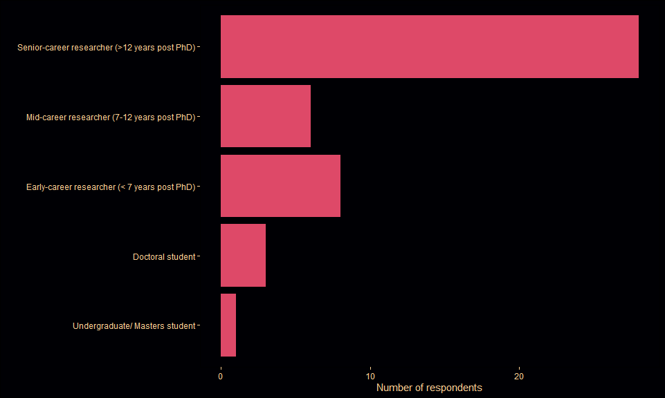<!-- -->

#### Figure: How many trials of interventions to prevent obesity, and/or to improve child health behaviours related to childhood obesity, in children from 0 to 5 years old have you been involved in to date? (Q5)

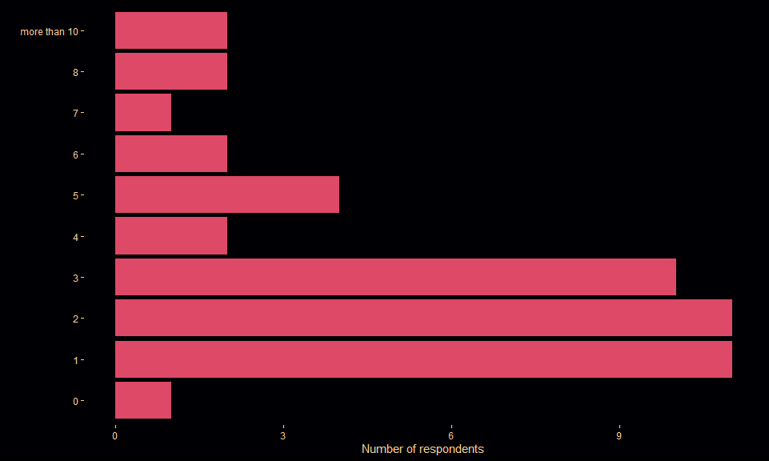<!-- -->

#### Figure: In what country/countries were the trials in which you are/were involved conducted? (Q6)
 
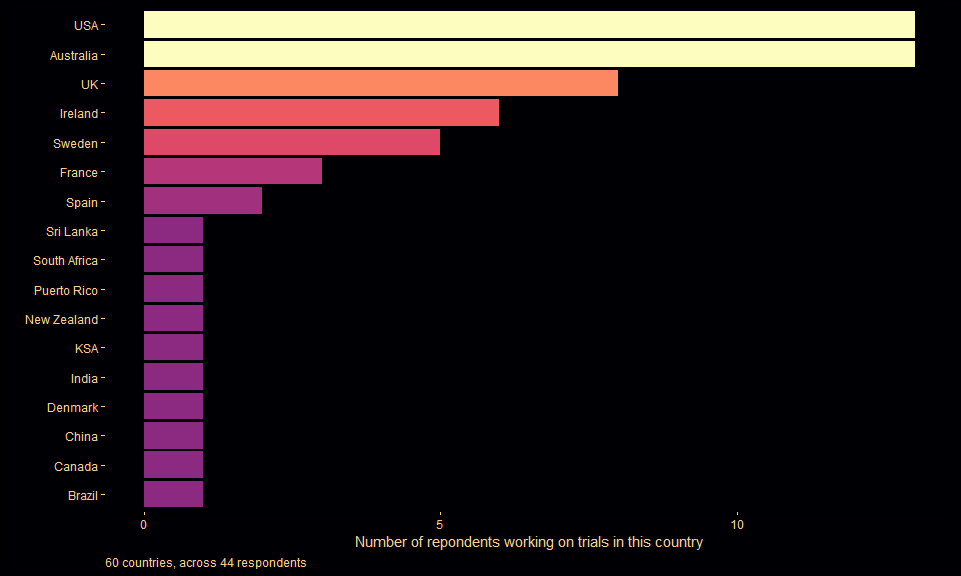<!-- -->

#### Table: In what country/countries were the trials in which you are/were involved conducted? (Q6)


```{=html}
<div id="rhnfgdbcep" style="padding-left:0px;padding-right:0px;padding-top:10px;padding-bottom:10px;overflow-x:auto;overflow-y:auto;width:auto;height:auto;">
<style>#rhnfgdbcep table {
  font-family: system-ui, 'Segoe UI', Roboto, Helvetica, Arial, sans-serif, 'Apple Color Emoji', 'Segoe UI Emoji', 'Segoe UI Symbol', 'Noto Color Emoji';
  -webkit-font-smoothing: antialiased;
  -moz-osx-font-smoothing: grayscale;
}

#rhnfgdbcep thead, #rhnfgdbcep tbody, #rhnfgdbcep tfoot, #rhnfgdbcep tr, #rhnfgdbcep td, #rhnfgdbcep th {
  border-style: none;
}

#rhnfgdbcep p {
  margin: 0;
  padding: 0;
}

#rhnfgdbcep .gt_table {
  display: table;
  border-collapse: collapse;
  line-height: normal;
  margin-left: auto;
  margin-right: auto;
  color: #333333;
  font-size: 16px;
  font-weight: normal;
  font-style: normal;
  background-color: #FFFFFF;
  width: auto;
  border-top-style: solid;
  border-top-width: 2px;
  border-top-color: #A8A8A8;
  border-right-style: none;
  border-right-width: 2px;
  border-right-color: #D3D3D3;
  border-bottom-style: solid;
  border-bottom-width: 2px;
  border-bottom-color: #A8A8A8;
  border-left-style: none;
  border-left-width: 2px;
  border-left-color: #D3D3D3;
}

#rhnfgdbcep .gt_caption {
  padding-top: 4px;
  padding-bottom: 4px;
}

#rhnfgdbcep .gt_title {
  color: #333333;
  font-size: 125%;
  font-weight: initial;
  padding-top: 4px;
  padding-bottom: 4px;
  padding-left: 5px;
  padding-right: 5px;
  border-bottom-color: #FFFFFF;
  border-bottom-width: 0;
}

#rhnfgdbcep .gt_subtitle {
  color: #333333;
  font-size: 85%;
  font-weight: initial;
  padding-top: 3px;
  padding-bottom: 5px;
  padding-left: 5px;
  padding-right: 5px;
  border-top-color: #FFFFFF;
  border-top-width: 0;
}

#rhnfgdbcep .gt_heading {
  background-color: #FFFFFF;
  text-align: center;
  border-bottom-color: #FFFFFF;
  border-left-style: none;
  border-left-width: 1px;
  border-left-color: #D3D3D3;
  border-right-style: none;
  border-right-width: 1px;
  border-right-color: #D3D3D3;
}

#rhnfgdbcep .gt_bottom_border {
  border-bottom-style: solid;
  border-bottom-width: 2px;
  border-bottom-color: #D3D3D3;
}

#rhnfgdbcep .gt_col_headings {
  border-top-style: solid;
  border-top-width: 2px;
  border-top-color: #D3D3D3;
  border-bottom-style: solid;
  border-bottom-width: 2px;
  border-bottom-color: #D3D3D3;
  border-left-style: none;
  border-left-width: 1px;
  border-left-color: #D3D3D3;
  border-right-style: none;
  border-right-width: 1px;
  border-right-color: #D3D3D3;
}

#rhnfgdbcep .gt_col_heading {
  color: #333333;
  background-color: #FFFFFF;
  font-size: 100%;
  font-weight: normal;
  text-transform: inherit;
  border-left-style: none;
  border-left-width: 1px;
  border-left-color: #D3D3D3;
  border-right-style: none;
  border-right-width: 1px;
  border-right-color: #D3D3D3;
  vertical-align: bottom;
  padding-top: 5px;
  padding-bottom: 6px;
  padding-left: 5px;
  padding-right: 5px;
  overflow-x: hidden;
}

#rhnfgdbcep .gt_column_spanner_outer {
  color: #333333;
  background-color: #FFFFFF;
  font-size: 100%;
  font-weight: normal;
  text-transform: inherit;
  padding-top: 0;
  padding-bottom: 0;
  padding-left: 4px;
  padding-right: 4px;
}

#rhnfgdbcep .gt_column_spanner_outer:first-child {
  padding-left: 0;
}

#rhnfgdbcep .gt_column_spanner_outer:last-child {
  padding-right: 0;
}

#rhnfgdbcep .gt_column_spanner {
  border-bottom-style: solid;
  border-bottom-width: 2px;
  border-bottom-color: #D3D3D3;
  vertical-align: bottom;
  padding-top: 5px;
  padding-bottom: 5px;
  overflow-x: hidden;
  display: inline-block;
  width: 100%;
}

#rhnfgdbcep .gt_spanner_row {
  border-bottom-style: hidden;
}

#rhnfgdbcep .gt_group_heading {
  padding-top: 8px;
  padding-bottom: 8px;
  padding-left: 5px;
  padding-right: 5px;
  color: #333333;
  background-color: #FFFFFF;
  font-size: 100%;
  font-weight: initial;
  text-transform: inherit;
  border-top-style: solid;
  border-top-width: 2px;
  border-top-color: #D3D3D3;
  border-bottom-style: solid;
  border-bottom-width: 2px;
  border-bottom-color: #D3D3D3;
  border-left-style: none;
  border-left-width: 1px;
  border-left-color: #D3D3D3;
  border-right-style: none;
  border-right-width: 1px;
  border-right-color: #D3D3D3;
  vertical-align: middle;
  text-align: left;
}

#rhnfgdbcep .gt_empty_group_heading {
  padding: 0.5px;
  color: #333333;
  background-color: #FFFFFF;
  font-size: 100%;
  font-weight: initial;
  border-top-style: solid;
  border-top-width: 2px;
  border-top-color: #D3D3D3;
  border-bottom-style: solid;
  border-bottom-width: 2px;
  border-bottom-color: #D3D3D3;
  vertical-align: middle;
}

#rhnfgdbcep .gt_from_md > :first-child {
  margin-top: 0;
}

#rhnfgdbcep .gt_from_md > :last-child {
  margin-bottom: 0;
}

#rhnfgdbcep .gt_row {
  padding-top: 8px;
  padding-bottom: 8px;
  padding-left: 5px;
  padding-right: 5px;
  margin: 10px;
  border-top-style: solid;
  border-top-width: 1px;
  border-top-color: #D3D3D3;
  border-left-style: none;
  border-left-width: 1px;
  border-left-color: #D3D3D3;
  border-right-style: none;
  border-right-width: 1px;
  border-right-color: #D3D3D3;
  vertical-align: middle;
  overflow-x: hidden;
}

#rhnfgdbcep .gt_stub {
  color: #333333;
  background-color: #FFFFFF;
  font-size: 100%;
  font-weight: initial;
  text-transform: inherit;
  border-right-style: solid;
  border-right-width: 2px;
  border-right-color: #D3D3D3;
  padding-left: 5px;
  padding-right: 5px;
}

#rhnfgdbcep .gt_stub_row_group {
  color: #333333;
  background-color: #FFFFFF;
  font-size: 100%;
  font-weight: initial;
  text-transform: inherit;
  border-right-style: solid;
  border-right-width: 2px;
  border-right-color: #D3D3D3;
  padding-left: 5px;
  padding-right: 5px;
  vertical-align: top;
}

#rhnfgdbcep .gt_row_group_first td {
  border-top-width: 2px;
}

#rhnfgdbcep .gt_row_group_first th {
  border-top-width: 2px;
}

#rhnfgdbcep .gt_summary_row {
  color: #333333;
  background-color: #FFFFFF;
  text-transform: inherit;
  padding-top: 8px;
  padding-bottom: 8px;
  padding-left: 5px;
  padding-right: 5px;
}

#rhnfgdbcep .gt_first_summary_row {
  border-top-style: solid;
  border-top-color: #D3D3D3;
}

#rhnfgdbcep .gt_first_summary_row.thick {
  border-top-width: 2px;
}

#rhnfgdbcep .gt_last_summary_row {
  padding-top: 8px;
  padding-bottom: 8px;
  padding-left: 5px;
  padding-right: 5px;
  border-bottom-style: solid;
  border-bottom-width: 2px;
  border-bottom-color: #D3D3D3;
}

#rhnfgdbcep .gt_grand_summary_row {
  color: #333333;
  background-color: #FFFFFF;
  text-transform: inherit;
  padding-top: 8px;
  padding-bottom: 8px;
  padding-left: 5px;
  padding-right: 5px;
}

#rhnfgdbcep .gt_first_grand_summary_row {
  padding-top: 8px;
  padding-bottom: 8px;
  padding-left: 5px;
  padding-right: 5px;
  border-top-style: double;
  border-top-width: 6px;
  border-top-color: #D3D3D3;
}

#rhnfgdbcep .gt_last_grand_summary_row_top {
  padding-top: 8px;
  padding-bottom: 8px;
  padding-left: 5px;
  padding-right: 5px;
  border-bottom-style: double;
  border-bottom-width: 6px;
  border-bottom-color: #D3D3D3;
}

#rhnfgdbcep .gt_striped {
  background-color: rgba(128, 128, 128, 0.05);
}

#rhnfgdbcep .gt_table_body {
  border-top-style: solid;
  border-top-width: 2px;
  border-top-color: #D3D3D3;
  border-bottom-style: solid;
  border-bottom-width: 2px;
  border-bottom-color: #D3D3D3;
}

#rhnfgdbcep .gt_footnotes {
  color: #333333;
  background-color: #FFFFFF;
  border-bottom-style: none;
  border-bottom-width: 2px;
  border-bottom-color: #D3D3D3;
  border-left-style: none;
  border-left-width: 2px;
  border-left-color: #D3D3D3;
  border-right-style: none;
  border-right-width: 2px;
  border-right-color: #D3D3D3;
}

#rhnfgdbcep .gt_footnote {
  margin: 0px;
  font-size: 90%;
  padding-top: 4px;
  padding-bottom: 4px;
  padding-left: 5px;
  padding-right: 5px;
}

#rhnfgdbcep .gt_sourcenotes {
  color: #333333;
  background-color: #FFFFFF;
  border-bottom-style: none;
  border-bottom-width: 2px;
  border-bottom-color: #D3D3D3;
  border-left-style: none;
  border-left-width: 2px;
  border-left-color: #D3D3D3;
  border-right-style: none;
  border-right-width: 2px;
  border-right-color: #D3D3D3;
}

#rhnfgdbcep .gt_sourcenote {
  font-size: 90%;
  padding-top: 4px;
  padding-bottom: 4px;
  padding-left: 5px;
  padding-right: 5px;
}

#rhnfgdbcep .gt_left {
  text-align: left;
}

#rhnfgdbcep .gt_center {
  text-align: center;
}

#rhnfgdbcep .gt_right {
  text-align: right;
  font-variant-numeric: tabular-nums;
}

#rhnfgdbcep .gt_font_normal {
  font-weight: normal;
}

#rhnfgdbcep .gt_font_bold {
  font-weight: bold;
}

#rhnfgdbcep .gt_font_italic {
  font-style: italic;
}

#rhnfgdbcep .gt_super {
  font-size: 65%;
}

#rhnfgdbcep .gt_footnote_marks {
  font-size: 75%;
  vertical-align: 0.4em;
  position: initial;
}

#rhnfgdbcep .gt_asterisk {
  font-size: 100%;
  vertical-align: 0;
}

#rhnfgdbcep .gt_indent_1 {
  text-indent: 5px;
}

#rhnfgdbcep .gt_indent_2 {
  text-indent: 10px;
}

#rhnfgdbcep .gt_indent_3 {
  text-indent: 15px;
}

#rhnfgdbcep .gt_indent_4 {
  text-indent: 20px;
}

#rhnfgdbcep .gt_indent_5 {
  text-indent: 25px;
}

#rhnfgdbcep .katex-display {
  display: inline-flex !important;
  margin-bottom: 0.75em !important;
}

#rhnfgdbcep div.Reactable > div.rt-table > div.rt-thead > div.rt-tr.rt-tr-group-header > div.rt-th-group:after {
  height: 0px !important;
}
</style>
<table class="gt_table" data-quarto-disable-processing="false" data-quarto-bootstrap="false">
  <thead>
    <tr class="gt_col_headings">
      <th class="gt_col_heading gt_columns_bottom_border gt_left" rowspan="1" colspan="1" scope="col" id="label"><span class='gt_from_md'><strong>Characteristic</strong></span></th>
      <th class="gt_col_heading gt_columns_bottom_border gt_center" rowspan="1" colspan="1" scope="col" id="stat_0"><span class='gt_from_md'><strong>N = 60</strong></span><span class="gt_footnote_marks" style="white-space:nowrap;font-style:italic;font-weight:normal;line-height:0;"><sup>1</sup></span></th>
    </tr>
  </thead>
  <tbody class="gt_table_body">
    <tr><td headers="label" class="gt_row gt_left">country</td>
<td headers="stat_0" class="gt_row gt_center"><br /></td></tr>
    <tr><td headers="label" class="gt_row gt_left">    Brazil</td>
<td headers="stat_0" class="gt_row gt_center">1/60 (1.7%)</td></tr>
    <tr><td headers="label" class="gt_row gt_left">    Canada</td>
<td headers="stat_0" class="gt_row gt_center">1/60 (1.7%)</td></tr>
    <tr><td headers="label" class="gt_row gt_left">    China</td>
<td headers="stat_0" class="gt_row gt_center">1/60 (1.7%)</td></tr>
    <tr><td headers="label" class="gt_row gt_left">    Denmark</td>
<td headers="stat_0" class="gt_row gt_center">1/60 (1.7%)</td></tr>
    <tr><td headers="label" class="gt_row gt_left">    India</td>
<td headers="stat_0" class="gt_row gt_center">1/60 (1.7%)</td></tr>
    <tr><td headers="label" class="gt_row gt_left">    KSA</td>
<td headers="stat_0" class="gt_row gt_center">1/60 (1.7%)</td></tr>
    <tr><td headers="label" class="gt_row gt_left">    New Zealand</td>
<td headers="stat_0" class="gt_row gt_center">1/60 (1.7%)</td></tr>
    <tr><td headers="label" class="gt_row gt_left">    Puerto Rico</td>
<td headers="stat_0" class="gt_row gt_center">1/60 (1.7%)</td></tr>
    <tr><td headers="label" class="gt_row gt_left">    South Africa</td>
<td headers="stat_0" class="gt_row gt_center">1/60 (1.7%)</td></tr>
    <tr><td headers="label" class="gt_row gt_left">    Sri Lanka</td>
<td headers="stat_0" class="gt_row gt_center">1/60 (1.7%)</td></tr>
    <tr><td headers="label" class="gt_row gt_left">    Spain</td>
<td headers="stat_0" class="gt_row gt_center">2/60 (3.3%)</td></tr>
    <tr><td headers="label" class="gt_row gt_left">    France</td>
<td headers="stat_0" class="gt_row gt_center">3/60 (5.0%)</td></tr>
    <tr><td headers="label" class="gt_row gt_left">    Sweden</td>
<td headers="stat_0" class="gt_row gt_center">5/60 (8.3%)</td></tr>
    <tr><td headers="label" class="gt_row gt_left">    Ireland</td>
<td headers="stat_0" class="gt_row gt_center">6/60 (10%)</td></tr>
    <tr><td headers="label" class="gt_row gt_left">    UK</td>
<td headers="stat_0" class="gt_row gt_center">8/60 (13%)</td></tr>
    <tr><td headers="label" class="gt_row gt_left">    Australia</td>
<td headers="stat_0" class="gt_row gt_center">13/60 (22%)</td></tr>
    <tr><td headers="label" class="gt_row gt_left">    USA</td>
<td headers="stat_0" class="gt_row gt_center">13/60 (22%)</td></tr>
  </tbody>
  
  <tfoot class="gt_footnotes">
    <tr>
      <td class="gt_footnote" colspan="2"><span class="gt_footnote_marks" style="white-space:nowrap;font-style:italic;font-weight:normal;line-height:0;"><sup>1</sup></span> <span class='gt_from_md'>n/N Non-missing (%)</span></td>
    </tr>
  </tfoot>
</table>
</div>
```

## (Q8) Trial Status

#### Figure: Number of current trials for each respondent

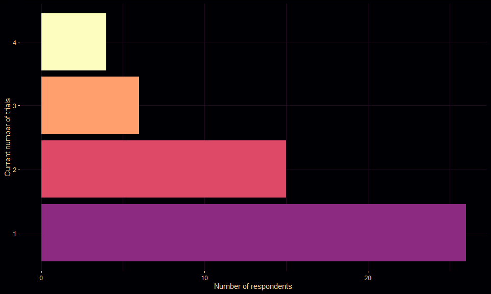<!-- -->

#### Figure: Status of all current trials

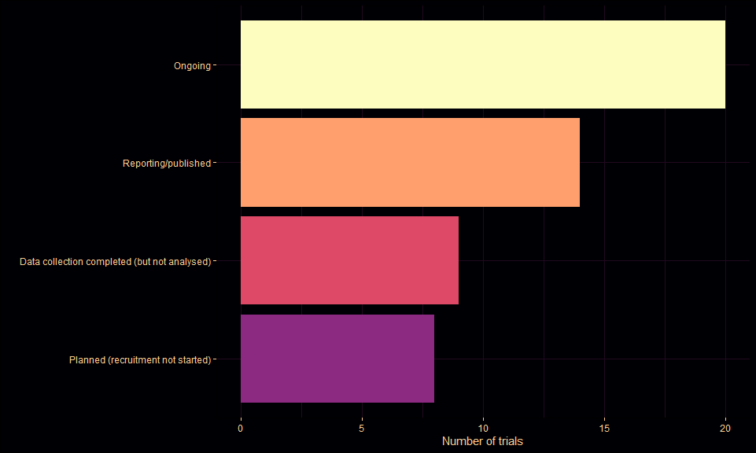<!-- -->

#### Figure: Number and status of all current trials, by respondent

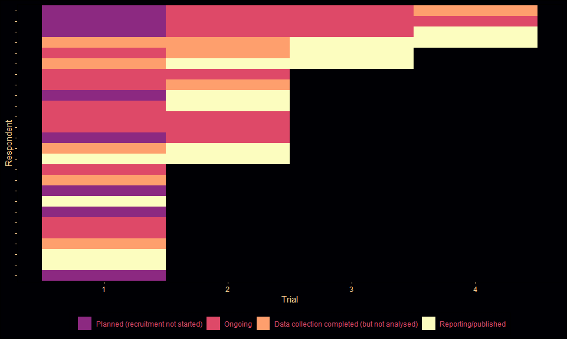<!-- -->

#### Table: At what stage is your current trial(s)?\n\nPlease select one option for each trial you are currently involved in - Trial 1-4


```{=html}
<div id="odclwdplva" style="padding-left:0px;padding-right:0px;padding-top:10px;padding-bottom:10px;overflow-x:auto;overflow-y:auto;width:auto;height:auto;">
<style>#odclwdplva table {
  font-family: system-ui, 'Segoe UI', Roboto, Helvetica, Arial, sans-serif, 'Apple Color Emoji', 'Segoe UI Emoji', 'Segoe UI Symbol', 'Noto Color Emoji';
  -webkit-font-smoothing: antialiased;
  -moz-osx-font-smoothing: grayscale;
}

#odclwdplva thead, #odclwdplva tbody, #odclwdplva tfoot, #odclwdplva tr, #odclwdplva td, #odclwdplva th {
  border-style: none;
}

#odclwdplva p {
  margin: 0;
  padding: 0;
}

#odclwdplva .gt_table {
  display: table;
  border-collapse: collapse;
  line-height: normal;
  margin-left: auto;
  margin-right: auto;
  color: #333333;
  font-size: 16px;
  font-weight: normal;
  font-style: normal;
  background-color: #FFFFFF;
  width: auto;
  border-top-style: solid;
  border-top-width: 2px;
  border-top-color: #A8A8A8;
  border-right-style: none;
  border-right-width: 2px;
  border-right-color: #D3D3D3;
  border-bottom-style: solid;
  border-bottom-width: 2px;
  border-bottom-color: #A8A8A8;
  border-left-style: none;
  border-left-width: 2px;
  border-left-color: #D3D3D3;
}

#odclwdplva .gt_caption {
  padding-top: 4px;
  padding-bottom: 4px;
}

#odclwdplva .gt_title {
  color: #333333;
  font-size: 125%;
  font-weight: initial;
  padding-top: 4px;
  padding-bottom: 4px;
  padding-left: 5px;
  padding-right: 5px;
  border-bottom-color: #FFFFFF;
  border-bottom-width: 0;
}

#odclwdplva .gt_subtitle {
  color: #333333;
  font-size: 85%;
  font-weight: initial;
  padding-top: 3px;
  padding-bottom: 5px;
  padding-left: 5px;
  padding-right: 5px;
  border-top-color: #FFFFFF;
  border-top-width: 0;
}

#odclwdplva .gt_heading {
  background-color: #FFFFFF;
  text-align: center;
  border-bottom-color: #FFFFFF;
  border-left-style: none;
  border-left-width: 1px;
  border-left-color: #D3D3D3;
  border-right-style: none;
  border-right-width: 1px;
  border-right-color: #D3D3D3;
}

#odclwdplva .gt_bottom_border {
  border-bottom-style: solid;
  border-bottom-width: 2px;
  border-bottom-color: #D3D3D3;
}

#odclwdplva .gt_col_headings {
  border-top-style: solid;
  border-top-width: 2px;
  border-top-color: #D3D3D3;
  border-bottom-style: solid;
  border-bottom-width: 2px;
  border-bottom-color: #D3D3D3;
  border-left-style: none;
  border-left-width: 1px;
  border-left-color: #D3D3D3;
  border-right-style: none;
  border-right-width: 1px;
  border-right-color: #D3D3D3;
}

#odclwdplva .gt_col_heading {
  color: #333333;
  background-color: #FFFFFF;
  font-size: 100%;
  font-weight: normal;
  text-transform: inherit;
  border-left-style: none;
  border-left-width: 1px;
  border-left-color: #D3D3D3;
  border-right-style: none;
  border-right-width: 1px;
  border-right-color: #D3D3D3;
  vertical-align: bottom;
  padding-top: 5px;
  padding-bottom: 6px;
  padding-left: 5px;
  padding-right: 5px;
  overflow-x: hidden;
}

#odclwdplva .gt_column_spanner_outer {
  color: #333333;
  background-color: #FFFFFF;
  font-size: 100%;
  font-weight: normal;
  text-transform: inherit;
  padding-top: 0;
  padding-bottom: 0;
  padding-left: 4px;
  padding-right: 4px;
}

#odclwdplva .gt_column_spanner_outer:first-child {
  padding-left: 0;
}

#odclwdplva .gt_column_spanner_outer:last-child {
  padding-right: 0;
}

#odclwdplva .gt_column_spanner {
  border-bottom-style: solid;
  border-bottom-width: 2px;
  border-bottom-color: #D3D3D3;
  vertical-align: bottom;
  padding-top: 5px;
  padding-bottom: 5px;
  overflow-x: hidden;
  display: inline-block;
  width: 100%;
}

#odclwdplva .gt_spanner_row {
  border-bottom-style: hidden;
}

#odclwdplva .gt_group_heading {
  padding-top: 8px;
  padding-bottom: 8px;
  padding-left: 5px;
  padding-right: 5px;
  color: #333333;
  background-color: #FFFFFF;
  font-size: 100%;
  font-weight: initial;
  text-transform: inherit;
  border-top-style: solid;
  border-top-width: 2px;
  border-top-color: #D3D3D3;
  border-bottom-style: solid;
  border-bottom-width: 2px;
  border-bottom-color: #D3D3D3;
  border-left-style: none;
  border-left-width: 1px;
  border-left-color: #D3D3D3;
  border-right-style: none;
  border-right-width: 1px;
  border-right-color: #D3D3D3;
  vertical-align: middle;
  text-align: left;
}

#odclwdplva .gt_empty_group_heading {
  padding: 0.5px;
  color: #333333;
  background-color: #FFFFFF;
  font-size: 100%;
  font-weight: initial;
  border-top-style: solid;
  border-top-width: 2px;
  border-top-color: #D3D3D3;
  border-bottom-style: solid;
  border-bottom-width: 2px;
  border-bottom-color: #D3D3D3;
  vertical-align: middle;
}

#odclwdplva .gt_from_md > :first-child {
  margin-top: 0;
}

#odclwdplva .gt_from_md > :last-child {
  margin-bottom: 0;
}

#odclwdplva .gt_row {
  padding-top: 8px;
  padding-bottom: 8px;
  padding-left: 5px;
  padding-right: 5px;
  margin: 10px;
  border-top-style: solid;
  border-top-width: 1px;
  border-top-color: #D3D3D3;
  border-left-style: none;
  border-left-width: 1px;
  border-left-color: #D3D3D3;
  border-right-style: none;
  border-right-width: 1px;
  border-right-color: #D3D3D3;
  vertical-align: middle;
  overflow-x: hidden;
}

#odclwdplva .gt_stub {
  color: #333333;
  background-color: #FFFFFF;
  font-size: 100%;
  font-weight: initial;
  text-transform: inherit;
  border-right-style: solid;
  border-right-width: 2px;
  border-right-color: #D3D3D3;
  padding-left: 5px;
  padding-right: 5px;
}

#odclwdplva .gt_stub_row_group {
  color: #333333;
  background-color: #FFFFFF;
  font-size: 100%;
  font-weight: initial;
  text-transform: inherit;
  border-right-style: solid;
  border-right-width: 2px;
  border-right-color: #D3D3D3;
  padding-left: 5px;
  padding-right: 5px;
  vertical-align: top;
}

#odclwdplva .gt_row_group_first td {
  border-top-width: 2px;
}

#odclwdplva .gt_row_group_first th {
  border-top-width: 2px;
}

#odclwdplva .gt_summary_row {
  color: #333333;
  background-color: #FFFFFF;
  text-transform: inherit;
  padding-top: 8px;
  padding-bottom: 8px;
  padding-left: 5px;
  padding-right: 5px;
}

#odclwdplva .gt_first_summary_row {
  border-top-style: solid;
  border-top-color: #D3D3D3;
}

#odclwdplva .gt_first_summary_row.thick {
  border-top-width: 2px;
}

#odclwdplva .gt_last_summary_row {
  padding-top: 8px;
  padding-bottom: 8px;
  padding-left: 5px;
  padding-right: 5px;
  border-bottom-style: solid;
  border-bottom-width: 2px;
  border-bottom-color: #D3D3D3;
}

#odclwdplva .gt_grand_summary_row {
  color: #333333;
  background-color: #FFFFFF;
  text-transform: inherit;
  padding-top: 8px;
  padding-bottom: 8px;
  padding-left: 5px;
  padding-right: 5px;
}

#odclwdplva .gt_first_grand_summary_row {
  padding-top: 8px;
  padding-bottom: 8px;
  padding-left: 5px;
  padding-right: 5px;
  border-top-style: double;
  border-top-width: 6px;
  border-top-color: #D3D3D3;
}

#odclwdplva .gt_last_grand_summary_row_top {
  padding-top: 8px;
  padding-bottom: 8px;
  padding-left: 5px;
  padding-right: 5px;
  border-bottom-style: double;
  border-bottom-width: 6px;
  border-bottom-color: #D3D3D3;
}

#odclwdplva .gt_striped {
  background-color: rgba(128, 128, 128, 0.05);
}

#odclwdplva .gt_table_body {
  border-top-style: solid;
  border-top-width: 2px;
  border-top-color: #D3D3D3;
  border-bottom-style: solid;
  border-bottom-width: 2px;
  border-bottom-color: #D3D3D3;
}

#odclwdplva .gt_footnotes {
  color: #333333;
  background-color: #FFFFFF;
  border-bottom-style: none;
  border-bottom-width: 2px;
  border-bottom-color: #D3D3D3;
  border-left-style: none;
  border-left-width: 2px;
  border-left-color: #D3D3D3;
  border-right-style: none;
  border-right-width: 2px;
  border-right-color: #D3D3D3;
}

#odclwdplva .gt_footnote {
  margin: 0px;
  font-size: 90%;
  padding-top: 4px;
  padding-bottom: 4px;
  padding-left: 5px;
  padding-right: 5px;
}

#odclwdplva .gt_sourcenotes {
  color: #333333;
  background-color: #FFFFFF;
  border-bottom-style: none;
  border-bottom-width: 2px;
  border-bottom-color: #D3D3D3;
  border-left-style: none;
  border-left-width: 2px;
  border-left-color: #D3D3D3;
  border-right-style: none;
  border-right-width: 2px;
  border-right-color: #D3D3D3;
}

#odclwdplva .gt_sourcenote {
  font-size: 90%;
  padding-top: 4px;
  padding-bottom: 4px;
  padding-left: 5px;
  padding-right: 5px;
}

#odclwdplva .gt_left {
  text-align: left;
}

#odclwdplva .gt_center {
  text-align: center;
}

#odclwdplva .gt_right {
  text-align: right;
  font-variant-numeric: tabular-nums;
}

#odclwdplva .gt_font_normal {
  font-weight: normal;
}

#odclwdplva .gt_font_bold {
  font-weight: bold;
}

#odclwdplva .gt_font_italic {
  font-style: italic;
}

#odclwdplva .gt_super {
  font-size: 65%;
}

#odclwdplva .gt_footnote_marks {
  font-size: 75%;
  vertical-align: 0.4em;
  position: initial;
}

#odclwdplva .gt_asterisk {
  font-size: 100%;
  vertical-align: 0;
}

#odclwdplva .gt_indent_1 {
  text-indent: 5px;
}

#odclwdplva .gt_indent_2 {
  text-indent: 10px;
}

#odclwdplva .gt_indent_3 {
  text-indent: 15px;
}

#odclwdplva .gt_indent_4 {
  text-indent: 20px;
}

#odclwdplva .gt_indent_5 {
  text-indent: 25px;
}

#odclwdplva .katex-display {
  display: inline-flex !important;
  margin-bottom: 0.75em !important;
}

#odclwdplva div.Reactable > div.rt-table > div.rt-thead > div.rt-tr.rt-tr-group-header > div.rt-th-group:after {
  height: 0px !important;
}
</style>
<table class="gt_table" data-quarto-disable-processing="false" data-quarto-bootstrap="false">
  <thead>
    <tr class="gt_col_headings">
      <th class="gt_col_heading gt_columns_bottom_border gt_left" rowspan="1" colspan="1" scope="col" id="label"><span class='gt_from_md'><strong>Characteristic</strong></span></th>
      <th class="gt_col_heading gt_columns_bottom_border gt_center" rowspan="1" colspan="1" scope="col" id="stat_0"><span class='gt_from_md'><strong>N = 46</strong></span><span class="gt_footnote_marks" style="white-space:nowrap;font-style:italic;font-weight:normal;line-height:0;"><sup>1</sup></span></th>
    </tr>
  </thead>
  <tbody class="gt_table_body">
    <tr><td headers="label" class="gt_row gt_left">At what stage is your current trial(s)?\n\nPlease select one option for each trial you are currently involved in - Trial 1</td>
<td headers="stat_0" class="gt_row gt_center"><br /></td></tr>
    <tr><td headers="label" class="gt_row gt_left">    Planned (recruitment not started)</td>
<td headers="stat_0" class="gt_row gt_center">5/26 (19%)</td></tr>
    <tr><td headers="label" class="gt_row gt_left">    Ongoing</td>
<td headers="stat_0" class="gt_row gt_center">9/26 (35%)</td></tr>
    <tr><td headers="label" class="gt_row gt_left">    Data collection completed (but not analysed)</td>
<td headers="stat_0" class="gt_row gt_center">7/26 (27%)</td></tr>
    <tr><td headers="label" class="gt_row gt_left">    Reporting/published</td>
<td headers="stat_0" class="gt_row gt_center">5/26 (19%)</td></tr>
    <tr><td headers="label" class="gt_row gt_left">    Missing values</td>
<td headers="stat_0" class="gt_row gt_center">20</td></tr>
    <tr><td headers="label" class="gt_row gt_left">At what stage is your current trial(s)?\n\nPlease select one option for each trial you are currently involved in - Trial 2</td>
<td headers="stat_0" class="gt_row gt_center"><br /></td></tr>
    <tr><td headers="label" class="gt_row gt_left">    Planned (recruitment not started)</td>
<td headers="stat_0" class="gt_row gt_center">3/15 (20%)</td></tr>
    <tr><td headers="label" class="gt_row gt_left">    Ongoing</td>
<td headers="stat_0" class="gt_row gt_center">5/15 (33%)</td></tr>
    <tr><td headers="label" class="gt_row gt_left">    Data collection completed (but not analysed)</td>
<td headers="stat_0" class="gt_row gt_center">0/15 (0%)</td></tr>
    <tr><td headers="label" class="gt_row gt_left">    Reporting/published</td>
<td headers="stat_0" class="gt_row gt_center">7/15 (47%)</td></tr>
    <tr><td headers="label" class="gt_row gt_left">    Missing values</td>
<td headers="stat_0" class="gt_row gt_center">31</td></tr>
    <tr><td headers="label" class="gt_row gt_left">At what stage is your current trial(s)?\n\nPlease select one option for each trial you are currently involved in - Trial 3</td>
<td headers="stat_0" class="gt_row gt_center"><br /></td></tr>
    <tr><td headers="label" class="gt_row gt_left">    Planned (recruitment not started)</td>
<td headers="stat_0" class="gt_row gt_center">0/6 (0%)</td></tr>
    <tr><td headers="label" class="gt_row gt_left">    Ongoing</td>
<td headers="stat_0" class="gt_row gt_center">3/6 (50%)</td></tr>
    <tr><td headers="label" class="gt_row gt_left">    Data collection completed (but not analysed)</td>
<td headers="stat_0" class="gt_row gt_center">1/6 (17%)</td></tr>
    <tr><td headers="label" class="gt_row gt_left">    Reporting/published</td>
<td headers="stat_0" class="gt_row gt_center">2/6 (33%)</td></tr>
    <tr><td headers="label" class="gt_row gt_left">    Missing values</td>
<td headers="stat_0" class="gt_row gt_center">40</td></tr>
    <tr><td headers="label" class="gt_row gt_left">At what stage is your current trial(s)?\n\nPlease select one option for each trial you are currently involved in - Trial 4</td>
<td headers="stat_0" class="gt_row gt_center"><br /></td></tr>
    <tr><td headers="label" class="gt_row gt_left">    Planned (recruitment not started)</td>
<td headers="stat_0" class="gt_row gt_center">0/4 (0%)</td></tr>
    <tr><td headers="label" class="gt_row gt_left">    Ongoing</td>
<td headers="stat_0" class="gt_row gt_center">3/4 (75%)</td></tr>
    <tr><td headers="label" class="gt_row gt_left">    Data collection completed (but not analysed)</td>
<td headers="stat_0" class="gt_row gt_center">1/4 (25%)</td></tr>
    <tr><td headers="label" class="gt_row gt_left">    Reporting/published</td>
<td headers="stat_0" class="gt_row gt_center">0/4 (0%)</td></tr>
    <tr><td headers="label" class="gt_row gt_left">    Missing values</td>
<td headers="stat_0" class="gt_row gt_center">42</td></tr>
  </tbody>
  
  <tfoot class="gt_footnotes">
    <tr>
      <td class="gt_footnote" colspan="2"><span class="gt_footnote_marks" style="white-space:nowrap;font-style:italic;font-weight:normal;line-height:0;"><sup>1</sup></span> <span class='gt_from_md'>n/N Non-missing (%)</span></td>
    </tr>
  </tfoot>
</table>
</div>
```


## (Q9) Current and previous roles working on childhood obesity prevention trials 

#### Figure: Current and previous roles working on childhood obesity prevention trials across all respondents

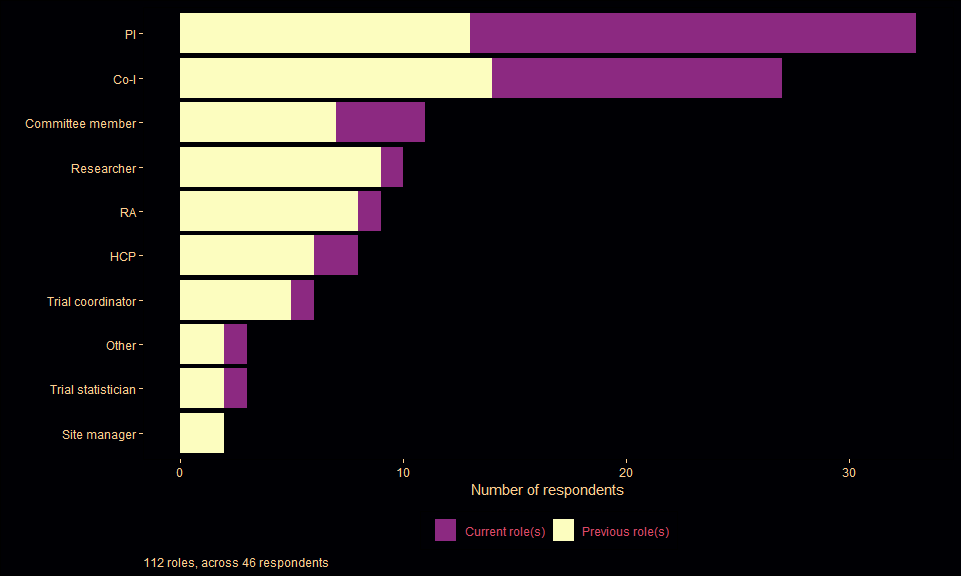<!-- -->

#### Free text


```
## [1] "Database manager; PhD student; We submitted a proposal to get funding for a childhood obesity trial"
```

## (Q10) Methods for identifying outcomes 

#### Figure: Methods for identifying outcomes as reported across all respondents

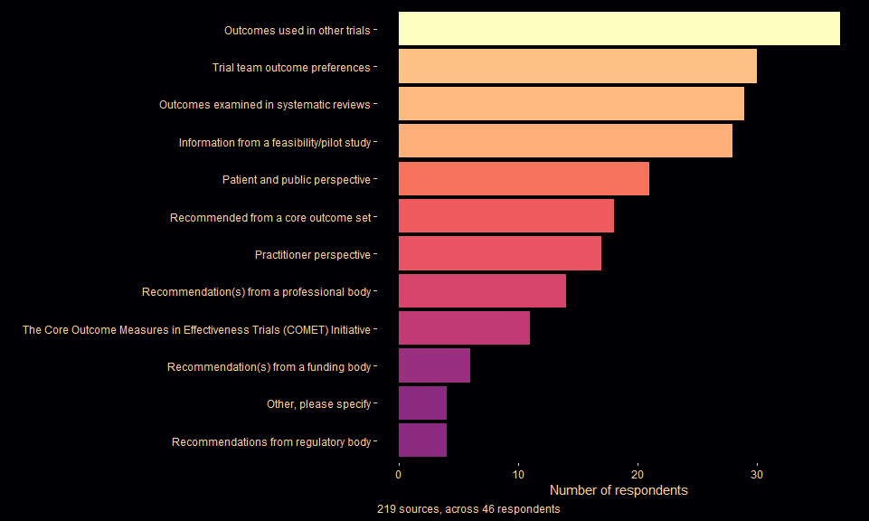<!-- -->

#### Free text


```
## [1] "WHO ICF Core Outcome Sets; Innovative ideas from teams; Outcomes come from previous trials (under this body of work) - based on the protocol of this trial, it is possible to understand what the outcomes would come from but I couldn't identify them off the top of my head.; Causal logic model"
```

## (Q11 & 12) Familiarity with core outcome sets 

Among the 46 respondents, 32 indicated they had heard of, or were familiar with, core outcome sets prior to taking the survey. 

#### Figure: Sources of previous exposure to core outcome sets

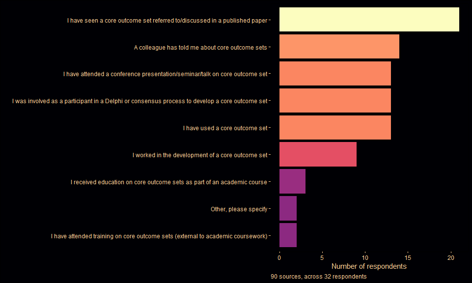<!-- -->

Note: I don't see an actual open text variable associated with this set of responses. 

## (Q13) Familarity with existing core outcomes sets for childhood obesity trials 

#### Table: Familarity with existing core outcomes sets for childhood obesity trials


```{=html}
<div id="gvymkqxivn" style="padding-left:0px;padding-right:0px;padding-top:10px;padding-bottom:10px;overflow-x:auto;overflow-y:auto;width:auto;height:auto;">
<style>#gvymkqxivn table {
  font-family: system-ui, 'Segoe UI', Roboto, Helvetica, Arial, sans-serif, 'Apple Color Emoji', 'Segoe UI Emoji', 'Segoe UI Symbol', 'Noto Color Emoji';
  -webkit-font-smoothing: antialiased;
  -moz-osx-font-smoothing: grayscale;
}

#gvymkqxivn thead, #gvymkqxivn tbody, #gvymkqxivn tfoot, #gvymkqxivn tr, #gvymkqxivn td, #gvymkqxivn th {
  border-style: none;
}

#gvymkqxivn p {
  margin: 0;
  padding: 0;
}

#gvymkqxivn .gt_table {
  display: table;
  border-collapse: collapse;
  line-height: normal;
  margin-left: auto;
  margin-right: auto;
  color: #333333;
  font-size: 16px;
  font-weight: normal;
  font-style: normal;
  background-color: #FFFFFF;
  width: auto;
  border-top-style: solid;
  border-top-width: 2px;
  border-top-color: #A8A8A8;
  border-right-style: none;
  border-right-width: 2px;
  border-right-color: #D3D3D3;
  border-bottom-style: solid;
  border-bottom-width: 2px;
  border-bottom-color: #A8A8A8;
  border-left-style: none;
  border-left-width: 2px;
  border-left-color: #D3D3D3;
}

#gvymkqxivn .gt_caption {
  padding-top: 4px;
  padding-bottom: 4px;
}

#gvymkqxivn .gt_title {
  color: #333333;
  font-size: 125%;
  font-weight: initial;
  padding-top: 4px;
  padding-bottom: 4px;
  padding-left: 5px;
  padding-right: 5px;
  border-bottom-color: #FFFFFF;
  border-bottom-width: 0;
}

#gvymkqxivn .gt_subtitle {
  color: #333333;
  font-size: 85%;
  font-weight: initial;
  padding-top: 3px;
  padding-bottom: 5px;
  padding-left: 5px;
  padding-right: 5px;
  border-top-color: #FFFFFF;
  border-top-width: 0;
}

#gvymkqxivn .gt_heading {
  background-color: #FFFFFF;
  text-align: center;
  border-bottom-color: #FFFFFF;
  border-left-style: none;
  border-left-width: 1px;
  border-left-color: #D3D3D3;
  border-right-style: none;
  border-right-width: 1px;
  border-right-color: #D3D3D3;
}

#gvymkqxivn .gt_bottom_border {
  border-bottom-style: solid;
  border-bottom-width: 2px;
  border-bottom-color: #D3D3D3;
}

#gvymkqxivn .gt_col_headings {
  border-top-style: solid;
  border-top-width: 2px;
  border-top-color: #D3D3D3;
  border-bottom-style: solid;
  border-bottom-width: 2px;
  border-bottom-color: #D3D3D3;
  border-left-style: none;
  border-left-width: 1px;
  border-left-color: #D3D3D3;
  border-right-style: none;
  border-right-width: 1px;
  border-right-color: #D3D3D3;
}

#gvymkqxivn .gt_col_heading {
  color: #333333;
  background-color: #FFFFFF;
  font-size: 100%;
  font-weight: normal;
  text-transform: inherit;
  border-left-style: none;
  border-left-width: 1px;
  border-left-color: #D3D3D3;
  border-right-style: none;
  border-right-width: 1px;
  border-right-color: #D3D3D3;
  vertical-align: bottom;
  padding-top: 5px;
  padding-bottom: 6px;
  padding-left: 5px;
  padding-right: 5px;
  overflow-x: hidden;
}

#gvymkqxivn .gt_column_spanner_outer {
  color: #333333;
  background-color: #FFFFFF;
  font-size: 100%;
  font-weight: normal;
  text-transform: inherit;
  padding-top: 0;
  padding-bottom: 0;
  padding-left: 4px;
  padding-right: 4px;
}

#gvymkqxivn .gt_column_spanner_outer:first-child {
  padding-left: 0;
}

#gvymkqxivn .gt_column_spanner_outer:last-child {
  padding-right: 0;
}

#gvymkqxivn .gt_column_spanner {
  border-bottom-style: solid;
  border-bottom-width: 2px;
  border-bottom-color: #D3D3D3;
  vertical-align: bottom;
  padding-top: 5px;
  padding-bottom: 5px;
  overflow-x: hidden;
  display: inline-block;
  width: 100%;
}

#gvymkqxivn .gt_spanner_row {
  border-bottom-style: hidden;
}

#gvymkqxivn .gt_group_heading {
  padding-top: 8px;
  padding-bottom: 8px;
  padding-left: 5px;
  padding-right: 5px;
  color: #333333;
  background-color: #FFFFFF;
  font-size: 100%;
  font-weight: initial;
  text-transform: inherit;
  border-top-style: solid;
  border-top-width: 2px;
  border-top-color: #D3D3D3;
  border-bottom-style: solid;
  border-bottom-width: 2px;
  border-bottom-color: #D3D3D3;
  border-left-style: none;
  border-left-width: 1px;
  border-left-color: #D3D3D3;
  border-right-style: none;
  border-right-width: 1px;
  border-right-color: #D3D3D3;
  vertical-align: middle;
  text-align: left;
}

#gvymkqxivn .gt_empty_group_heading {
  padding: 0.5px;
  color: #333333;
  background-color: #FFFFFF;
  font-size: 100%;
  font-weight: initial;
  border-top-style: solid;
  border-top-width: 2px;
  border-top-color: #D3D3D3;
  border-bottom-style: solid;
  border-bottom-width: 2px;
  border-bottom-color: #D3D3D3;
  vertical-align: middle;
}

#gvymkqxivn .gt_from_md > :first-child {
  margin-top: 0;
}

#gvymkqxivn .gt_from_md > :last-child {
  margin-bottom: 0;
}

#gvymkqxivn .gt_row {
  padding-top: 8px;
  padding-bottom: 8px;
  padding-left: 5px;
  padding-right: 5px;
  margin: 10px;
  border-top-style: solid;
  border-top-width: 1px;
  border-top-color: #D3D3D3;
  border-left-style: none;
  border-left-width: 1px;
  border-left-color: #D3D3D3;
  border-right-style: none;
  border-right-width: 1px;
  border-right-color: #D3D3D3;
  vertical-align: middle;
  overflow-x: hidden;
}

#gvymkqxivn .gt_stub {
  color: #333333;
  background-color: #FFFFFF;
  font-size: 100%;
  font-weight: initial;
  text-transform: inherit;
  border-right-style: solid;
  border-right-width: 2px;
  border-right-color: #D3D3D3;
  padding-left: 5px;
  padding-right: 5px;
}

#gvymkqxivn .gt_stub_row_group {
  color: #333333;
  background-color: #FFFFFF;
  font-size: 100%;
  font-weight: initial;
  text-transform: inherit;
  border-right-style: solid;
  border-right-width: 2px;
  border-right-color: #D3D3D3;
  padding-left: 5px;
  padding-right: 5px;
  vertical-align: top;
}

#gvymkqxivn .gt_row_group_first td {
  border-top-width: 2px;
}

#gvymkqxivn .gt_row_group_first th {
  border-top-width: 2px;
}

#gvymkqxivn .gt_summary_row {
  color: #333333;
  background-color: #FFFFFF;
  text-transform: inherit;
  padding-top: 8px;
  padding-bottom: 8px;
  padding-left: 5px;
  padding-right: 5px;
}

#gvymkqxivn .gt_first_summary_row {
  border-top-style: solid;
  border-top-color: #D3D3D3;
}

#gvymkqxivn .gt_first_summary_row.thick {
  border-top-width: 2px;
}

#gvymkqxivn .gt_last_summary_row {
  padding-top: 8px;
  padding-bottom: 8px;
  padding-left: 5px;
  padding-right: 5px;
  border-bottom-style: solid;
  border-bottom-width: 2px;
  border-bottom-color: #D3D3D3;
}

#gvymkqxivn .gt_grand_summary_row {
  color: #333333;
  background-color: #FFFFFF;
  text-transform: inherit;
  padding-top: 8px;
  padding-bottom: 8px;
  padding-left: 5px;
  padding-right: 5px;
}

#gvymkqxivn .gt_first_grand_summary_row {
  padding-top: 8px;
  padding-bottom: 8px;
  padding-left: 5px;
  padding-right: 5px;
  border-top-style: double;
  border-top-width: 6px;
  border-top-color: #D3D3D3;
}

#gvymkqxivn .gt_last_grand_summary_row_top {
  padding-top: 8px;
  padding-bottom: 8px;
  padding-left: 5px;
  padding-right: 5px;
  border-bottom-style: double;
  border-bottom-width: 6px;
  border-bottom-color: #D3D3D3;
}

#gvymkqxivn .gt_striped {
  background-color: rgba(128, 128, 128, 0.05);
}

#gvymkqxivn .gt_table_body {
  border-top-style: solid;
  border-top-width: 2px;
  border-top-color: #D3D3D3;
  border-bottom-style: solid;
  border-bottom-width: 2px;
  border-bottom-color: #D3D3D3;
}

#gvymkqxivn .gt_footnotes {
  color: #333333;
  background-color: #FFFFFF;
  border-bottom-style: none;
  border-bottom-width: 2px;
  border-bottom-color: #D3D3D3;
  border-left-style: none;
  border-left-width: 2px;
  border-left-color: #D3D3D3;
  border-right-style: none;
  border-right-width: 2px;
  border-right-color: #D3D3D3;
}

#gvymkqxivn .gt_footnote {
  margin: 0px;
  font-size: 90%;
  padding-top: 4px;
  padding-bottom: 4px;
  padding-left: 5px;
  padding-right: 5px;
}

#gvymkqxivn .gt_sourcenotes {
  color: #333333;
  background-color: #FFFFFF;
  border-bottom-style: none;
  border-bottom-width: 2px;
  border-bottom-color: #D3D3D3;
  border-left-style: none;
  border-left-width: 2px;
  border-left-color: #D3D3D3;
  border-right-style: none;
  border-right-width: 2px;
  border-right-color: #D3D3D3;
}

#gvymkqxivn .gt_sourcenote {
  font-size: 90%;
  padding-top: 4px;
  padding-bottom: 4px;
  padding-left: 5px;
  padding-right: 5px;
}

#gvymkqxivn .gt_left {
  text-align: left;
}

#gvymkqxivn .gt_center {
  text-align: center;
}

#gvymkqxivn .gt_right {
  text-align: right;
  font-variant-numeric: tabular-nums;
}

#gvymkqxivn .gt_font_normal {
  font-weight: normal;
}

#gvymkqxivn .gt_font_bold {
  font-weight: bold;
}

#gvymkqxivn .gt_font_italic {
  font-style: italic;
}

#gvymkqxivn .gt_super {
  font-size: 65%;
}

#gvymkqxivn .gt_footnote_marks {
  font-size: 75%;
  vertical-align: 0.4em;
  position: initial;
}

#gvymkqxivn .gt_asterisk {
  font-size: 100%;
  vertical-align: 0;
}

#gvymkqxivn .gt_indent_1 {
  text-indent: 5px;
}

#gvymkqxivn .gt_indent_2 {
  text-indent: 10px;
}

#gvymkqxivn .gt_indent_3 {
  text-indent: 15px;
}

#gvymkqxivn .gt_indent_4 {
  text-indent: 20px;
}

#gvymkqxivn .gt_indent_5 {
  text-indent: 25px;
}

#gvymkqxivn .katex-display {
  display: inline-flex !important;
  margin-bottom: 0.75em !important;
}

#gvymkqxivn div.Reactable > div.rt-table > div.rt-thead > div.rt-tr.rt-tr-group-header > div.rt-th-group:after {
  height: 0px !important;
}
</style>
<table class="gt_table" data-quarto-disable-processing="false" data-quarto-bootstrap="false">
  <thead>
    <tr class="gt_col_headings">
      <th class="gt_col_heading gt_columns_bottom_border gt_left" rowspan="1" colspan="1" scope="col" id="label"><span class='gt_from_md'><strong>Characteristic</strong></span></th>
      <th class="gt_col_heading gt_columns_bottom_border gt_center" rowspan="1" colspan="1" scope="col" id="stat_0"><span class='gt_from_md'><strong>N = 46</strong></span><span class="gt_footnote_marks" style="white-space:nowrap;font-style:italic;font-weight:normal;line-height:0;"><sup>1</sup></span></th>
    </tr>
  </thead>
  <tbody class="gt_table_body">
    <tr><td headers="label" class="gt_row gt_left">Are you familiar with these core outcome sets?</td>
<td headers="stat_0" class="gt_row gt_center"><br /></td></tr>
    <tr><td headers="label" class="gt_row gt_left">    No, I am not familiar with either core outcome set</td>
<td headers="stat_0" class="gt_row gt_center">5/31 (16%)</td></tr>
    <tr><td headers="label" class="gt_row gt_left">    Yes, I am familiar with both core outcome sets</td>
<td headers="stat_0" class="gt_row gt_center">20/31 (65%)</td></tr>
    <tr><td headers="label" class="gt_row gt_left">    Yes, I am familiar with the EPOCH core outcome set for obesity prevention up to 5 years only</td>
<td headers="stat_0" class="gt_row gt_center">6/31 (19%)</td></tr>
    <tr><td headers="label" class="gt_row gt_left">    Missing values</td>
<td headers="stat_0" class="gt_row gt_center">15</td></tr>
  </tbody>
  
  <tfoot class="gt_footnotes">
    <tr>
      <td class="gt_footnote" colspan="2"><span class="gt_footnote_marks" style="white-space:nowrap;font-style:italic;font-weight:normal;line-height:0;"><sup>1</sup></span> <span class='gt_from_md'>n/N Non-missing (%)</span></td>
    </tr>
  </tfoot>
</table>
</div>
```

## (Q14) Sources of familiarity with existing core outcomes sets for childhood obesity 

#### Figure: Sources of previous exposure to core outcome sets

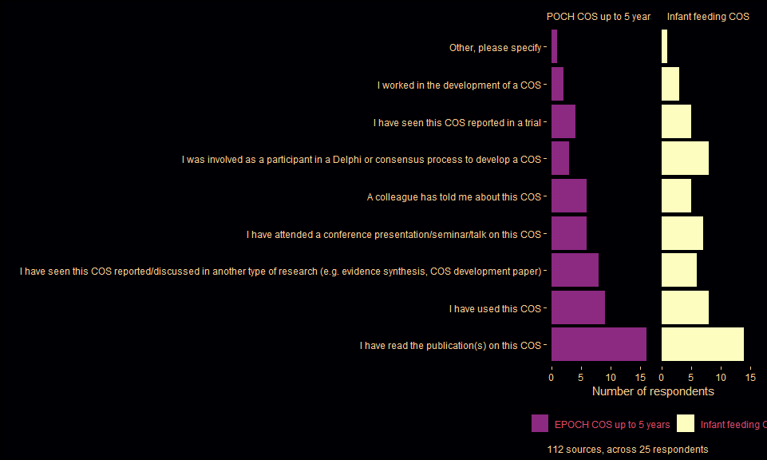<!-- -->


```{=html}
<div id="eopotqydyd" style="padding-left:0px;padding-right:0px;padding-top:10px;padding-bottom:10px;overflow-x:auto;overflow-y:auto;width:auto;height:auto;">
<style>#eopotqydyd table {
  font-family: system-ui, 'Segoe UI', Roboto, Helvetica, Arial, sans-serif, 'Apple Color Emoji', 'Segoe UI Emoji', 'Segoe UI Symbol', 'Noto Color Emoji';
  -webkit-font-smoothing: antialiased;
  -moz-osx-font-smoothing: grayscale;
}

#eopotqydyd thead, #eopotqydyd tbody, #eopotqydyd tfoot, #eopotqydyd tr, #eopotqydyd td, #eopotqydyd th {
  border-style: none;
}

#eopotqydyd p {
  margin: 0;
  padding: 0;
}

#eopotqydyd .gt_table {
  display: table;
  border-collapse: collapse;
  line-height: normal;
  margin-left: auto;
  margin-right: auto;
  color: #333333;
  font-size: 16px;
  font-weight: normal;
  font-style: normal;
  background-color: #FFFFFF;
  width: auto;
  border-top-style: solid;
  border-top-width: 2px;
  border-top-color: #A8A8A8;
  border-right-style: none;
  border-right-width: 2px;
  border-right-color: #D3D3D3;
  border-bottom-style: solid;
  border-bottom-width: 2px;
  border-bottom-color: #A8A8A8;
  border-left-style: none;
  border-left-width: 2px;
  border-left-color: #D3D3D3;
}

#eopotqydyd .gt_caption {
  padding-top: 4px;
  padding-bottom: 4px;
}

#eopotqydyd .gt_title {
  color: #333333;
  font-size: 125%;
  font-weight: initial;
  padding-top: 4px;
  padding-bottom: 4px;
  padding-left: 5px;
  padding-right: 5px;
  border-bottom-color: #FFFFFF;
  border-bottom-width: 0;
}

#eopotqydyd .gt_subtitle {
  color: #333333;
  font-size: 85%;
  font-weight: initial;
  padding-top: 3px;
  padding-bottom: 5px;
  padding-left: 5px;
  padding-right: 5px;
  border-top-color: #FFFFFF;
  border-top-width: 0;
}

#eopotqydyd .gt_heading {
  background-color: #FFFFFF;
  text-align: center;
  border-bottom-color: #FFFFFF;
  border-left-style: none;
  border-left-width: 1px;
  border-left-color: #D3D3D3;
  border-right-style: none;
  border-right-width: 1px;
  border-right-color: #D3D3D3;
}

#eopotqydyd .gt_bottom_border {
  border-bottom-style: solid;
  border-bottom-width: 2px;
  border-bottom-color: #D3D3D3;
}

#eopotqydyd .gt_col_headings {
  border-top-style: solid;
  border-top-width: 2px;
  border-top-color: #D3D3D3;
  border-bottom-style: solid;
  border-bottom-width: 2px;
  border-bottom-color: #D3D3D3;
  border-left-style: none;
  border-left-width: 1px;
  border-left-color: #D3D3D3;
  border-right-style: none;
  border-right-width: 1px;
  border-right-color: #D3D3D3;
}

#eopotqydyd .gt_col_heading {
  color: #333333;
  background-color: #FFFFFF;
  font-size: 100%;
  font-weight: normal;
  text-transform: inherit;
  border-left-style: none;
  border-left-width: 1px;
  border-left-color: #D3D3D3;
  border-right-style: none;
  border-right-width: 1px;
  border-right-color: #D3D3D3;
  vertical-align: bottom;
  padding-top: 5px;
  padding-bottom: 6px;
  padding-left: 5px;
  padding-right: 5px;
  overflow-x: hidden;
}

#eopotqydyd .gt_column_spanner_outer {
  color: #333333;
  background-color: #FFFFFF;
  font-size: 100%;
  font-weight: normal;
  text-transform: inherit;
  padding-top: 0;
  padding-bottom: 0;
  padding-left: 4px;
  padding-right: 4px;
}

#eopotqydyd .gt_column_spanner_outer:first-child {
  padding-left: 0;
}

#eopotqydyd .gt_column_spanner_outer:last-child {
  padding-right: 0;
}

#eopotqydyd .gt_column_spanner {
  border-bottom-style: solid;
  border-bottom-width: 2px;
  border-bottom-color: #D3D3D3;
  vertical-align: bottom;
  padding-top: 5px;
  padding-bottom: 5px;
  overflow-x: hidden;
  display: inline-block;
  width: 100%;
}

#eopotqydyd .gt_spanner_row {
  border-bottom-style: hidden;
}

#eopotqydyd .gt_group_heading {
  padding-top: 8px;
  padding-bottom: 8px;
  padding-left: 5px;
  padding-right: 5px;
  color: #333333;
  background-color: #FFFFFF;
  font-size: 100%;
  font-weight: initial;
  text-transform: inherit;
  border-top-style: solid;
  border-top-width: 2px;
  border-top-color: #D3D3D3;
  border-bottom-style: solid;
  border-bottom-width: 2px;
  border-bottom-color: #D3D3D3;
  border-left-style: none;
  border-left-width: 1px;
  border-left-color: #D3D3D3;
  border-right-style: none;
  border-right-width: 1px;
  border-right-color: #D3D3D3;
  vertical-align: middle;
  text-align: left;
}

#eopotqydyd .gt_empty_group_heading {
  padding: 0.5px;
  color: #333333;
  background-color: #FFFFFF;
  font-size: 100%;
  font-weight: initial;
  border-top-style: solid;
  border-top-width: 2px;
  border-top-color: #D3D3D3;
  border-bottom-style: solid;
  border-bottom-width: 2px;
  border-bottom-color: #D3D3D3;
  vertical-align: middle;
}

#eopotqydyd .gt_from_md > :first-child {
  margin-top: 0;
}

#eopotqydyd .gt_from_md > :last-child {
  margin-bottom: 0;
}

#eopotqydyd .gt_row {
  padding-top: 8px;
  padding-bottom: 8px;
  padding-left: 5px;
  padding-right: 5px;
  margin: 10px;
  border-top-style: solid;
  border-top-width: 1px;
  border-top-color: #D3D3D3;
  border-left-style: none;
  border-left-width: 1px;
  border-left-color: #D3D3D3;
  border-right-style: none;
  border-right-width: 1px;
  border-right-color: #D3D3D3;
  vertical-align: middle;
  overflow-x: hidden;
}

#eopotqydyd .gt_stub {
  color: #333333;
  background-color: #FFFFFF;
  font-size: 100%;
  font-weight: initial;
  text-transform: inherit;
  border-right-style: solid;
  border-right-width: 2px;
  border-right-color: #D3D3D3;
  padding-left: 5px;
  padding-right: 5px;
}

#eopotqydyd .gt_stub_row_group {
  color: #333333;
  background-color: #FFFFFF;
  font-size: 100%;
  font-weight: initial;
  text-transform: inherit;
  border-right-style: solid;
  border-right-width: 2px;
  border-right-color: #D3D3D3;
  padding-left: 5px;
  padding-right: 5px;
  vertical-align: top;
}

#eopotqydyd .gt_row_group_first td {
  border-top-width: 2px;
}

#eopotqydyd .gt_row_group_first th {
  border-top-width: 2px;
}

#eopotqydyd .gt_summary_row {
  color: #333333;
  background-color: #FFFFFF;
  text-transform: inherit;
  padding-top: 8px;
  padding-bottom: 8px;
  padding-left: 5px;
  padding-right: 5px;
}

#eopotqydyd .gt_first_summary_row {
  border-top-style: solid;
  border-top-color: #D3D3D3;
}

#eopotqydyd .gt_first_summary_row.thick {
  border-top-width: 2px;
}

#eopotqydyd .gt_last_summary_row {
  padding-top: 8px;
  padding-bottom: 8px;
  padding-left: 5px;
  padding-right: 5px;
  border-bottom-style: solid;
  border-bottom-width: 2px;
  border-bottom-color: #D3D3D3;
}

#eopotqydyd .gt_grand_summary_row {
  color: #333333;
  background-color: #FFFFFF;
  text-transform: inherit;
  padding-top: 8px;
  padding-bottom: 8px;
  padding-left: 5px;
  padding-right: 5px;
}

#eopotqydyd .gt_first_grand_summary_row {
  padding-top: 8px;
  padding-bottom: 8px;
  padding-left: 5px;
  padding-right: 5px;
  border-top-style: double;
  border-top-width: 6px;
  border-top-color: #D3D3D3;
}

#eopotqydyd .gt_last_grand_summary_row_top {
  padding-top: 8px;
  padding-bottom: 8px;
  padding-left: 5px;
  padding-right: 5px;
  border-bottom-style: double;
  border-bottom-width: 6px;
  border-bottom-color: #D3D3D3;
}

#eopotqydyd .gt_striped {
  background-color: rgba(128, 128, 128, 0.05);
}

#eopotqydyd .gt_table_body {
  border-top-style: solid;
  border-top-width: 2px;
  border-top-color: #D3D3D3;
  border-bottom-style: solid;
  border-bottom-width: 2px;
  border-bottom-color: #D3D3D3;
}

#eopotqydyd .gt_footnotes {
  color: #333333;
  background-color: #FFFFFF;
  border-bottom-style: none;
  border-bottom-width: 2px;
  border-bottom-color: #D3D3D3;
  border-left-style: none;
  border-left-width: 2px;
  border-left-color: #D3D3D3;
  border-right-style: none;
  border-right-width: 2px;
  border-right-color: #D3D3D3;
}

#eopotqydyd .gt_footnote {
  margin: 0px;
  font-size: 90%;
  padding-top: 4px;
  padding-bottom: 4px;
  padding-left: 5px;
  padding-right: 5px;
}

#eopotqydyd .gt_sourcenotes {
  color: #333333;
  background-color: #FFFFFF;
  border-bottom-style: none;
  border-bottom-width: 2px;
  border-bottom-color: #D3D3D3;
  border-left-style: none;
  border-left-width: 2px;
  border-left-color: #D3D3D3;
  border-right-style: none;
  border-right-width: 2px;
  border-right-color: #D3D3D3;
}

#eopotqydyd .gt_sourcenote {
  font-size: 90%;
  padding-top: 4px;
  padding-bottom: 4px;
  padding-left: 5px;
  padding-right: 5px;
}

#eopotqydyd .gt_left {
  text-align: left;
}

#eopotqydyd .gt_center {
  text-align: center;
}

#eopotqydyd .gt_right {
  text-align: right;
  font-variant-numeric: tabular-nums;
}

#eopotqydyd .gt_font_normal {
  font-weight: normal;
}

#eopotqydyd .gt_font_bold {
  font-weight: bold;
}

#eopotqydyd .gt_font_italic {
  font-style: italic;
}

#eopotqydyd .gt_super {
  font-size: 65%;
}

#eopotqydyd .gt_footnote_marks {
  font-size: 75%;
  vertical-align: 0.4em;
  position: initial;
}

#eopotqydyd .gt_asterisk {
  font-size: 100%;
  vertical-align: 0;
}

#eopotqydyd .gt_indent_1 {
  text-indent: 5px;
}

#eopotqydyd .gt_indent_2 {
  text-indent: 10px;
}

#eopotqydyd .gt_indent_3 {
  text-indent: 15px;
}

#eopotqydyd .gt_indent_4 {
  text-indent: 20px;
}

#eopotqydyd .gt_indent_5 {
  text-indent: 25px;
}

#eopotqydyd .katex-display {
  display: inline-flex !important;
  margin-bottom: 0.75em !important;
}

#eopotqydyd div.Reactable > div.rt-table > div.rt-thead > div.rt-tr.rt-tr-group-header > div.rt-th-group:after {
  height: 0px !important;
}
</style>
<table class="gt_table" data-quarto-disable-processing="false" data-quarto-bootstrap="false">
  <thead>
    <tr class="gt_col_headings">
      <th class="gt_col_heading gt_columns_bottom_border gt_left" rowspan="1" colspan="1" scope="col" id="label"><span class='gt_from_md'><strong>Characteristic</strong></span></th>
      <th class="gt_col_heading gt_columns_bottom_border gt_center" rowspan="1" colspan="1" scope="col" id="n"><span class='gt_from_md'><strong>N</strong></span><span class="gt_footnote_marks" style="white-space:nowrap;font-style:italic;font-weight:normal;line-height:0;"><sup>1</sup></span></th>
      <th class="gt_col_heading gt_columns_bottom_border gt_center" rowspan="1" colspan="1" scope="col" id="stat_1"><span class='gt_from_md'><strong>EPOCH COS up to 5 years</strong><br />
N = 55</span><span class="gt_footnote_marks" style="white-space:nowrap;font-style:italic;font-weight:normal;line-height:0;"><sup>2</sup></span></th>
      <th class="gt_col_heading gt_columns_bottom_border gt_center" rowspan="1" colspan="1" scope="col" id="stat_2"><span class='gt_from_md'><strong>Infant feeding COS</strong><br />
N = 57</span><span class="gt_footnote_marks" style="white-space:nowrap;font-style:italic;font-weight:normal;line-height:0;"><sup>2</sup></span></th>
    </tr>
  </thead>
  <tbody class="gt_table_body">
    <tr><td headers="label" class="gt_row gt_left">Source</td>
<td headers="n" class="gt_row gt_center">112</td>
<td headers="stat_1" class="gt_row gt_center"><br /></td>
<td headers="stat_2" class="gt_row gt_center"><br /></td></tr>
    <tr><td headers="label" class="gt_row gt_left">    I have read the publication(s) on this COS</td>
<td headers="n" class="gt_row gt_center"><br /></td>
<td headers="stat_1" class="gt_row gt_center">16/55 (29%)</td>
<td headers="stat_2" class="gt_row gt_center">14/57 (25%)</td></tr>
    <tr><td headers="label" class="gt_row gt_left">    I have used this COS</td>
<td headers="n" class="gt_row gt_center"><br /></td>
<td headers="stat_1" class="gt_row gt_center">9/55 (16%)</td>
<td headers="stat_2" class="gt_row gt_center">8/57 (14%)</td></tr>
    <tr><td headers="label" class="gt_row gt_left">    I have seen this COS reported/discussed in another type of research (e.g. evidence synthesis, COS development paper)</td>
<td headers="n" class="gt_row gt_center"><br /></td>
<td headers="stat_1" class="gt_row gt_center">8/55 (15%)</td>
<td headers="stat_2" class="gt_row gt_center">6/57 (11%)</td></tr>
    <tr><td headers="label" class="gt_row gt_left">    I have attended a conference presentation/seminar/talk on this COS</td>
<td headers="n" class="gt_row gt_center"><br /></td>
<td headers="stat_1" class="gt_row gt_center">6/55 (11%)</td>
<td headers="stat_2" class="gt_row gt_center">7/57 (12%)</td></tr>
    <tr><td headers="label" class="gt_row gt_left">    A colleague has told me about this COS</td>
<td headers="n" class="gt_row gt_center"><br /></td>
<td headers="stat_1" class="gt_row gt_center">6/55 (11%)</td>
<td headers="stat_2" class="gt_row gt_center">5/57 (8.8%)</td></tr>
    <tr><td headers="label" class="gt_row gt_left">    I was involved as a participant in a Delphi or consensus process to develop a COS</td>
<td headers="n" class="gt_row gt_center"><br /></td>
<td headers="stat_1" class="gt_row gt_center">3/55 (5.5%)</td>
<td headers="stat_2" class="gt_row gt_center">8/57 (14%)</td></tr>
    <tr><td headers="label" class="gt_row gt_left">    I have seen this COS reported in a trial</td>
<td headers="n" class="gt_row gt_center"><br /></td>
<td headers="stat_1" class="gt_row gt_center">4/55 (7.3%)</td>
<td headers="stat_2" class="gt_row gt_center">5/57 (8.8%)</td></tr>
    <tr><td headers="label" class="gt_row gt_left">    I worked in the development of a COS</td>
<td headers="n" class="gt_row gt_center"><br /></td>
<td headers="stat_1" class="gt_row gt_center">2/55 (3.6%)</td>
<td headers="stat_2" class="gt_row gt_center">3/57 (5.3%)</td></tr>
    <tr><td headers="label" class="gt_row gt_left">    Other, please specify</td>
<td headers="n" class="gt_row gt_center"><br /></td>
<td headers="stat_1" class="gt_row gt_center">1/55 (1.8%)</td>
<td headers="stat_2" class="gt_row gt_center">1/57 (1.8%)</td></tr>
  </tbody>
  
  <tfoot class="gt_footnotes">
    <tr>
      <td class="gt_footnote" colspan="4"><span class="gt_footnote_marks" style="white-space:nowrap;font-style:italic;font-weight:normal;line-height:0;"><sup>1</sup></span> <span class='gt_from_md'>112 sources endorsed by 25 respondents</span></td>
    </tr>
    <tr>
      <td class="gt_footnote" colspan="4"><span class="gt_footnote_marks" style="white-space:nowrap;font-style:italic;font-weight:normal;line-height:0;"><sup>2</sup></span> <span class='gt_from_md'>n/N Non-missing (%)</span></td>
    </tr>
  </tfoot>
</table>
</div>
```

Note: No actual open text field for "other". 

## (Q15) Barriers to using childhood obesity prevention core outcome set(s) in a trial 

#### Figure: Barriers to using childhood obesity prevention core outcome set(s) in a trial

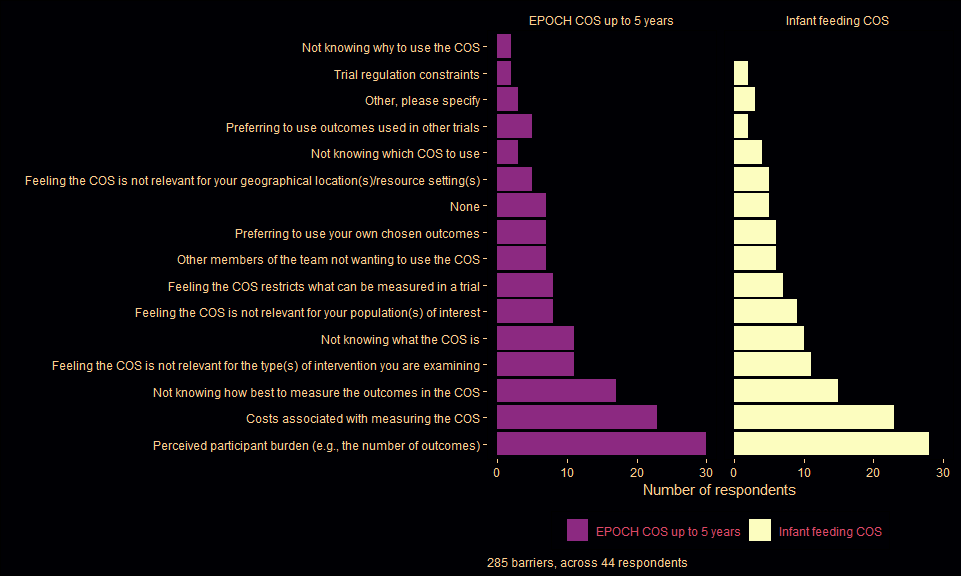<!-- -->


```{=html}
<div id="jtlezqsaqn" style="padding-left:0px;padding-right:0px;padding-top:10px;padding-bottom:10px;overflow-x:auto;overflow-y:auto;width:auto;height:auto;">
<style>#jtlezqsaqn table {
  font-family: system-ui, 'Segoe UI', Roboto, Helvetica, Arial, sans-serif, 'Apple Color Emoji', 'Segoe UI Emoji', 'Segoe UI Symbol', 'Noto Color Emoji';
  -webkit-font-smoothing: antialiased;
  -moz-osx-font-smoothing: grayscale;
}

#jtlezqsaqn thead, #jtlezqsaqn tbody, #jtlezqsaqn tfoot, #jtlezqsaqn tr, #jtlezqsaqn td, #jtlezqsaqn th {
  border-style: none;
}

#jtlezqsaqn p {
  margin: 0;
  padding: 0;
}

#jtlezqsaqn .gt_table {
  display: table;
  border-collapse: collapse;
  line-height: normal;
  margin-left: auto;
  margin-right: auto;
  color: #333333;
  font-size: 16px;
  font-weight: normal;
  font-style: normal;
  background-color: #FFFFFF;
  width: auto;
  border-top-style: solid;
  border-top-width: 2px;
  border-top-color: #A8A8A8;
  border-right-style: none;
  border-right-width: 2px;
  border-right-color: #D3D3D3;
  border-bottom-style: solid;
  border-bottom-width: 2px;
  border-bottom-color: #A8A8A8;
  border-left-style: none;
  border-left-width: 2px;
  border-left-color: #D3D3D3;
}

#jtlezqsaqn .gt_caption {
  padding-top: 4px;
  padding-bottom: 4px;
}

#jtlezqsaqn .gt_title {
  color: #333333;
  font-size: 125%;
  font-weight: initial;
  padding-top: 4px;
  padding-bottom: 4px;
  padding-left: 5px;
  padding-right: 5px;
  border-bottom-color: #FFFFFF;
  border-bottom-width: 0;
}

#jtlezqsaqn .gt_subtitle {
  color: #333333;
  font-size: 85%;
  font-weight: initial;
  padding-top: 3px;
  padding-bottom: 5px;
  padding-left: 5px;
  padding-right: 5px;
  border-top-color: #FFFFFF;
  border-top-width: 0;
}

#jtlezqsaqn .gt_heading {
  background-color: #FFFFFF;
  text-align: center;
  border-bottom-color: #FFFFFF;
  border-left-style: none;
  border-left-width: 1px;
  border-left-color: #D3D3D3;
  border-right-style: none;
  border-right-width: 1px;
  border-right-color: #D3D3D3;
}

#jtlezqsaqn .gt_bottom_border {
  border-bottom-style: solid;
  border-bottom-width: 2px;
  border-bottom-color: #D3D3D3;
}

#jtlezqsaqn .gt_col_headings {
  border-top-style: solid;
  border-top-width: 2px;
  border-top-color: #D3D3D3;
  border-bottom-style: solid;
  border-bottom-width: 2px;
  border-bottom-color: #D3D3D3;
  border-left-style: none;
  border-left-width: 1px;
  border-left-color: #D3D3D3;
  border-right-style: none;
  border-right-width: 1px;
  border-right-color: #D3D3D3;
}

#jtlezqsaqn .gt_col_heading {
  color: #333333;
  background-color: #FFFFFF;
  font-size: 100%;
  font-weight: normal;
  text-transform: inherit;
  border-left-style: none;
  border-left-width: 1px;
  border-left-color: #D3D3D3;
  border-right-style: none;
  border-right-width: 1px;
  border-right-color: #D3D3D3;
  vertical-align: bottom;
  padding-top: 5px;
  padding-bottom: 6px;
  padding-left: 5px;
  padding-right: 5px;
  overflow-x: hidden;
}

#jtlezqsaqn .gt_column_spanner_outer {
  color: #333333;
  background-color: #FFFFFF;
  font-size: 100%;
  font-weight: normal;
  text-transform: inherit;
  padding-top: 0;
  padding-bottom: 0;
  padding-left: 4px;
  padding-right: 4px;
}

#jtlezqsaqn .gt_column_spanner_outer:first-child {
  padding-left: 0;
}

#jtlezqsaqn .gt_column_spanner_outer:last-child {
  padding-right: 0;
}

#jtlezqsaqn .gt_column_spanner {
  border-bottom-style: solid;
  border-bottom-width: 2px;
  border-bottom-color: #D3D3D3;
  vertical-align: bottom;
  padding-top: 5px;
  padding-bottom: 5px;
  overflow-x: hidden;
  display: inline-block;
  width: 100%;
}

#jtlezqsaqn .gt_spanner_row {
  border-bottom-style: hidden;
}

#jtlezqsaqn .gt_group_heading {
  padding-top: 8px;
  padding-bottom: 8px;
  padding-left: 5px;
  padding-right: 5px;
  color: #333333;
  background-color: #FFFFFF;
  font-size: 100%;
  font-weight: initial;
  text-transform: inherit;
  border-top-style: solid;
  border-top-width: 2px;
  border-top-color: #D3D3D3;
  border-bottom-style: solid;
  border-bottom-width: 2px;
  border-bottom-color: #D3D3D3;
  border-left-style: none;
  border-left-width: 1px;
  border-left-color: #D3D3D3;
  border-right-style: none;
  border-right-width: 1px;
  border-right-color: #D3D3D3;
  vertical-align: middle;
  text-align: left;
}

#jtlezqsaqn .gt_empty_group_heading {
  padding: 0.5px;
  color: #333333;
  background-color: #FFFFFF;
  font-size: 100%;
  font-weight: initial;
  border-top-style: solid;
  border-top-width: 2px;
  border-top-color: #D3D3D3;
  border-bottom-style: solid;
  border-bottom-width: 2px;
  border-bottom-color: #D3D3D3;
  vertical-align: middle;
}

#jtlezqsaqn .gt_from_md > :first-child {
  margin-top: 0;
}

#jtlezqsaqn .gt_from_md > :last-child {
  margin-bottom: 0;
}

#jtlezqsaqn .gt_row {
  padding-top: 8px;
  padding-bottom: 8px;
  padding-left: 5px;
  padding-right: 5px;
  margin: 10px;
  border-top-style: solid;
  border-top-width: 1px;
  border-top-color: #D3D3D3;
  border-left-style: none;
  border-left-width: 1px;
  border-left-color: #D3D3D3;
  border-right-style: none;
  border-right-width: 1px;
  border-right-color: #D3D3D3;
  vertical-align: middle;
  overflow-x: hidden;
}

#jtlezqsaqn .gt_stub {
  color: #333333;
  background-color: #FFFFFF;
  font-size: 100%;
  font-weight: initial;
  text-transform: inherit;
  border-right-style: solid;
  border-right-width: 2px;
  border-right-color: #D3D3D3;
  padding-left: 5px;
  padding-right: 5px;
}

#jtlezqsaqn .gt_stub_row_group {
  color: #333333;
  background-color: #FFFFFF;
  font-size: 100%;
  font-weight: initial;
  text-transform: inherit;
  border-right-style: solid;
  border-right-width: 2px;
  border-right-color: #D3D3D3;
  padding-left: 5px;
  padding-right: 5px;
  vertical-align: top;
}

#jtlezqsaqn .gt_row_group_first td {
  border-top-width: 2px;
}

#jtlezqsaqn .gt_row_group_first th {
  border-top-width: 2px;
}

#jtlezqsaqn .gt_summary_row {
  color: #333333;
  background-color: #FFFFFF;
  text-transform: inherit;
  padding-top: 8px;
  padding-bottom: 8px;
  padding-left: 5px;
  padding-right: 5px;
}

#jtlezqsaqn .gt_first_summary_row {
  border-top-style: solid;
  border-top-color: #D3D3D3;
}

#jtlezqsaqn .gt_first_summary_row.thick {
  border-top-width: 2px;
}

#jtlezqsaqn .gt_last_summary_row {
  padding-top: 8px;
  padding-bottom: 8px;
  padding-left: 5px;
  padding-right: 5px;
  border-bottom-style: solid;
  border-bottom-width: 2px;
  border-bottom-color: #D3D3D3;
}

#jtlezqsaqn .gt_grand_summary_row {
  color: #333333;
  background-color: #FFFFFF;
  text-transform: inherit;
  padding-top: 8px;
  padding-bottom: 8px;
  padding-left: 5px;
  padding-right: 5px;
}

#jtlezqsaqn .gt_first_grand_summary_row {
  padding-top: 8px;
  padding-bottom: 8px;
  padding-left: 5px;
  padding-right: 5px;
  border-top-style: double;
  border-top-width: 6px;
  border-top-color: #D3D3D3;
}

#jtlezqsaqn .gt_last_grand_summary_row_top {
  padding-top: 8px;
  padding-bottom: 8px;
  padding-left: 5px;
  padding-right: 5px;
  border-bottom-style: double;
  border-bottom-width: 6px;
  border-bottom-color: #D3D3D3;
}

#jtlezqsaqn .gt_striped {
  background-color: rgba(128, 128, 128, 0.05);
}

#jtlezqsaqn .gt_table_body {
  border-top-style: solid;
  border-top-width: 2px;
  border-top-color: #D3D3D3;
  border-bottom-style: solid;
  border-bottom-width: 2px;
  border-bottom-color: #D3D3D3;
}

#jtlezqsaqn .gt_footnotes {
  color: #333333;
  background-color: #FFFFFF;
  border-bottom-style: none;
  border-bottom-width: 2px;
  border-bottom-color: #D3D3D3;
  border-left-style: none;
  border-left-width: 2px;
  border-left-color: #D3D3D3;
  border-right-style: none;
  border-right-width: 2px;
  border-right-color: #D3D3D3;
}

#jtlezqsaqn .gt_footnote {
  margin: 0px;
  font-size: 90%;
  padding-top: 4px;
  padding-bottom: 4px;
  padding-left: 5px;
  padding-right: 5px;
}

#jtlezqsaqn .gt_sourcenotes {
  color: #333333;
  background-color: #FFFFFF;
  border-bottom-style: none;
  border-bottom-width: 2px;
  border-bottom-color: #D3D3D3;
  border-left-style: none;
  border-left-width: 2px;
  border-left-color: #D3D3D3;
  border-right-style: none;
  border-right-width: 2px;
  border-right-color: #D3D3D3;
}

#jtlezqsaqn .gt_sourcenote {
  font-size: 90%;
  padding-top: 4px;
  padding-bottom: 4px;
  padding-left: 5px;
  padding-right: 5px;
}

#jtlezqsaqn .gt_left {
  text-align: left;
}

#jtlezqsaqn .gt_center {
  text-align: center;
}

#jtlezqsaqn .gt_right {
  text-align: right;
  font-variant-numeric: tabular-nums;
}

#jtlezqsaqn .gt_font_normal {
  font-weight: normal;
}

#jtlezqsaqn .gt_font_bold {
  font-weight: bold;
}

#jtlezqsaqn .gt_font_italic {
  font-style: italic;
}

#jtlezqsaqn .gt_super {
  font-size: 65%;
}

#jtlezqsaqn .gt_footnote_marks {
  font-size: 75%;
  vertical-align: 0.4em;
  position: initial;
}

#jtlezqsaqn .gt_asterisk {
  font-size: 100%;
  vertical-align: 0;
}

#jtlezqsaqn .gt_indent_1 {
  text-indent: 5px;
}

#jtlezqsaqn .gt_indent_2 {
  text-indent: 10px;
}

#jtlezqsaqn .gt_indent_3 {
  text-indent: 15px;
}

#jtlezqsaqn .gt_indent_4 {
  text-indent: 20px;
}

#jtlezqsaqn .gt_indent_5 {
  text-indent: 25px;
}

#jtlezqsaqn .katex-display {
  display: inline-flex !important;
  margin-bottom: 0.75em !important;
}

#jtlezqsaqn div.Reactable > div.rt-table > div.rt-thead > div.rt-tr.rt-tr-group-header > div.rt-th-group:after {
  height: 0px !important;
}
</style>
<table class="gt_table" data-quarto-disable-processing="false" data-quarto-bootstrap="false">
  <thead>
    <tr class="gt_col_headings">
      <th class="gt_col_heading gt_columns_bottom_border gt_left" rowspan="1" colspan="1" scope="col" id="label"><span class='gt_from_md'><strong>Characteristic</strong></span></th>
      <th class="gt_col_heading gt_columns_bottom_border gt_center" rowspan="1" colspan="1" scope="col" id="n"><span class='gt_from_md'><strong>N</strong></span><span class="gt_footnote_marks" style="white-space:nowrap;font-style:italic;font-weight:normal;line-height:0;"><sup>1</sup></span></th>
      <th class="gt_col_heading gt_columns_bottom_border gt_center" rowspan="1" colspan="1" scope="col" id="stat_1"><span class='gt_from_md'><strong>EPOCH COS up to 5 years</strong><br />
N = 149</span><span class="gt_footnote_marks" style="white-space:nowrap;font-style:italic;font-weight:normal;line-height:0;"><sup>2</sup></span></th>
      <th class="gt_col_heading gt_columns_bottom_border gt_center" rowspan="1" colspan="1" scope="col" id="stat_2"><span class='gt_from_md'><strong>Infant feeding COS</strong><br />
N = 136</span><span class="gt_footnote_marks" style="white-space:nowrap;font-style:italic;font-weight:normal;line-height:0;"><sup>2</sup></span></th>
    </tr>
  </thead>
  <tbody class="gt_table_body">
    <tr><td headers="label" class="gt_row gt_left">Barrier</td>
<td headers="n" class="gt_row gt_center">285</td>
<td headers="stat_1" class="gt_row gt_center"><br /></td>
<td headers="stat_2" class="gt_row gt_center"><br /></td></tr>
    <tr><td headers="label" class="gt_row gt_left">    Perceived participant burden (e.g., the number of outcomes)</td>
<td headers="n" class="gt_row gt_center"><br /></td>
<td headers="stat_1" class="gt_row gt_center">30/149 (20%)</td>
<td headers="stat_2" class="gt_row gt_center">28/136 (21%)</td></tr>
    <tr><td headers="label" class="gt_row gt_left">    Costs associated with measuring the COS</td>
<td headers="n" class="gt_row gt_center"><br /></td>
<td headers="stat_1" class="gt_row gt_center">23/149 (15%)</td>
<td headers="stat_2" class="gt_row gt_center">23/136 (17%)</td></tr>
    <tr><td headers="label" class="gt_row gt_left">    Not knowing how best to measure the outcomes in the COS</td>
<td headers="n" class="gt_row gt_center"><br /></td>
<td headers="stat_1" class="gt_row gt_center">17/149 (11%)</td>
<td headers="stat_2" class="gt_row gt_center">15/136 (11%)</td></tr>
    <tr><td headers="label" class="gt_row gt_left">    Feeling the COS is not relevant for the type(s) of intervention you are examining</td>
<td headers="n" class="gt_row gt_center"><br /></td>
<td headers="stat_1" class="gt_row gt_center">11/149 (7.4%)</td>
<td headers="stat_2" class="gt_row gt_center">11/136 (8.1%)</td></tr>
    <tr><td headers="label" class="gt_row gt_left">    Not knowing what the COS is</td>
<td headers="n" class="gt_row gt_center"><br /></td>
<td headers="stat_1" class="gt_row gt_center">11/149 (7.4%)</td>
<td headers="stat_2" class="gt_row gt_center">10/136 (7.4%)</td></tr>
    <tr><td headers="label" class="gt_row gt_left">    Feeling the COS is not relevant for your population(s) of interest</td>
<td headers="n" class="gt_row gt_center"><br /></td>
<td headers="stat_1" class="gt_row gt_center">8/149 (5.4%)</td>
<td headers="stat_2" class="gt_row gt_center">9/136 (6.6%)</td></tr>
    <tr><td headers="label" class="gt_row gt_left">    Feeling the COS restricts what can be measured in a trial</td>
<td headers="n" class="gt_row gt_center"><br /></td>
<td headers="stat_1" class="gt_row gt_center">8/149 (5.4%)</td>
<td headers="stat_2" class="gt_row gt_center">7/136 (5.1%)</td></tr>
    <tr><td headers="label" class="gt_row gt_left">    Other members of the team not wanting to use the COS</td>
<td headers="n" class="gt_row gt_center"><br /></td>
<td headers="stat_1" class="gt_row gt_center">7/149 (4.7%)</td>
<td headers="stat_2" class="gt_row gt_center">6/136 (4.4%)</td></tr>
    <tr><td headers="label" class="gt_row gt_left">    Preferring to use your own chosen outcomes</td>
<td headers="n" class="gt_row gt_center"><br /></td>
<td headers="stat_1" class="gt_row gt_center">7/149 (4.7%)</td>
<td headers="stat_2" class="gt_row gt_center">6/136 (4.4%)</td></tr>
    <tr><td headers="label" class="gt_row gt_left">    None</td>
<td headers="n" class="gt_row gt_center"><br /></td>
<td headers="stat_1" class="gt_row gt_center">7/149 (4.7%)</td>
<td headers="stat_2" class="gt_row gt_center">5/136 (3.7%)</td></tr>
    <tr><td headers="label" class="gt_row gt_left">    Feeling the COS is not relevant for your geographical location(s)/resource setting(s)</td>
<td headers="n" class="gt_row gt_center"><br /></td>
<td headers="stat_1" class="gt_row gt_center">5/149 (3.4%)</td>
<td headers="stat_2" class="gt_row gt_center">5/136 (3.7%)</td></tr>
    <tr><td headers="label" class="gt_row gt_left">    Not knowing which COS to use</td>
<td headers="n" class="gt_row gt_center"><br /></td>
<td headers="stat_1" class="gt_row gt_center">3/149 (2.0%)</td>
<td headers="stat_2" class="gt_row gt_center">4/136 (2.9%)</td></tr>
    <tr><td headers="label" class="gt_row gt_left">    Preferring to use outcomes used in other trials</td>
<td headers="n" class="gt_row gt_center"><br /></td>
<td headers="stat_1" class="gt_row gt_center">5/149 (3.4%)</td>
<td headers="stat_2" class="gt_row gt_center">2/136 (1.5%)</td></tr>
    <tr><td headers="label" class="gt_row gt_left">    Other, please specify</td>
<td headers="n" class="gt_row gt_center"><br /></td>
<td headers="stat_1" class="gt_row gt_center">3/149 (2.0%)</td>
<td headers="stat_2" class="gt_row gt_center">3/136 (2.2%)</td></tr>
    <tr><td headers="label" class="gt_row gt_left">    Trial regulation constraints</td>
<td headers="n" class="gt_row gt_center"><br /></td>
<td headers="stat_1" class="gt_row gt_center">2/149 (1.3%)</td>
<td headers="stat_2" class="gt_row gt_center">2/136 (1.5%)</td></tr>
    <tr><td headers="label" class="gt_row gt_left">    Not knowing why to use the COS</td>
<td headers="n" class="gt_row gt_center"><br /></td>
<td headers="stat_1" class="gt_row gt_center">2/149 (1.3%)</td>
<td headers="stat_2" class="gt_row gt_center">0/136 (0%)</td></tr>
  </tbody>
  
  <tfoot class="gt_footnotes">
    <tr>
      <td class="gt_footnote" colspan="4"><span class="gt_footnote_marks" style="white-space:nowrap;font-style:italic;font-weight:normal;line-height:0;"><sup>1</sup></span> <span class='gt_from_md'>285 sources endorsed by 44 respondents</span></td>
    </tr>
    <tr>
      <td class="gt_footnote" colspan="4"><span class="gt_footnote_marks" style="white-space:nowrap;font-style:italic;font-weight:normal;line-height:0;"><sup>2</sup></span> <span class='gt_from_md'>n/N Non-missing (%)</span></td>
    </tr>
  </tfoot>
</table>
</div>
```

#### Free text


```
## [1] "Self reported outcomes are unreliable andnot associated with long-term outcome. Physical activity is not associated with weight development in this age group. A large number of excellent studies have failed to affect long-term weight outcome. We need to identify new interventions and outcome parameters based on, maybe based on  \"life history theory\"; Too many outcomes, each trial needs to prioritise; Availability of instruments to measure the core outcome in my langage; number of outcomes and measurement; i am looking for a core outcome set for early child eating behaviours"
```

## (Q16) Faciliators to using childhood obesity prevention core outcome set(s) in a trial 

#### Figure: Faciliators to using childhood obesity prevention core outcome set(s) in a trial

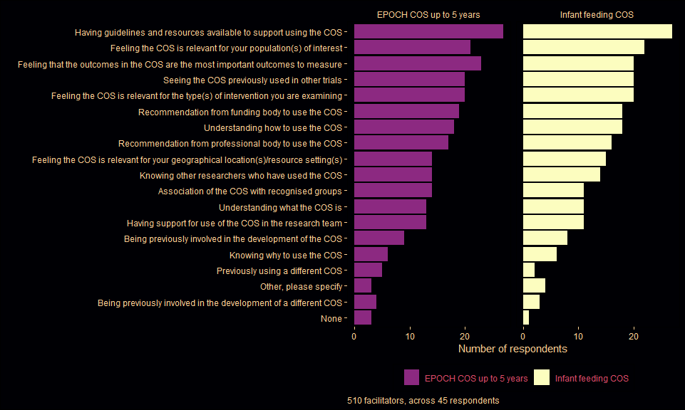<!-- -->


```{=html}
<div id="swqklpbfxt" style="padding-left:0px;padding-right:0px;padding-top:10px;padding-bottom:10px;overflow-x:auto;overflow-y:auto;width:auto;height:auto;">
<style>#swqklpbfxt table {
  font-family: system-ui, 'Segoe UI', Roboto, Helvetica, Arial, sans-serif, 'Apple Color Emoji', 'Segoe UI Emoji', 'Segoe UI Symbol', 'Noto Color Emoji';
  -webkit-font-smoothing: antialiased;
  -moz-osx-font-smoothing: grayscale;
}

#swqklpbfxt thead, #swqklpbfxt tbody, #swqklpbfxt tfoot, #swqklpbfxt tr, #swqklpbfxt td, #swqklpbfxt th {
  border-style: none;
}

#swqklpbfxt p {
  margin: 0;
  padding: 0;
}

#swqklpbfxt .gt_table {
  display: table;
  border-collapse: collapse;
  line-height: normal;
  margin-left: auto;
  margin-right: auto;
  color: #333333;
  font-size: 16px;
  font-weight: normal;
  font-style: normal;
  background-color: #FFFFFF;
  width: auto;
  border-top-style: solid;
  border-top-width: 2px;
  border-top-color: #A8A8A8;
  border-right-style: none;
  border-right-width: 2px;
  border-right-color: #D3D3D3;
  border-bottom-style: solid;
  border-bottom-width: 2px;
  border-bottom-color: #A8A8A8;
  border-left-style: none;
  border-left-width: 2px;
  border-left-color: #D3D3D3;
}

#swqklpbfxt .gt_caption {
  padding-top: 4px;
  padding-bottom: 4px;
}

#swqklpbfxt .gt_title {
  color: #333333;
  font-size: 125%;
  font-weight: initial;
  padding-top: 4px;
  padding-bottom: 4px;
  padding-left: 5px;
  padding-right: 5px;
  border-bottom-color: #FFFFFF;
  border-bottom-width: 0;
}

#swqklpbfxt .gt_subtitle {
  color: #333333;
  font-size: 85%;
  font-weight: initial;
  padding-top: 3px;
  padding-bottom: 5px;
  padding-left: 5px;
  padding-right: 5px;
  border-top-color: #FFFFFF;
  border-top-width: 0;
}

#swqklpbfxt .gt_heading {
  background-color: #FFFFFF;
  text-align: center;
  border-bottom-color: #FFFFFF;
  border-left-style: none;
  border-left-width: 1px;
  border-left-color: #D3D3D3;
  border-right-style: none;
  border-right-width: 1px;
  border-right-color: #D3D3D3;
}

#swqklpbfxt .gt_bottom_border {
  border-bottom-style: solid;
  border-bottom-width: 2px;
  border-bottom-color: #D3D3D3;
}

#swqklpbfxt .gt_col_headings {
  border-top-style: solid;
  border-top-width: 2px;
  border-top-color: #D3D3D3;
  border-bottom-style: solid;
  border-bottom-width: 2px;
  border-bottom-color: #D3D3D3;
  border-left-style: none;
  border-left-width: 1px;
  border-left-color: #D3D3D3;
  border-right-style: none;
  border-right-width: 1px;
  border-right-color: #D3D3D3;
}

#swqklpbfxt .gt_col_heading {
  color: #333333;
  background-color: #FFFFFF;
  font-size: 100%;
  font-weight: normal;
  text-transform: inherit;
  border-left-style: none;
  border-left-width: 1px;
  border-left-color: #D3D3D3;
  border-right-style: none;
  border-right-width: 1px;
  border-right-color: #D3D3D3;
  vertical-align: bottom;
  padding-top: 5px;
  padding-bottom: 6px;
  padding-left: 5px;
  padding-right: 5px;
  overflow-x: hidden;
}

#swqklpbfxt .gt_column_spanner_outer {
  color: #333333;
  background-color: #FFFFFF;
  font-size: 100%;
  font-weight: normal;
  text-transform: inherit;
  padding-top: 0;
  padding-bottom: 0;
  padding-left: 4px;
  padding-right: 4px;
}

#swqklpbfxt .gt_column_spanner_outer:first-child {
  padding-left: 0;
}

#swqklpbfxt .gt_column_spanner_outer:last-child {
  padding-right: 0;
}

#swqklpbfxt .gt_column_spanner {
  border-bottom-style: solid;
  border-bottom-width: 2px;
  border-bottom-color: #D3D3D3;
  vertical-align: bottom;
  padding-top: 5px;
  padding-bottom: 5px;
  overflow-x: hidden;
  display: inline-block;
  width: 100%;
}

#swqklpbfxt .gt_spanner_row {
  border-bottom-style: hidden;
}

#swqklpbfxt .gt_group_heading {
  padding-top: 8px;
  padding-bottom: 8px;
  padding-left: 5px;
  padding-right: 5px;
  color: #333333;
  background-color: #FFFFFF;
  font-size: 100%;
  font-weight: initial;
  text-transform: inherit;
  border-top-style: solid;
  border-top-width: 2px;
  border-top-color: #D3D3D3;
  border-bottom-style: solid;
  border-bottom-width: 2px;
  border-bottom-color: #D3D3D3;
  border-left-style: none;
  border-left-width: 1px;
  border-left-color: #D3D3D3;
  border-right-style: none;
  border-right-width: 1px;
  border-right-color: #D3D3D3;
  vertical-align: middle;
  text-align: left;
}

#swqklpbfxt .gt_empty_group_heading {
  padding: 0.5px;
  color: #333333;
  background-color: #FFFFFF;
  font-size: 100%;
  font-weight: initial;
  border-top-style: solid;
  border-top-width: 2px;
  border-top-color: #D3D3D3;
  border-bottom-style: solid;
  border-bottom-width: 2px;
  border-bottom-color: #D3D3D3;
  vertical-align: middle;
}

#swqklpbfxt .gt_from_md > :first-child {
  margin-top: 0;
}

#swqklpbfxt .gt_from_md > :last-child {
  margin-bottom: 0;
}

#swqklpbfxt .gt_row {
  padding-top: 8px;
  padding-bottom: 8px;
  padding-left: 5px;
  padding-right: 5px;
  margin: 10px;
  border-top-style: solid;
  border-top-width: 1px;
  border-top-color: #D3D3D3;
  border-left-style: none;
  border-left-width: 1px;
  border-left-color: #D3D3D3;
  border-right-style: none;
  border-right-width: 1px;
  border-right-color: #D3D3D3;
  vertical-align: middle;
  overflow-x: hidden;
}

#swqklpbfxt .gt_stub {
  color: #333333;
  background-color: #FFFFFF;
  font-size: 100%;
  font-weight: initial;
  text-transform: inherit;
  border-right-style: solid;
  border-right-width: 2px;
  border-right-color: #D3D3D3;
  padding-left: 5px;
  padding-right: 5px;
}

#swqklpbfxt .gt_stub_row_group {
  color: #333333;
  background-color: #FFFFFF;
  font-size: 100%;
  font-weight: initial;
  text-transform: inherit;
  border-right-style: solid;
  border-right-width: 2px;
  border-right-color: #D3D3D3;
  padding-left: 5px;
  padding-right: 5px;
  vertical-align: top;
}

#swqklpbfxt .gt_row_group_first td {
  border-top-width: 2px;
}

#swqklpbfxt .gt_row_group_first th {
  border-top-width: 2px;
}

#swqklpbfxt .gt_summary_row {
  color: #333333;
  background-color: #FFFFFF;
  text-transform: inherit;
  padding-top: 8px;
  padding-bottom: 8px;
  padding-left: 5px;
  padding-right: 5px;
}

#swqklpbfxt .gt_first_summary_row {
  border-top-style: solid;
  border-top-color: #D3D3D3;
}

#swqklpbfxt .gt_first_summary_row.thick {
  border-top-width: 2px;
}

#swqklpbfxt .gt_last_summary_row {
  padding-top: 8px;
  padding-bottom: 8px;
  padding-left: 5px;
  padding-right: 5px;
  border-bottom-style: solid;
  border-bottom-width: 2px;
  border-bottom-color: #D3D3D3;
}

#swqklpbfxt .gt_grand_summary_row {
  color: #333333;
  background-color: #FFFFFF;
  text-transform: inherit;
  padding-top: 8px;
  padding-bottom: 8px;
  padding-left: 5px;
  padding-right: 5px;
}

#swqklpbfxt .gt_first_grand_summary_row {
  padding-top: 8px;
  padding-bottom: 8px;
  padding-left: 5px;
  padding-right: 5px;
  border-top-style: double;
  border-top-width: 6px;
  border-top-color: #D3D3D3;
}

#swqklpbfxt .gt_last_grand_summary_row_top {
  padding-top: 8px;
  padding-bottom: 8px;
  padding-left: 5px;
  padding-right: 5px;
  border-bottom-style: double;
  border-bottom-width: 6px;
  border-bottom-color: #D3D3D3;
}

#swqklpbfxt .gt_striped {
  background-color: rgba(128, 128, 128, 0.05);
}

#swqklpbfxt .gt_table_body {
  border-top-style: solid;
  border-top-width: 2px;
  border-top-color: #D3D3D3;
  border-bottom-style: solid;
  border-bottom-width: 2px;
  border-bottom-color: #D3D3D3;
}

#swqklpbfxt .gt_footnotes {
  color: #333333;
  background-color: #FFFFFF;
  border-bottom-style: none;
  border-bottom-width: 2px;
  border-bottom-color: #D3D3D3;
  border-left-style: none;
  border-left-width: 2px;
  border-left-color: #D3D3D3;
  border-right-style: none;
  border-right-width: 2px;
  border-right-color: #D3D3D3;
}

#swqklpbfxt .gt_footnote {
  margin: 0px;
  font-size: 90%;
  padding-top: 4px;
  padding-bottom: 4px;
  padding-left: 5px;
  padding-right: 5px;
}

#swqklpbfxt .gt_sourcenotes {
  color: #333333;
  background-color: #FFFFFF;
  border-bottom-style: none;
  border-bottom-width: 2px;
  border-bottom-color: #D3D3D3;
  border-left-style: none;
  border-left-width: 2px;
  border-left-color: #D3D3D3;
  border-right-style: none;
  border-right-width: 2px;
  border-right-color: #D3D3D3;
}

#swqklpbfxt .gt_sourcenote {
  font-size: 90%;
  padding-top: 4px;
  padding-bottom: 4px;
  padding-left: 5px;
  padding-right: 5px;
}

#swqklpbfxt .gt_left {
  text-align: left;
}

#swqklpbfxt .gt_center {
  text-align: center;
}

#swqklpbfxt .gt_right {
  text-align: right;
  font-variant-numeric: tabular-nums;
}

#swqklpbfxt .gt_font_normal {
  font-weight: normal;
}

#swqklpbfxt .gt_font_bold {
  font-weight: bold;
}

#swqklpbfxt .gt_font_italic {
  font-style: italic;
}

#swqklpbfxt .gt_super {
  font-size: 65%;
}

#swqklpbfxt .gt_footnote_marks {
  font-size: 75%;
  vertical-align: 0.4em;
  position: initial;
}

#swqklpbfxt .gt_asterisk {
  font-size: 100%;
  vertical-align: 0;
}

#swqklpbfxt .gt_indent_1 {
  text-indent: 5px;
}

#swqklpbfxt .gt_indent_2 {
  text-indent: 10px;
}

#swqklpbfxt .gt_indent_3 {
  text-indent: 15px;
}

#swqklpbfxt .gt_indent_4 {
  text-indent: 20px;
}

#swqklpbfxt .gt_indent_5 {
  text-indent: 25px;
}

#swqklpbfxt .katex-display {
  display: inline-flex !important;
  margin-bottom: 0.75em !important;
}

#swqklpbfxt div.Reactable > div.rt-table > div.rt-thead > div.rt-tr.rt-tr-group-header > div.rt-th-group:after {
  height: 0px !important;
}
</style>
<table class="gt_table" data-quarto-disable-processing="false" data-quarto-bootstrap="false">
  <thead>
    <tr class="gt_col_headings">
      <th class="gt_col_heading gt_columns_bottom_border gt_left" rowspan="1" colspan="1" scope="col" id="label"><span class='gt_from_md'><strong>Characteristic</strong></span></th>
      <th class="gt_col_heading gt_columns_bottom_border gt_center" rowspan="1" colspan="1" scope="col" id="n"><span class='gt_from_md'><strong>N</strong></span><span class="gt_footnote_marks" style="white-space:nowrap;font-style:italic;font-weight:normal;line-height:0;"><sup>1</sup></span></th>
      <th class="gt_col_heading gt_columns_bottom_border gt_center" rowspan="1" colspan="1" scope="col" id="stat_1"><span class='gt_from_md'><strong>EPOCH COS up to 5 years</strong><br />
N = 263</span><span class="gt_footnote_marks" style="white-space:nowrap;font-style:italic;font-weight:normal;line-height:0;"><sup>2</sup></span></th>
      <th class="gt_col_heading gt_columns_bottom_border gt_center" rowspan="1" colspan="1" scope="col" id="stat_2"><span class='gt_from_md'><strong>Infant feeding COS</strong><br />
N = 247</span><span class="gt_footnote_marks" style="white-space:nowrap;font-style:italic;font-weight:normal;line-height:0;"><sup>2</sup></span></th>
    </tr>
  </thead>
  <tbody class="gt_table_body">
    <tr><td headers="label" class="gt_row gt_left">Facilitator</td>
<td headers="n" class="gt_row gt_center">510</td>
<td headers="stat_1" class="gt_row gt_center"><br /></td>
<td headers="stat_2" class="gt_row gt_center"><br /></td></tr>
    <tr><td headers="label" class="gt_row gt_left">    Having guidelines and resources available to support using the COS</td>
<td headers="n" class="gt_row gt_center"><br /></td>
<td headers="stat_1" class="gt_row gt_center">27/263 (10%)</td>
<td headers="stat_2" class="gt_row gt_center">27/247 (11%)</td></tr>
    <tr><td headers="label" class="gt_row gt_left">    Feeling that the outcomes in the COS are the most important outcomes to measure</td>
<td headers="n" class="gt_row gt_center"><br /></td>
<td headers="stat_1" class="gt_row gt_center">23/263 (8.7%)</td>
<td headers="stat_2" class="gt_row gt_center">20/247 (8.1%)</td></tr>
    <tr><td headers="label" class="gt_row gt_left">    Feeling the COS is relevant for your population(s) of interest</td>
<td headers="n" class="gt_row gt_center"><br /></td>
<td headers="stat_1" class="gt_row gt_center">21/263 (8.0%)</td>
<td headers="stat_2" class="gt_row gt_center">22/247 (8.9%)</td></tr>
    <tr><td headers="label" class="gt_row gt_left">    Feeling the COS is relevant for the type(s) of intervention you are examining</td>
<td headers="n" class="gt_row gt_center"><br /></td>
<td headers="stat_1" class="gt_row gt_center">20/263 (7.6%)</td>
<td headers="stat_2" class="gt_row gt_center">20/247 (8.1%)</td></tr>
    <tr><td headers="label" class="gt_row gt_left">    Seeing the COS previously used in other trials</td>
<td headers="n" class="gt_row gt_center"><br /></td>
<td headers="stat_1" class="gt_row gt_center">20/263 (7.6%)</td>
<td headers="stat_2" class="gt_row gt_center">20/247 (8.1%)</td></tr>
    <tr><td headers="label" class="gt_row gt_left">    Recommendation from funding body to use the COS</td>
<td headers="n" class="gt_row gt_center"><br /></td>
<td headers="stat_1" class="gt_row gt_center">19/263 (7.2%)</td>
<td headers="stat_2" class="gt_row gt_center">18/247 (7.3%)</td></tr>
    <tr><td headers="label" class="gt_row gt_left">    Understanding how to use the COS</td>
<td headers="n" class="gt_row gt_center"><br /></td>
<td headers="stat_1" class="gt_row gt_center">18/263 (6.8%)</td>
<td headers="stat_2" class="gt_row gt_center">18/247 (7.3%)</td></tr>
    <tr><td headers="label" class="gt_row gt_left">    Recommendation from professional body to use the COS</td>
<td headers="n" class="gt_row gt_center"><br /></td>
<td headers="stat_1" class="gt_row gt_center">17/263 (6.5%)</td>
<td headers="stat_2" class="gt_row gt_center">16/247 (6.5%)</td></tr>
    <tr><td headers="label" class="gt_row gt_left">    Feeling the COS is relevant for your geographical location(s)/resource setting(s)</td>
<td headers="n" class="gt_row gt_center"><br /></td>
<td headers="stat_1" class="gt_row gt_center">14/263 (5.3%)</td>
<td headers="stat_2" class="gt_row gt_center">15/247 (6.1%)</td></tr>
    <tr><td headers="label" class="gt_row gt_left">    Knowing other researchers who have used the COS</td>
<td headers="n" class="gt_row gt_center"><br /></td>
<td headers="stat_1" class="gt_row gt_center">14/263 (5.3%)</td>
<td headers="stat_2" class="gt_row gt_center">14/247 (5.7%)</td></tr>
    <tr><td headers="label" class="gt_row gt_left">    Association of the COS with recognised groups (e.g., Translating Early Prevention of Obesity in Childhood (EPOCH-Translate))</td>
<td headers="n" class="gt_row gt_center"><br /></td>
<td headers="stat_1" class="gt_row gt_center">14/263 (5.3%)</td>
<td headers="stat_2" class="gt_row gt_center">11/247 (4.5%)</td></tr>
    <tr><td headers="label" class="gt_row gt_left">    Having support for use of the COS in the research team</td>
<td headers="n" class="gt_row gt_center"><br /></td>
<td headers="stat_1" class="gt_row gt_center">13/263 (4.9%)</td>
<td headers="stat_2" class="gt_row gt_center">11/247 (4.5%)</td></tr>
    <tr><td headers="label" class="gt_row gt_left">    Understanding what the COS is</td>
<td headers="n" class="gt_row gt_center"><br /></td>
<td headers="stat_1" class="gt_row gt_center">13/263 (4.9%)</td>
<td headers="stat_2" class="gt_row gt_center">11/247 (4.5%)</td></tr>
    <tr><td headers="label" class="gt_row gt_left">    Being previously involved in the development of the COS</td>
<td headers="n" class="gt_row gt_center"><br /></td>
<td headers="stat_1" class="gt_row gt_center">9/263 (3.4%)</td>
<td headers="stat_2" class="gt_row gt_center">8/247 (3.2%)</td></tr>
    <tr><td headers="label" class="gt_row gt_left">    Knowing why to use the COS</td>
<td headers="n" class="gt_row gt_center"><br /></td>
<td headers="stat_1" class="gt_row gt_center">6/263 (2.3%)</td>
<td headers="stat_2" class="gt_row gt_center">6/247 (2.4%)</td></tr>
    <tr><td headers="label" class="gt_row gt_left">    Being previously involved in the development of a different COS</td>
<td headers="n" class="gt_row gt_center"><br /></td>
<td headers="stat_1" class="gt_row gt_center">4/263 (1.5%)</td>
<td headers="stat_2" class="gt_row gt_center">3/247 (1.2%)</td></tr>
    <tr><td headers="label" class="gt_row gt_left">    Other, please specify</td>
<td headers="n" class="gt_row gt_center"><br /></td>
<td headers="stat_1" class="gt_row gt_center">3/263 (1.1%)</td>
<td headers="stat_2" class="gt_row gt_center">4/247 (1.6%)</td></tr>
    <tr><td headers="label" class="gt_row gt_left">    Previously using a different COS</td>
<td headers="n" class="gt_row gt_center"><br /></td>
<td headers="stat_1" class="gt_row gt_center">5/263 (1.9%)</td>
<td headers="stat_2" class="gt_row gt_center">2/247 (0.8%)</td></tr>
    <tr><td headers="label" class="gt_row gt_left">    None</td>
<td headers="n" class="gt_row gt_center"><br /></td>
<td headers="stat_1" class="gt_row gt_center">3/263 (1.1%)</td>
<td headers="stat_2" class="gt_row gt_center">1/247 (0.4%)</td></tr>
  </tbody>
  
  <tfoot class="gt_footnotes">
    <tr>
      <td class="gt_footnote" colspan="4"><span class="gt_footnote_marks" style="white-space:nowrap;font-style:italic;font-weight:normal;line-height:0;"><sup>1</sup></span> <span class='gt_from_md'>510 facilitators endorsed by 45 respondents</span></td>
    </tr>
    <tr>
      <td class="gt_footnote" colspan="4"><span class="gt_footnote_marks" style="white-space:nowrap;font-style:italic;font-weight:normal;line-height:0;"><sup>2</sup></span> <span class='gt_from_md'>n/N Non-missing (%)</span></td>
    </tr>
  </tfoot>
</table>
</div>
```

#### Free text


```
## [1] "more funding; clear-cut scientific evidence that they are effective in long-term studies, i.e., 4 years or more. There is no association between short term and long term studies. In many reviews 6 month outcomes are used to demonstrate a preventive effect. 6 months is too short to demonstrate a reliable weight-loss treatment effect and of course not relevant for prevention.; Short form tools to measure outcomes. Item bank for flexibility to contextually select measures; Availability of validated instruments to measure the outcomes in my langage; Knowing the specific questionnaires to use"
```

## (Q17) Sources to identify outcomes in childhood obesity prevention trials 

#### Figure: Sources to identify outcomes in childhood obesity prevention trials

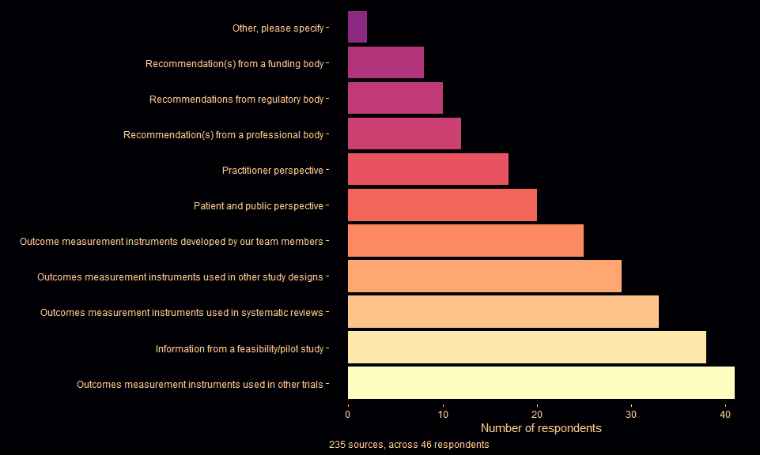<!-- -->


```{=html}
<div id="cxwkicgrtl" style="padding-left:0px;padding-right:0px;padding-top:10px;padding-bottom:10px;overflow-x:auto;overflow-y:auto;width:auto;height:auto;">
<style>#cxwkicgrtl table {
  font-family: system-ui, 'Segoe UI', Roboto, Helvetica, Arial, sans-serif, 'Apple Color Emoji', 'Segoe UI Emoji', 'Segoe UI Symbol', 'Noto Color Emoji';
  -webkit-font-smoothing: antialiased;
  -moz-osx-font-smoothing: grayscale;
}

#cxwkicgrtl thead, #cxwkicgrtl tbody, #cxwkicgrtl tfoot, #cxwkicgrtl tr, #cxwkicgrtl td, #cxwkicgrtl th {
  border-style: none;
}

#cxwkicgrtl p {
  margin: 0;
  padding: 0;
}

#cxwkicgrtl .gt_table {
  display: table;
  border-collapse: collapse;
  line-height: normal;
  margin-left: auto;
  margin-right: auto;
  color: #333333;
  font-size: 16px;
  font-weight: normal;
  font-style: normal;
  background-color: #FFFFFF;
  width: auto;
  border-top-style: solid;
  border-top-width: 2px;
  border-top-color: #A8A8A8;
  border-right-style: none;
  border-right-width: 2px;
  border-right-color: #D3D3D3;
  border-bottom-style: solid;
  border-bottom-width: 2px;
  border-bottom-color: #A8A8A8;
  border-left-style: none;
  border-left-width: 2px;
  border-left-color: #D3D3D3;
}

#cxwkicgrtl .gt_caption {
  padding-top: 4px;
  padding-bottom: 4px;
}

#cxwkicgrtl .gt_title {
  color: #333333;
  font-size: 125%;
  font-weight: initial;
  padding-top: 4px;
  padding-bottom: 4px;
  padding-left: 5px;
  padding-right: 5px;
  border-bottom-color: #FFFFFF;
  border-bottom-width: 0;
}

#cxwkicgrtl .gt_subtitle {
  color: #333333;
  font-size: 85%;
  font-weight: initial;
  padding-top: 3px;
  padding-bottom: 5px;
  padding-left: 5px;
  padding-right: 5px;
  border-top-color: #FFFFFF;
  border-top-width: 0;
}

#cxwkicgrtl .gt_heading {
  background-color: #FFFFFF;
  text-align: center;
  border-bottom-color: #FFFFFF;
  border-left-style: none;
  border-left-width: 1px;
  border-left-color: #D3D3D3;
  border-right-style: none;
  border-right-width: 1px;
  border-right-color: #D3D3D3;
}

#cxwkicgrtl .gt_bottom_border {
  border-bottom-style: solid;
  border-bottom-width: 2px;
  border-bottom-color: #D3D3D3;
}

#cxwkicgrtl .gt_col_headings {
  border-top-style: solid;
  border-top-width: 2px;
  border-top-color: #D3D3D3;
  border-bottom-style: solid;
  border-bottom-width: 2px;
  border-bottom-color: #D3D3D3;
  border-left-style: none;
  border-left-width: 1px;
  border-left-color: #D3D3D3;
  border-right-style: none;
  border-right-width: 1px;
  border-right-color: #D3D3D3;
}

#cxwkicgrtl .gt_col_heading {
  color: #333333;
  background-color: #FFFFFF;
  font-size: 100%;
  font-weight: normal;
  text-transform: inherit;
  border-left-style: none;
  border-left-width: 1px;
  border-left-color: #D3D3D3;
  border-right-style: none;
  border-right-width: 1px;
  border-right-color: #D3D3D3;
  vertical-align: bottom;
  padding-top: 5px;
  padding-bottom: 6px;
  padding-left: 5px;
  padding-right: 5px;
  overflow-x: hidden;
}

#cxwkicgrtl .gt_column_spanner_outer {
  color: #333333;
  background-color: #FFFFFF;
  font-size: 100%;
  font-weight: normal;
  text-transform: inherit;
  padding-top: 0;
  padding-bottom: 0;
  padding-left: 4px;
  padding-right: 4px;
}

#cxwkicgrtl .gt_column_spanner_outer:first-child {
  padding-left: 0;
}

#cxwkicgrtl .gt_column_spanner_outer:last-child {
  padding-right: 0;
}

#cxwkicgrtl .gt_column_spanner {
  border-bottom-style: solid;
  border-bottom-width: 2px;
  border-bottom-color: #D3D3D3;
  vertical-align: bottom;
  padding-top: 5px;
  padding-bottom: 5px;
  overflow-x: hidden;
  display: inline-block;
  width: 100%;
}

#cxwkicgrtl .gt_spanner_row {
  border-bottom-style: hidden;
}

#cxwkicgrtl .gt_group_heading {
  padding-top: 8px;
  padding-bottom: 8px;
  padding-left: 5px;
  padding-right: 5px;
  color: #333333;
  background-color: #FFFFFF;
  font-size: 100%;
  font-weight: initial;
  text-transform: inherit;
  border-top-style: solid;
  border-top-width: 2px;
  border-top-color: #D3D3D3;
  border-bottom-style: solid;
  border-bottom-width: 2px;
  border-bottom-color: #D3D3D3;
  border-left-style: none;
  border-left-width: 1px;
  border-left-color: #D3D3D3;
  border-right-style: none;
  border-right-width: 1px;
  border-right-color: #D3D3D3;
  vertical-align: middle;
  text-align: left;
}

#cxwkicgrtl .gt_empty_group_heading {
  padding: 0.5px;
  color: #333333;
  background-color: #FFFFFF;
  font-size: 100%;
  font-weight: initial;
  border-top-style: solid;
  border-top-width: 2px;
  border-top-color: #D3D3D3;
  border-bottom-style: solid;
  border-bottom-width: 2px;
  border-bottom-color: #D3D3D3;
  vertical-align: middle;
}

#cxwkicgrtl .gt_from_md > :first-child {
  margin-top: 0;
}

#cxwkicgrtl .gt_from_md > :last-child {
  margin-bottom: 0;
}

#cxwkicgrtl .gt_row {
  padding-top: 8px;
  padding-bottom: 8px;
  padding-left: 5px;
  padding-right: 5px;
  margin: 10px;
  border-top-style: solid;
  border-top-width: 1px;
  border-top-color: #D3D3D3;
  border-left-style: none;
  border-left-width: 1px;
  border-left-color: #D3D3D3;
  border-right-style: none;
  border-right-width: 1px;
  border-right-color: #D3D3D3;
  vertical-align: middle;
  overflow-x: hidden;
}

#cxwkicgrtl .gt_stub {
  color: #333333;
  background-color: #FFFFFF;
  font-size: 100%;
  font-weight: initial;
  text-transform: inherit;
  border-right-style: solid;
  border-right-width: 2px;
  border-right-color: #D3D3D3;
  padding-left: 5px;
  padding-right: 5px;
}

#cxwkicgrtl .gt_stub_row_group {
  color: #333333;
  background-color: #FFFFFF;
  font-size: 100%;
  font-weight: initial;
  text-transform: inherit;
  border-right-style: solid;
  border-right-width: 2px;
  border-right-color: #D3D3D3;
  padding-left: 5px;
  padding-right: 5px;
  vertical-align: top;
}

#cxwkicgrtl .gt_row_group_first td {
  border-top-width: 2px;
}

#cxwkicgrtl .gt_row_group_first th {
  border-top-width: 2px;
}

#cxwkicgrtl .gt_summary_row {
  color: #333333;
  background-color: #FFFFFF;
  text-transform: inherit;
  padding-top: 8px;
  padding-bottom: 8px;
  padding-left: 5px;
  padding-right: 5px;
}

#cxwkicgrtl .gt_first_summary_row {
  border-top-style: solid;
  border-top-color: #D3D3D3;
}

#cxwkicgrtl .gt_first_summary_row.thick {
  border-top-width: 2px;
}

#cxwkicgrtl .gt_last_summary_row {
  padding-top: 8px;
  padding-bottom: 8px;
  padding-left: 5px;
  padding-right: 5px;
  border-bottom-style: solid;
  border-bottom-width: 2px;
  border-bottom-color: #D3D3D3;
}

#cxwkicgrtl .gt_grand_summary_row {
  color: #333333;
  background-color: #FFFFFF;
  text-transform: inherit;
  padding-top: 8px;
  padding-bottom: 8px;
  padding-left: 5px;
  padding-right: 5px;
}

#cxwkicgrtl .gt_first_grand_summary_row {
  padding-top: 8px;
  padding-bottom: 8px;
  padding-left: 5px;
  padding-right: 5px;
  border-top-style: double;
  border-top-width: 6px;
  border-top-color: #D3D3D3;
}

#cxwkicgrtl .gt_last_grand_summary_row_top {
  padding-top: 8px;
  padding-bottom: 8px;
  padding-left: 5px;
  padding-right: 5px;
  border-bottom-style: double;
  border-bottom-width: 6px;
  border-bottom-color: #D3D3D3;
}

#cxwkicgrtl .gt_striped {
  background-color: rgba(128, 128, 128, 0.05);
}

#cxwkicgrtl .gt_table_body {
  border-top-style: solid;
  border-top-width: 2px;
  border-top-color: #D3D3D3;
  border-bottom-style: solid;
  border-bottom-width: 2px;
  border-bottom-color: #D3D3D3;
}

#cxwkicgrtl .gt_footnotes {
  color: #333333;
  background-color: #FFFFFF;
  border-bottom-style: none;
  border-bottom-width: 2px;
  border-bottom-color: #D3D3D3;
  border-left-style: none;
  border-left-width: 2px;
  border-left-color: #D3D3D3;
  border-right-style: none;
  border-right-width: 2px;
  border-right-color: #D3D3D3;
}

#cxwkicgrtl .gt_footnote {
  margin: 0px;
  font-size: 90%;
  padding-top: 4px;
  padding-bottom: 4px;
  padding-left: 5px;
  padding-right: 5px;
}

#cxwkicgrtl .gt_sourcenotes {
  color: #333333;
  background-color: #FFFFFF;
  border-bottom-style: none;
  border-bottom-width: 2px;
  border-bottom-color: #D3D3D3;
  border-left-style: none;
  border-left-width: 2px;
  border-left-color: #D3D3D3;
  border-right-style: none;
  border-right-width: 2px;
  border-right-color: #D3D3D3;
}

#cxwkicgrtl .gt_sourcenote {
  font-size: 90%;
  padding-top: 4px;
  padding-bottom: 4px;
  padding-left: 5px;
  padding-right: 5px;
}

#cxwkicgrtl .gt_left {
  text-align: left;
}

#cxwkicgrtl .gt_center {
  text-align: center;
}

#cxwkicgrtl .gt_right {
  text-align: right;
  font-variant-numeric: tabular-nums;
}

#cxwkicgrtl .gt_font_normal {
  font-weight: normal;
}

#cxwkicgrtl .gt_font_bold {
  font-weight: bold;
}

#cxwkicgrtl .gt_font_italic {
  font-style: italic;
}

#cxwkicgrtl .gt_super {
  font-size: 65%;
}

#cxwkicgrtl .gt_footnote_marks {
  font-size: 75%;
  vertical-align: 0.4em;
  position: initial;
}

#cxwkicgrtl .gt_asterisk {
  font-size: 100%;
  vertical-align: 0;
}

#cxwkicgrtl .gt_indent_1 {
  text-indent: 5px;
}

#cxwkicgrtl .gt_indent_2 {
  text-indent: 10px;
}

#cxwkicgrtl .gt_indent_3 {
  text-indent: 15px;
}

#cxwkicgrtl .gt_indent_4 {
  text-indent: 20px;
}

#cxwkicgrtl .gt_indent_5 {
  text-indent: 25px;
}

#cxwkicgrtl .katex-display {
  display: inline-flex !important;
  margin-bottom: 0.75em !important;
}

#cxwkicgrtl div.Reactable > div.rt-table > div.rt-thead > div.rt-tr.rt-tr-group-header > div.rt-th-group:after {
  height: 0px !important;
}
</style>
<table class="gt_table" data-quarto-disable-processing="false" data-quarto-bootstrap="false">
  <thead>
    <tr class="gt_col_headings">
      <th class="gt_col_heading gt_columns_bottom_border gt_left" rowspan="1" colspan="1" scope="col" id="label"><span class='gt_from_md'><strong>Characteristic</strong></span></th>
      <th class="gt_col_heading gt_columns_bottom_border gt_center" rowspan="1" colspan="1" scope="col" id="n"><span class='gt_from_md'><strong>N</strong></span><span class="gt_footnote_marks" style="white-space:nowrap;font-style:italic;font-weight:normal;line-height:0;"><sup>1</sup></span></th>
      <th class="gt_col_heading gt_columns_bottom_border gt_center" rowspan="1" colspan="1" scope="col" id="stat_0"><span class='gt_from_md'><strong>N = 235</strong></span><span class="gt_footnote_marks" style="white-space:nowrap;font-style:italic;font-weight:normal;line-height:0;"><sup>2</sup></span></th>
    </tr>
  </thead>
  <tbody class="gt_table_body">
    <tr><td headers="label" class="gt_row gt_left">Sources</td>
<td headers="n" class="gt_row gt_center">235</td>
<td headers="stat_0" class="gt_row gt_center"><br /></td></tr>
    <tr><td headers="label" class="gt_row gt_left">    Outcomes measurement instruments used in other trials</td>
<td headers="n" class="gt_row gt_center"><br /></td>
<td headers="stat_0" class="gt_row gt_center">41/235 (17%)</td></tr>
    <tr><td headers="label" class="gt_row gt_left">    Information from a feasibility/pilot study</td>
<td headers="n" class="gt_row gt_center"><br /></td>
<td headers="stat_0" class="gt_row gt_center">38/235 (16%)</td></tr>
    <tr><td headers="label" class="gt_row gt_left">    Outcomes measurement instruments used in systematic reviews</td>
<td headers="n" class="gt_row gt_center"><br /></td>
<td headers="stat_0" class="gt_row gt_center">33/235 (14%)</td></tr>
    <tr><td headers="label" class="gt_row gt_left">    Outcomes measurement instruments used in other study designs</td>
<td headers="n" class="gt_row gt_center"><br /></td>
<td headers="stat_0" class="gt_row gt_center">29/235 (12%)</td></tr>
    <tr><td headers="label" class="gt_row gt_left">    Outcome measurement instruments developed by our team members</td>
<td headers="n" class="gt_row gt_center"><br /></td>
<td headers="stat_0" class="gt_row gt_center">25/235 (11%)</td></tr>
    <tr><td headers="label" class="gt_row gt_left">    Patient and public perspective</td>
<td headers="n" class="gt_row gt_center"><br /></td>
<td headers="stat_0" class="gt_row gt_center">20/235 (8.5%)</td></tr>
    <tr><td headers="label" class="gt_row gt_left">    Practitioner perspective</td>
<td headers="n" class="gt_row gt_center"><br /></td>
<td headers="stat_0" class="gt_row gt_center">17/235 (7.2%)</td></tr>
    <tr><td headers="label" class="gt_row gt_left">    Recommendation(s) from a professional body</td>
<td headers="n" class="gt_row gt_center"><br /></td>
<td headers="stat_0" class="gt_row gt_center">12/235 (5.1%)</td></tr>
    <tr><td headers="label" class="gt_row gt_left">    Recommendations from regulatory body</td>
<td headers="n" class="gt_row gt_center"><br /></td>
<td headers="stat_0" class="gt_row gt_center">10/235 (4.3%)</td></tr>
    <tr><td headers="label" class="gt_row gt_left">    Recommendation(s) from a funding body</td>
<td headers="n" class="gt_row gt_center"><br /></td>
<td headers="stat_0" class="gt_row gt_center">8/235 (3.4%)</td></tr>
    <tr><td headers="label" class="gt_row gt_left">    Other, please specify</td>
<td headers="n" class="gt_row gt_center"><br /></td>
<td headers="stat_0" class="gt_row gt_center">2/235 (0.9%)</td></tr>
  </tbody>
  
  <tfoot class="gt_footnotes">
    <tr>
      <td class="gt_footnote" colspan="3"><span class="gt_footnote_marks" style="white-space:nowrap;font-style:italic;font-weight:normal;line-height:0;"><sup>1</sup></span> <span class='gt_from_md'>235 sources endorsed by 46 respondents</span></td>
    </tr>
    <tr>
      <td class="gt_footnote" colspan="3"><span class="gt_footnote_marks" style="white-space:nowrap;font-style:italic;font-weight:normal;line-height:0;"><sup>2</sup></span> <span class='gt_from_md'>n/N Non-missing (%)</span></td>
    </tr>
  </tfoot>
</table>
</div>
```


Note: No actual free text field for "other" responses. 

## (Q18) Currently planned/used outcomes 

#### Figure: Currently planned/used outcomes in childhood obesity prevention interventions.

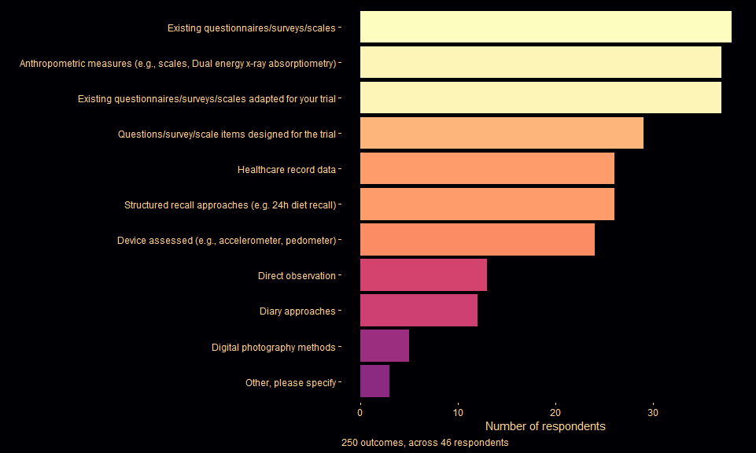<!-- -->

#### Free text


```
## [1] "Physical tests: exercise tests, motor function tests"
```

## (Q19) Administration 

#### Figure: Route and method of administration across all responses

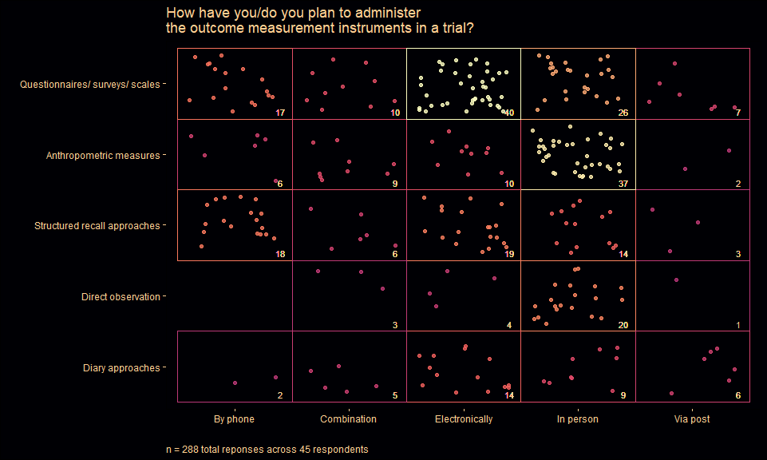<!-- -->

#### Table: Route and method of administration across all responses


```{=html}
<div id="leybngxhik" style="padding-left:0px;padding-right:0px;padding-top:10px;padding-bottom:10px;overflow-x:auto;overflow-y:auto;width:auto;height:auto;">
<style>#leybngxhik table {
  font-family: system-ui, 'Segoe UI', Roboto, Helvetica, Arial, sans-serif, 'Apple Color Emoji', 'Segoe UI Emoji', 'Segoe UI Symbol', 'Noto Color Emoji';
  -webkit-font-smoothing: antialiased;
  -moz-osx-font-smoothing: grayscale;
}

#leybngxhik thead, #leybngxhik tbody, #leybngxhik tfoot, #leybngxhik tr, #leybngxhik td, #leybngxhik th {
  border-style: none;
}

#leybngxhik p {
  margin: 0;
  padding: 0;
}

#leybngxhik .gt_table {
  display: table;
  border-collapse: collapse;
  line-height: normal;
  margin-left: auto;
  margin-right: auto;
  color: #333333;
  font-size: 16px;
  font-weight: normal;
  font-style: normal;
  background-color: #FFFFFF;
  width: auto;
  border-top-style: solid;
  border-top-width: 2px;
  border-top-color: #A8A8A8;
  border-right-style: none;
  border-right-width: 2px;
  border-right-color: #D3D3D3;
  border-bottom-style: solid;
  border-bottom-width: 2px;
  border-bottom-color: #A8A8A8;
  border-left-style: none;
  border-left-width: 2px;
  border-left-color: #D3D3D3;
}

#leybngxhik .gt_caption {
  padding-top: 4px;
  padding-bottom: 4px;
}

#leybngxhik .gt_title {
  color: #333333;
  font-size: 125%;
  font-weight: initial;
  padding-top: 4px;
  padding-bottom: 4px;
  padding-left: 5px;
  padding-right: 5px;
  border-bottom-color: #FFFFFF;
  border-bottom-width: 0;
}

#leybngxhik .gt_subtitle {
  color: #333333;
  font-size: 85%;
  font-weight: initial;
  padding-top: 3px;
  padding-bottom: 5px;
  padding-left: 5px;
  padding-right: 5px;
  border-top-color: #FFFFFF;
  border-top-width: 0;
}

#leybngxhik .gt_heading {
  background-color: #FFFFFF;
  text-align: center;
  border-bottom-color: #FFFFFF;
  border-left-style: none;
  border-left-width: 1px;
  border-left-color: #D3D3D3;
  border-right-style: none;
  border-right-width: 1px;
  border-right-color: #D3D3D3;
}

#leybngxhik .gt_bottom_border {
  border-bottom-style: solid;
  border-bottom-width: 2px;
  border-bottom-color: #D3D3D3;
}

#leybngxhik .gt_col_headings {
  border-top-style: solid;
  border-top-width: 2px;
  border-top-color: #D3D3D3;
  border-bottom-style: solid;
  border-bottom-width: 2px;
  border-bottom-color: #D3D3D3;
  border-left-style: none;
  border-left-width: 1px;
  border-left-color: #D3D3D3;
  border-right-style: none;
  border-right-width: 1px;
  border-right-color: #D3D3D3;
}

#leybngxhik .gt_col_heading {
  color: #333333;
  background-color: #FFFFFF;
  font-size: 100%;
  font-weight: normal;
  text-transform: inherit;
  border-left-style: none;
  border-left-width: 1px;
  border-left-color: #D3D3D3;
  border-right-style: none;
  border-right-width: 1px;
  border-right-color: #D3D3D3;
  vertical-align: bottom;
  padding-top: 5px;
  padding-bottom: 6px;
  padding-left: 5px;
  padding-right: 5px;
  overflow-x: hidden;
}

#leybngxhik .gt_column_spanner_outer {
  color: #333333;
  background-color: #FFFFFF;
  font-size: 100%;
  font-weight: normal;
  text-transform: inherit;
  padding-top: 0;
  padding-bottom: 0;
  padding-left: 4px;
  padding-right: 4px;
}

#leybngxhik .gt_column_spanner_outer:first-child {
  padding-left: 0;
}

#leybngxhik .gt_column_spanner_outer:last-child {
  padding-right: 0;
}

#leybngxhik .gt_column_spanner {
  border-bottom-style: solid;
  border-bottom-width: 2px;
  border-bottom-color: #D3D3D3;
  vertical-align: bottom;
  padding-top: 5px;
  padding-bottom: 5px;
  overflow-x: hidden;
  display: inline-block;
  width: 100%;
}

#leybngxhik .gt_spanner_row {
  border-bottom-style: hidden;
}

#leybngxhik .gt_group_heading {
  padding-top: 8px;
  padding-bottom: 8px;
  padding-left: 5px;
  padding-right: 5px;
  color: #333333;
  background-color: #FFFFFF;
  font-size: 100%;
  font-weight: initial;
  text-transform: inherit;
  border-top-style: solid;
  border-top-width: 2px;
  border-top-color: #D3D3D3;
  border-bottom-style: solid;
  border-bottom-width: 2px;
  border-bottom-color: #D3D3D3;
  border-left-style: none;
  border-left-width: 1px;
  border-left-color: #D3D3D3;
  border-right-style: none;
  border-right-width: 1px;
  border-right-color: #D3D3D3;
  vertical-align: middle;
  text-align: left;
}

#leybngxhik .gt_empty_group_heading {
  padding: 0.5px;
  color: #333333;
  background-color: #FFFFFF;
  font-size: 100%;
  font-weight: initial;
  border-top-style: solid;
  border-top-width: 2px;
  border-top-color: #D3D3D3;
  border-bottom-style: solid;
  border-bottom-width: 2px;
  border-bottom-color: #D3D3D3;
  vertical-align: middle;
}

#leybngxhik .gt_from_md > :first-child {
  margin-top: 0;
}

#leybngxhik .gt_from_md > :last-child {
  margin-bottom: 0;
}

#leybngxhik .gt_row {
  padding-top: 8px;
  padding-bottom: 8px;
  padding-left: 5px;
  padding-right: 5px;
  margin: 10px;
  border-top-style: solid;
  border-top-width: 1px;
  border-top-color: #D3D3D3;
  border-left-style: none;
  border-left-width: 1px;
  border-left-color: #D3D3D3;
  border-right-style: none;
  border-right-width: 1px;
  border-right-color: #D3D3D3;
  vertical-align: middle;
  overflow-x: hidden;
}

#leybngxhik .gt_stub {
  color: #333333;
  background-color: #FFFFFF;
  font-size: 100%;
  font-weight: initial;
  text-transform: inherit;
  border-right-style: solid;
  border-right-width: 2px;
  border-right-color: #D3D3D3;
  padding-left: 5px;
  padding-right: 5px;
}

#leybngxhik .gt_stub_row_group {
  color: #333333;
  background-color: #FFFFFF;
  font-size: 100%;
  font-weight: initial;
  text-transform: inherit;
  border-right-style: solid;
  border-right-width: 2px;
  border-right-color: #D3D3D3;
  padding-left: 5px;
  padding-right: 5px;
  vertical-align: top;
}

#leybngxhik .gt_row_group_first td {
  border-top-width: 2px;
}

#leybngxhik .gt_row_group_first th {
  border-top-width: 2px;
}

#leybngxhik .gt_summary_row {
  color: #333333;
  background-color: #FFFFFF;
  text-transform: inherit;
  padding-top: 8px;
  padding-bottom: 8px;
  padding-left: 5px;
  padding-right: 5px;
}

#leybngxhik .gt_first_summary_row {
  border-top-style: solid;
  border-top-color: #D3D3D3;
}

#leybngxhik .gt_first_summary_row.thick {
  border-top-width: 2px;
}

#leybngxhik .gt_last_summary_row {
  padding-top: 8px;
  padding-bottom: 8px;
  padding-left: 5px;
  padding-right: 5px;
  border-bottom-style: solid;
  border-bottom-width: 2px;
  border-bottom-color: #D3D3D3;
}

#leybngxhik .gt_grand_summary_row {
  color: #333333;
  background-color: #FFFFFF;
  text-transform: inherit;
  padding-top: 8px;
  padding-bottom: 8px;
  padding-left: 5px;
  padding-right: 5px;
}

#leybngxhik .gt_first_grand_summary_row {
  padding-top: 8px;
  padding-bottom: 8px;
  padding-left: 5px;
  padding-right: 5px;
  border-top-style: double;
  border-top-width: 6px;
  border-top-color: #D3D3D3;
}

#leybngxhik .gt_last_grand_summary_row_top {
  padding-top: 8px;
  padding-bottom: 8px;
  padding-left: 5px;
  padding-right: 5px;
  border-bottom-style: double;
  border-bottom-width: 6px;
  border-bottom-color: #D3D3D3;
}

#leybngxhik .gt_striped {
  background-color: rgba(128, 128, 128, 0.05);
}

#leybngxhik .gt_table_body {
  border-top-style: solid;
  border-top-width: 2px;
  border-top-color: #D3D3D3;
  border-bottom-style: solid;
  border-bottom-width: 2px;
  border-bottom-color: #D3D3D3;
}

#leybngxhik .gt_footnotes {
  color: #333333;
  background-color: #FFFFFF;
  border-bottom-style: none;
  border-bottom-width: 2px;
  border-bottom-color: #D3D3D3;
  border-left-style: none;
  border-left-width: 2px;
  border-left-color: #D3D3D3;
  border-right-style: none;
  border-right-width: 2px;
  border-right-color: #D3D3D3;
}

#leybngxhik .gt_footnote {
  margin: 0px;
  font-size: 90%;
  padding-top: 4px;
  padding-bottom: 4px;
  padding-left: 5px;
  padding-right: 5px;
}

#leybngxhik .gt_sourcenotes {
  color: #333333;
  background-color: #FFFFFF;
  border-bottom-style: none;
  border-bottom-width: 2px;
  border-bottom-color: #D3D3D3;
  border-left-style: none;
  border-left-width: 2px;
  border-left-color: #D3D3D3;
  border-right-style: none;
  border-right-width: 2px;
  border-right-color: #D3D3D3;
}

#leybngxhik .gt_sourcenote {
  font-size: 90%;
  padding-top: 4px;
  padding-bottom: 4px;
  padding-left: 5px;
  padding-right: 5px;
}

#leybngxhik .gt_left {
  text-align: left;
}

#leybngxhik .gt_center {
  text-align: center;
}

#leybngxhik .gt_right {
  text-align: right;
  font-variant-numeric: tabular-nums;
}

#leybngxhik .gt_font_normal {
  font-weight: normal;
}

#leybngxhik .gt_font_bold {
  font-weight: bold;
}

#leybngxhik .gt_font_italic {
  font-style: italic;
}

#leybngxhik .gt_super {
  font-size: 65%;
}

#leybngxhik .gt_footnote_marks {
  font-size: 75%;
  vertical-align: 0.4em;
  position: initial;
}

#leybngxhik .gt_asterisk {
  font-size: 100%;
  vertical-align: 0;
}

#leybngxhik .gt_indent_1 {
  text-indent: 5px;
}

#leybngxhik .gt_indent_2 {
  text-indent: 10px;
}

#leybngxhik .gt_indent_3 {
  text-indent: 15px;
}

#leybngxhik .gt_indent_4 {
  text-indent: 20px;
}

#leybngxhik .gt_indent_5 {
  text-indent: 25px;
}

#leybngxhik .katex-display {
  display: inline-flex !important;
  margin-bottom: 0.75em !important;
}

#leybngxhik div.Reactable > div.rt-table > div.rt-thead > div.rt-tr.rt-tr-group-header > div.rt-th-group:after {
  height: 0px !important;
}
</style>
<table class="gt_table" data-quarto-disable-processing="false" data-quarto-bootstrap="false">
  <thead>
    <tr class="gt_col_headings gt_spanner_row">
      <th class="gt_col_heading gt_columns_bottom_border gt_left" rowspan="2" colspan="1" scope="col" id="label"></th>
      <th class="gt_center gt_columns_top_border gt_column_spanner_outer" rowspan="1" colspan="5" scope="colgroup" id="Method">
        <div class="gt_column_spanner"><span class='gt_from_md'>Method</span></div>
      </th>
      <th class="gt_col_heading gt_columns_bottom_border gt_center" rowspan="2" colspan="1" scope="col" id="stat_0"><span class='gt_from_md'>Total</span></th>
    </tr>
    <tr class="gt_col_headings">
      <th class="gt_col_heading gt_columns_bottom_border gt_center" rowspan="1" colspan="1" scope="col" id="stat_1"><span class='gt_from_md'>Anthropometric measures</span></th>
      <th class="gt_col_heading gt_columns_bottom_border gt_center" rowspan="1" colspan="1" scope="col" id="stat_2"><span class='gt_from_md'>Diary approaches</span></th>
      <th class="gt_col_heading gt_columns_bottom_border gt_center" rowspan="1" colspan="1" scope="col" id="stat_3"><span class='gt_from_md'>Direct observation</span></th>
      <th class="gt_col_heading gt_columns_bottom_border gt_center" rowspan="1" colspan="1" scope="col" id="stat_4"><span class='gt_from_md'>Questionnaires/ surveys/ scales</span></th>
      <th class="gt_col_heading gt_columns_bottom_border gt_center" rowspan="1" colspan="1" scope="col" id="stat_5"><span class='gt_from_md'>Structured recall approaches</span></th>
    </tr>
  </thead>
  <tbody class="gt_table_body">
    <tr><td headers="label" class="gt_row gt_left">Route</td>
<td headers="stat_1" class="gt_row gt_center"><br /></td>
<td headers="stat_2" class="gt_row gt_center"><br /></td>
<td headers="stat_3" class="gt_row gt_center"><br /></td>
<td headers="stat_4" class="gt_row gt_center"><br /></td>
<td headers="stat_5" class="gt_row gt_center"><br /></td>
<td headers="stat_0" class="gt_row gt_center"><br /></td></tr>
    <tr><td headers="label" class="gt_row gt_left">    By phone</td>
<td headers="stat_1" class="gt_row gt_center">6 (2.1%)</td>
<td headers="stat_2" class="gt_row gt_center">2 (0.7%)</td>
<td headers="stat_3" class="gt_row gt_center">0 (0%)</td>
<td headers="stat_4" class="gt_row gt_center">17 (5.9%)</td>
<td headers="stat_5" class="gt_row gt_center">18 (6.3%)</td>
<td headers="stat_0" class="gt_row gt_center">43 (15%)</td></tr>
    <tr><td headers="label" class="gt_row gt_left">    Combination</td>
<td headers="stat_1" class="gt_row gt_center">9 (3.1%)</td>
<td headers="stat_2" class="gt_row gt_center">5 (1.7%)</td>
<td headers="stat_3" class="gt_row gt_center">3 (1.0%)</td>
<td headers="stat_4" class="gt_row gt_center">10 (3.5%)</td>
<td headers="stat_5" class="gt_row gt_center">6 (2.1%)</td>
<td headers="stat_0" class="gt_row gt_center">33 (11%)</td></tr>
    <tr><td headers="label" class="gt_row gt_left">    Electronically</td>
<td headers="stat_1" class="gt_row gt_center">10 (3.5%)</td>
<td headers="stat_2" class="gt_row gt_center">14 (4.9%)</td>
<td headers="stat_3" class="gt_row gt_center">4 (1.4%)</td>
<td headers="stat_4" class="gt_row gt_center">40 (14%)</td>
<td headers="stat_5" class="gt_row gt_center">19 (6.6%)</td>
<td headers="stat_0" class="gt_row gt_center">87 (30%)</td></tr>
    <tr><td headers="label" class="gt_row gt_left">    In person</td>
<td headers="stat_1" class="gt_row gt_center">37 (13%)</td>
<td headers="stat_2" class="gt_row gt_center">9 (3.1%)</td>
<td headers="stat_3" class="gt_row gt_center">20 (6.9%)</td>
<td headers="stat_4" class="gt_row gt_center">26 (9.0%)</td>
<td headers="stat_5" class="gt_row gt_center">14 (4.9%)</td>
<td headers="stat_0" class="gt_row gt_center">106 (37%)</td></tr>
    <tr><td headers="label" class="gt_row gt_left">    Via post</td>
<td headers="stat_1" class="gt_row gt_center">2 (0.7%)</td>
<td headers="stat_2" class="gt_row gt_center">6 (2.1%)</td>
<td headers="stat_3" class="gt_row gt_center">1 (0.3%)</td>
<td headers="stat_4" class="gt_row gt_center">7 (2.4%)</td>
<td headers="stat_5" class="gt_row gt_center">3 (1.0%)</td>
<td headers="stat_0" class="gt_row gt_center">19 (6.6%)</td></tr>
    <tr><td headers="label" class="gt_row gt_left">Total</td>
<td headers="stat_1" class="gt_row gt_center">64 (22%)</td>
<td headers="stat_2" class="gt_row gt_center">36 (13%)</td>
<td headers="stat_3" class="gt_row gt_center">28 (9.7%)</td>
<td headers="stat_4" class="gt_row gt_center">100 (35%)</td>
<td headers="stat_5" class="gt_row gt_center">60 (21%)</td>
<td headers="stat_0" class="gt_row gt_center">288 (100%)</td></tr>
  </tbody>
  
  
</table>
</div>
```

#### Figure: Route and method of administration across all responses

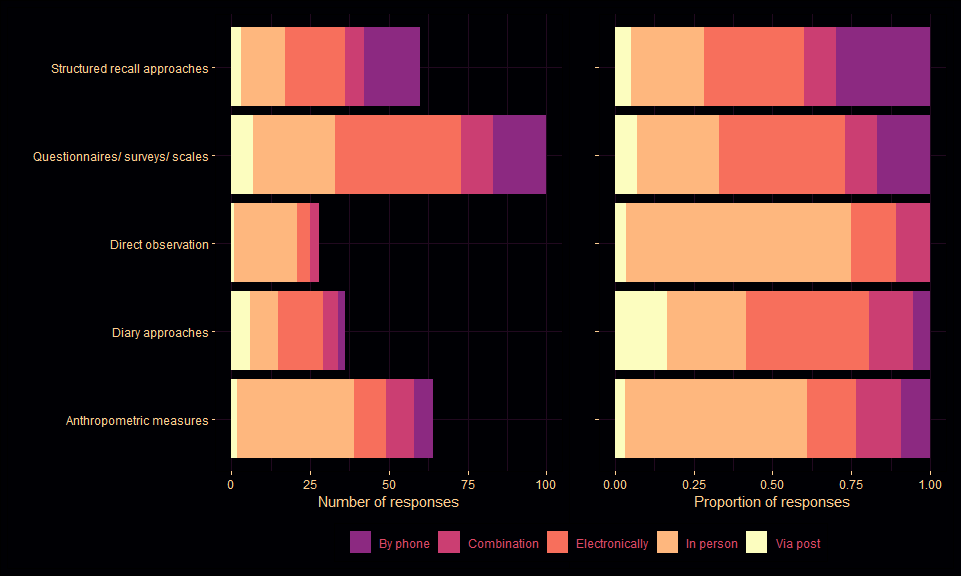<!-- -->

#### Figure: Method of administration across all responses

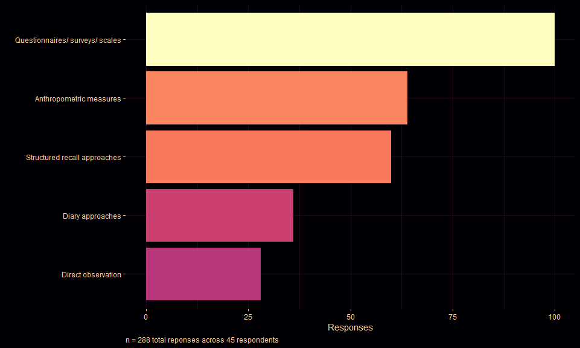<!-- -->

#### Figure: Route of administration across all responses

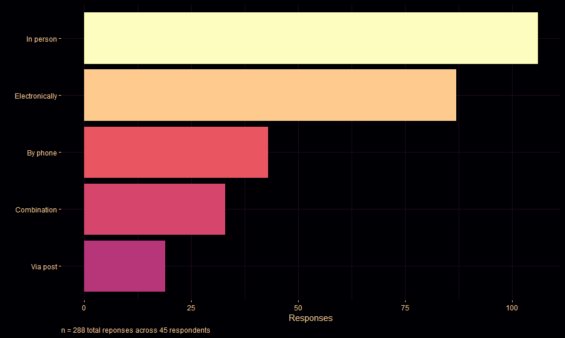<!-- -->

#### Figure: Method of administration - In person

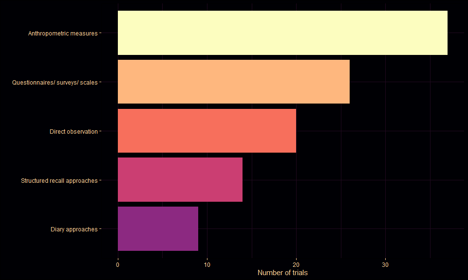<!-- -->

#### Figure: Method of administration - Electronically

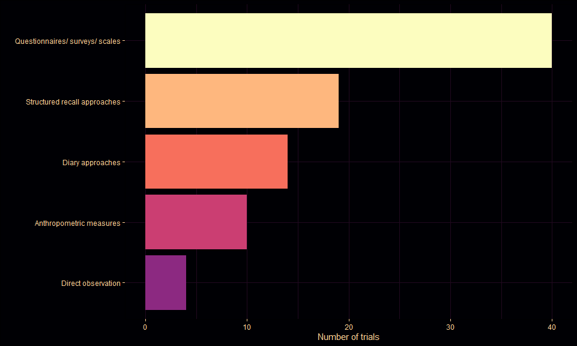<!-- -->

#### Figure: Method of administration - By phone

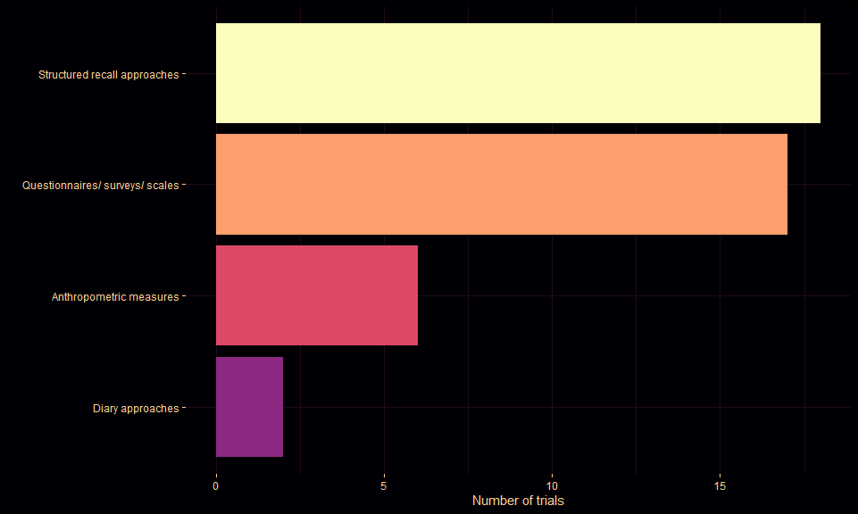<!-- -->

#### Figure: Method of administration - Via post

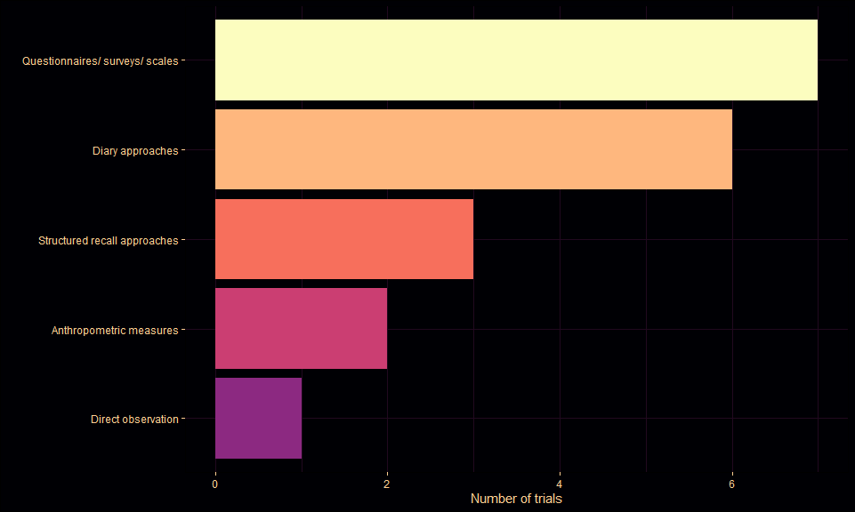<!-- -->

#### Figure: Method of administration - Combination

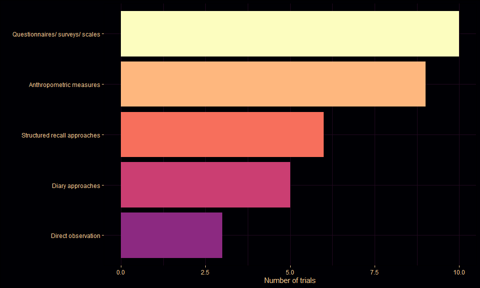<!-- -->

#### Free text


```
## [1] NA                                                                   
## [2] "0"                                                                  
## [3] "Anthropometric measures"                                            
## [4] "Gave participants options of how they wanted to complete the survey"
## [5] "from usual pediatric visit"
```

## (Q20) Location 

#### Figure: Method and setting of administration across all responses

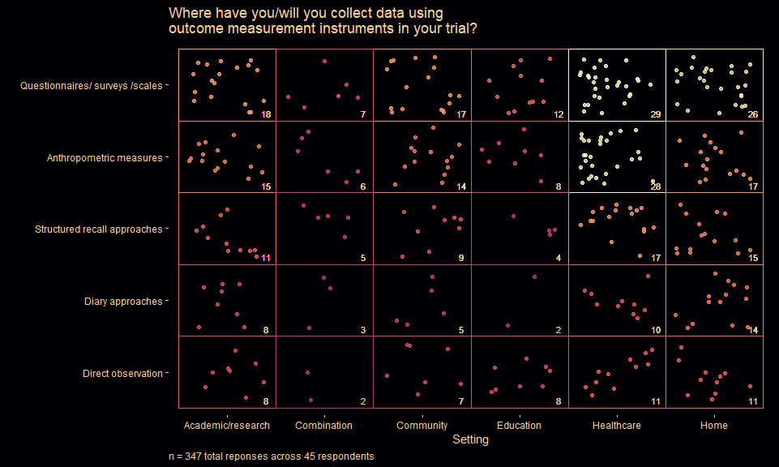<!-- -->

#### Table: Route and method of administration across all responses


```{=html}
<div id="niylxctwvt" style="padding-left:0px;padding-right:0px;padding-top:10px;padding-bottom:10px;overflow-x:auto;overflow-y:auto;width:auto;height:auto;">
<style>#niylxctwvt table {
  font-family: system-ui, 'Segoe UI', Roboto, Helvetica, Arial, sans-serif, 'Apple Color Emoji', 'Segoe UI Emoji', 'Segoe UI Symbol', 'Noto Color Emoji';
  -webkit-font-smoothing: antialiased;
  -moz-osx-font-smoothing: grayscale;
}

#niylxctwvt thead, #niylxctwvt tbody, #niylxctwvt tfoot, #niylxctwvt tr, #niylxctwvt td, #niylxctwvt th {
  border-style: none;
}

#niylxctwvt p {
  margin: 0;
  padding: 0;
}

#niylxctwvt .gt_table {
  display: table;
  border-collapse: collapse;
  line-height: normal;
  margin-left: auto;
  margin-right: auto;
  color: #333333;
  font-size: 16px;
  font-weight: normal;
  font-style: normal;
  background-color: #FFFFFF;
  width: auto;
  border-top-style: solid;
  border-top-width: 2px;
  border-top-color: #A8A8A8;
  border-right-style: none;
  border-right-width: 2px;
  border-right-color: #D3D3D3;
  border-bottom-style: solid;
  border-bottom-width: 2px;
  border-bottom-color: #A8A8A8;
  border-left-style: none;
  border-left-width: 2px;
  border-left-color: #D3D3D3;
}

#niylxctwvt .gt_caption {
  padding-top: 4px;
  padding-bottom: 4px;
}

#niylxctwvt .gt_title {
  color: #333333;
  font-size: 125%;
  font-weight: initial;
  padding-top: 4px;
  padding-bottom: 4px;
  padding-left: 5px;
  padding-right: 5px;
  border-bottom-color: #FFFFFF;
  border-bottom-width: 0;
}

#niylxctwvt .gt_subtitle {
  color: #333333;
  font-size: 85%;
  font-weight: initial;
  padding-top: 3px;
  padding-bottom: 5px;
  padding-left: 5px;
  padding-right: 5px;
  border-top-color: #FFFFFF;
  border-top-width: 0;
}

#niylxctwvt .gt_heading {
  background-color: #FFFFFF;
  text-align: center;
  border-bottom-color: #FFFFFF;
  border-left-style: none;
  border-left-width: 1px;
  border-left-color: #D3D3D3;
  border-right-style: none;
  border-right-width: 1px;
  border-right-color: #D3D3D3;
}

#niylxctwvt .gt_bottom_border {
  border-bottom-style: solid;
  border-bottom-width: 2px;
  border-bottom-color: #D3D3D3;
}

#niylxctwvt .gt_col_headings {
  border-top-style: solid;
  border-top-width: 2px;
  border-top-color: #D3D3D3;
  border-bottom-style: solid;
  border-bottom-width: 2px;
  border-bottom-color: #D3D3D3;
  border-left-style: none;
  border-left-width: 1px;
  border-left-color: #D3D3D3;
  border-right-style: none;
  border-right-width: 1px;
  border-right-color: #D3D3D3;
}

#niylxctwvt .gt_col_heading {
  color: #333333;
  background-color: #FFFFFF;
  font-size: 100%;
  font-weight: normal;
  text-transform: inherit;
  border-left-style: none;
  border-left-width: 1px;
  border-left-color: #D3D3D3;
  border-right-style: none;
  border-right-width: 1px;
  border-right-color: #D3D3D3;
  vertical-align: bottom;
  padding-top: 5px;
  padding-bottom: 6px;
  padding-left: 5px;
  padding-right: 5px;
  overflow-x: hidden;
}

#niylxctwvt .gt_column_spanner_outer {
  color: #333333;
  background-color: #FFFFFF;
  font-size: 100%;
  font-weight: normal;
  text-transform: inherit;
  padding-top: 0;
  padding-bottom: 0;
  padding-left: 4px;
  padding-right: 4px;
}

#niylxctwvt .gt_column_spanner_outer:first-child {
  padding-left: 0;
}

#niylxctwvt .gt_column_spanner_outer:last-child {
  padding-right: 0;
}

#niylxctwvt .gt_column_spanner {
  border-bottom-style: solid;
  border-bottom-width: 2px;
  border-bottom-color: #D3D3D3;
  vertical-align: bottom;
  padding-top: 5px;
  padding-bottom: 5px;
  overflow-x: hidden;
  display: inline-block;
  width: 100%;
}

#niylxctwvt .gt_spanner_row {
  border-bottom-style: hidden;
}

#niylxctwvt .gt_group_heading {
  padding-top: 8px;
  padding-bottom: 8px;
  padding-left: 5px;
  padding-right: 5px;
  color: #333333;
  background-color: #FFFFFF;
  font-size: 100%;
  font-weight: initial;
  text-transform: inherit;
  border-top-style: solid;
  border-top-width: 2px;
  border-top-color: #D3D3D3;
  border-bottom-style: solid;
  border-bottom-width: 2px;
  border-bottom-color: #D3D3D3;
  border-left-style: none;
  border-left-width: 1px;
  border-left-color: #D3D3D3;
  border-right-style: none;
  border-right-width: 1px;
  border-right-color: #D3D3D3;
  vertical-align: middle;
  text-align: left;
}

#niylxctwvt .gt_empty_group_heading {
  padding: 0.5px;
  color: #333333;
  background-color: #FFFFFF;
  font-size: 100%;
  font-weight: initial;
  border-top-style: solid;
  border-top-width: 2px;
  border-top-color: #D3D3D3;
  border-bottom-style: solid;
  border-bottom-width: 2px;
  border-bottom-color: #D3D3D3;
  vertical-align: middle;
}

#niylxctwvt .gt_from_md > :first-child {
  margin-top: 0;
}

#niylxctwvt .gt_from_md > :last-child {
  margin-bottom: 0;
}

#niylxctwvt .gt_row {
  padding-top: 8px;
  padding-bottom: 8px;
  padding-left: 5px;
  padding-right: 5px;
  margin: 10px;
  border-top-style: solid;
  border-top-width: 1px;
  border-top-color: #D3D3D3;
  border-left-style: none;
  border-left-width: 1px;
  border-left-color: #D3D3D3;
  border-right-style: none;
  border-right-width: 1px;
  border-right-color: #D3D3D3;
  vertical-align: middle;
  overflow-x: hidden;
}

#niylxctwvt .gt_stub {
  color: #333333;
  background-color: #FFFFFF;
  font-size: 100%;
  font-weight: initial;
  text-transform: inherit;
  border-right-style: solid;
  border-right-width: 2px;
  border-right-color: #D3D3D3;
  padding-left: 5px;
  padding-right: 5px;
}

#niylxctwvt .gt_stub_row_group {
  color: #333333;
  background-color: #FFFFFF;
  font-size: 100%;
  font-weight: initial;
  text-transform: inherit;
  border-right-style: solid;
  border-right-width: 2px;
  border-right-color: #D3D3D3;
  padding-left: 5px;
  padding-right: 5px;
  vertical-align: top;
}

#niylxctwvt .gt_row_group_first td {
  border-top-width: 2px;
}

#niylxctwvt .gt_row_group_first th {
  border-top-width: 2px;
}

#niylxctwvt .gt_summary_row {
  color: #333333;
  background-color: #FFFFFF;
  text-transform: inherit;
  padding-top: 8px;
  padding-bottom: 8px;
  padding-left: 5px;
  padding-right: 5px;
}

#niylxctwvt .gt_first_summary_row {
  border-top-style: solid;
  border-top-color: #D3D3D3;
}

#niylxctwvt .gt_first_summary_row.thick {
  border-top-width: 2px;
}

#niylxctwvt .gt_last_summary_row {
  padding-top: 8px;
  padding-bottom: 8px;
  padding-left: 5px;
  padding-right: 5px;
  border-bottom-style: solid;
  border-bottom-width: 2px;
  border-bottom-color: #D3D3D3;
}

#niylxctwvt .gt_grand_summary_row {
  color: #333333;
  background-color: #FFFFFF;
  text-transform: inherit;
  padding-top: 8px;
  padding-bottom: 8px;
  padding-left: 5px;
  padding-right: 5px;
}

#niylxctwvt .gt_first_grand_summary_row {
  padding-top: 8px;
  padding-bottom: 8px;
  padding-left: 5px;
  padding-right: 5px;
  border-top-style: double;
  border-top-width: 6px;
  border-top-color: #D3D3D3;
}

#niylxctwvt .gt_last_grand_summary_row_top {
  padding-top: 8px;
  padding-bottom: 8px;
  padding-left: 5px;
  padding-right: 5px;
  border-bottom-style: double;
  border-bottom-width: 6px;
  border-bottom-color: #D3D3D3;
}

#niylxctwvt .gt_striped {
  background-color: rgba(128, 128, 128, 0.05);
}

#niylxctwvt .gt_table_body {
  border-top-style: solid;
  border-top-width: 2px;
  border-top-color: #D3D3D3;
  border-bottom-style: solid;
  border-bottom-width: 2px;
  border-bottom-color: #D3D3D3;
}

#niylxctwvt .gt_footnotes {
  color: #333333;
  background-color: #FFFFFF;
  border-bottom-style: none;
  border-bottom-width: 2px;
  border-bottom-color: #D3D3D3;
  border-left-style: none;
  border-left-width: 2px;
  border-left-color: #D3D3D3;
  border-right-style: none;
  border-right-width: 2px;
  border-right-color: #D3D3D3;
}

#niylxctwvt .gt_footnote {
  margin: 0px;
  font-size: 90%;
  padding-top: 4px;
  padding-bottom: 4px;
  padding-left: 5px;
  padding-right: 5px;
}

#niylxctwvt .gt_sourcenotes {
  color: #333333;
  background-color: #FFFFFF;
  border-bottom-style: none;
  border-bottom-width: 2px;
  border-bottom-color: #D3D3D3;
  border-left-style: none;
  border-left-width: 2px;
  border-left-color: #D3D3D3;
  border-right-style: none;
  border-right-width: 2px;
  border-right-color: #D3D3D3;
}

#niylxctwvt .gt_sourcenote {
  font-size: 90%;
  padding-top: 4px;
  padding-bottom: 4px;
  padding-left: 5px;
  padding-right: 5px;
}

#niylxctwvt .gt_left {
  text-align: left;
}

#niylxctwvt .gt_center {
  text-align: center;
}

#niylxctwvt .gt_right {
  text-align: right;
  font-variant-numeric: tabular-nums;
}

#niylxctwvt .gt_font_normal {
  font-weight: normal;
}

#niylxctwvt .gt_font_bold {
  font-weight: bold;
}

#niylxctwvt .gt_font_italic {
  font-style: italic;
}

#niylxctwvt .gt_super {
  font-size: 65%;
}

#niylxctwvt .gt_footnote_marks {
  font-size: 75%;
  vertical-align: 0.4em;
  position: initial;
}

#niylxctwvt .gt_asterisk {
  font-size: 100%;
  vertical-align: 0;
}

#niylxctwvt .gt_indent_1 {
  text-indent: 5px;
}

#niylxctwvt .gt_indent_2 {
  text-indent: 10px;
}

#niylxctwvt .gt_indent_3 {
  text-indent: 15px;
}

#niylxctwvt .gt_indent_4 {
  text-indent: 20px;
}

#niylxctwvt .gt_indent_5 {
  text-indent: 25px;
}

#niylxctwvt .katex-display {
  display: inline-flex !important;
  margin-bottom: 0.75em !important;
}

#niylxctwvt div.Reactable > div.rt-table > div.rt-thead > div.rt-tr.rt-tr-group-header > div.rt-th-group:after {
  height: 0px !important;
}
</style>
<table class="gt_table" data-quarto-disable-processing="false" data-quarto-bootstrap="false">
  <thead>
    <tr class="gt_col_headings gt_spanner_row">
      <th class="gt_col_heading gt_columns_bottom_border gt_left" rowspan="2" colspan="1" scope="col" id="label"></th>
      <th class="gt_center gt_columns_top_border gt_column_spanner_outer" rowspan="1" colspan="5" scope="colgroup" id="Method">
        <div class="gt_column_spanner"><span class='gt_from_md'>Method</span></div>
      </th>
      <th class="gt_col_heading gt_columns_bottom_border gt_center" rowspan="2" colspan="1" scope="col" id="stat_0"><span class='gt_from_md'>Total</span></th>
    </tr>
    <tr class="gt_col_headings">
      <th class="gt_col_heading gt_columns_bottom_border gt_center" rowspan="1" colspan="1" scope="col" id="stat_1"><span class='gt_from_md'>Anthropometric measures</span></th>
      <th class="gt_col_heading gt_columns_bottom_border gt_center" rowspan="1" colspan="1" scope="col" id="stat_2"><span class='gt_from_md'>Diary approaches</span></th>
      <th class="gt_col_heading gt_columns_bottom_border gt_center" rowspan="1" colspan="1" scope="col" id="stat_3"><span class='gt_from_md'>Direct observation</span></th>
      <th class="gt_col_heading gt_columns_bottom_border gt_center" rowspan="1" colspan="1" scope="col" id="stat_4"><span class='gt_from_md'>Questionnaires/ surveys /scales</span></th>
      <th class="gt_col_heading gt_columns_bottom_border gt_center" rowspan="1" colspan="1" scope="col" id="stat_5"><span class='gt_from_md'>Structured recall approaches</span></th>
    </tr>
  </thead>
  <tbody class="gt_table_body">
    <tr><td headers="label" class="gt_row gt_left">Setting</td>
<td headers="stat_1" class="gt_row gt_center"><br /></td>
<td headers="stat_2" class="gt_row gt_center"><br /></td>
<td headers="stat_3" class="gt_row gt_center"><br /></td>
<td headers="stat_4" class="gt_row gt_center"><br /></td>
<td headers="stat_5" class="gt_row gt_center"><br /></td>
<td headers="stat_0" class="gt_row gt_center"><br /></td></tr>
    <tr><td headers="label" class="gt_row gt_left">    Academic/research</td>
<td headers="stat_1" class="gt_row gt_center">15 (4.3%)</td>
<td headers="stat_2" class="gt_row gt_center">8 (2.3%)</td>
<td headers="stat_3" class="gt_row gt_center">8 (2.3%)</td>
<td headers="stat_4" class="gt_row gt_center">18 (5.2%)</td>
<td headers="stat_5" class="gt_row gt_center">11 (3.2%)</td>
<td headers="stat_0" class="gt_row gt_center">60 (17%)</td></tr>
    <tr><td headers="label" class="gt_row gt_left">    Combination</td>
<td headers="stat_1" class="gt_row gt_center">6 (1.7%)</td>
<td headers="stat_2" class="gt_row gt_center">3 (0.9%)</td>
<td headers="stat_3" class="gt_row gt_center">2 (0.6%)</td>
<td headers="stat_4" class="gt_row gt_center">7 (2.0%)</td>
<td headers="stat_5" class="gt_row gt_center">5 (1.4%)</td>
<td headers="stat_0" class="gt_row gt_center">23 (6.6%)</td></tr>
    <tr><td headers="label" class="gt_row gt_left">    Community</td>
<td headers="stat_1" class="gt_row gt_center">14 (4.0%)</td>
<td headers="stat_2" class="gt_row gt_center">5 (1.4%)</td>
<td headers="stat_3" class="gt_row gt_center">7 (2.0%)</td>
<td headers="stat_4" class="gt_row gt_center">17 (4.9%)</td>
<td headers="stat_5" class="gt_row gt_center">9 (2.6%)</td>
<td headers="stat_0" class="gt_row gt_center">52 (15%)</td></tr>
    <tr><td headers="label" class="gt_row gt_left">    Education</td>
<td headers="stat_1" class="gt_row gt_center">8 (2.3%)</td>
<td headers="stat_2" class="gt_row gt_center">2 (0.6%)</td>
<td headers="stat_3" class="gt_row gt_center">8 (2.3%)</td>
<td headers="stat_4" class="gt_row gt_center">12 (3.5%)</td>
<td headers="stat_5" class="gt_row gt_center">4 (1.2%)</td>
<td headers="stat_0" class="gt_row gt_center">34 (9.8%)</td></tr>
    <tr><td headers="label" class="gt_row gt_left">    Healthcare</td>
<td headers="stat_1" class="gt_row gt_center">28 (8.1%)</td>
<td headers="stat_2" class="gt_row gt_center">10 (2.9%)</td>
<td headers="stat_3" class="gt_row gt_center">11 (3.2%)</td>
<td headers="stat_4" class="gt_row gt_center">29 (8.4%)</td>
<td headers="stat_5" class="gt_row gt_center">17 (4.9%)</td>
<td headers="stat_0" class="gt_row gt_center">95 (27%)</td></tr>
    <tr><td headers="label" class="gt_row gt_left">    Home</td>
<td headers="stat_1" class="gt_row gt_center">17 (4.9%)</td>
<td headers="stat_2" class="gt_row gt_center">14 (4.0%)</td>
<td headers="stat_3" class="gt_row gt_center">11 (3.2%)</td>
<td headers="stat_4" class="gt_row gt_center">26 (7.5%)</td>
<td headers="stat_5" class="gt_row gt_center">15 (4.3%)</td>
<td headers="stat_0" class="gt_row gt_center">83 (24%)</td></tr>
    <tr><td headers="label" class="gt_row gt_left">Total</td>
<td headers="stat_1" class="gt_row gt_center">88 (25%)</td>
<td headers="stat_2" class="gt_row gt_center">42 (12%)</td>
<td headers="stat_3" class="gt_row gt_center">47 (14%)</td>
<td headers="stat_4" class="gt_row gt_center">109 (31%)</td>
<td headers="stat_5" class="gt_row gt_center">61 (18%)</td>
<td headers="stat_0" class="gt_row gt_center">347 (100%)</td></tr>
  </tbody>
  
  
</table>
</div>
```

#### Figure: Route and method of administration across all responses

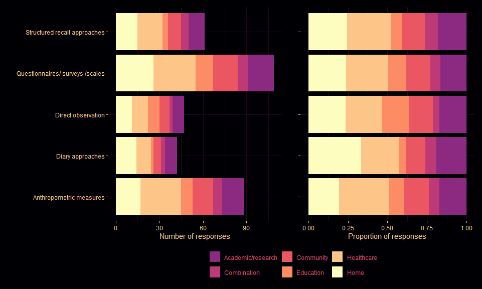<!-- -->

#### Figure: Method of administration across all responses

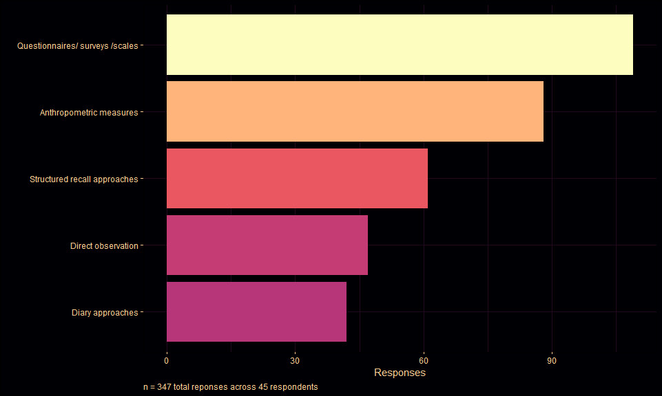<!-- -->

#### Figure: Location of administration across all responses

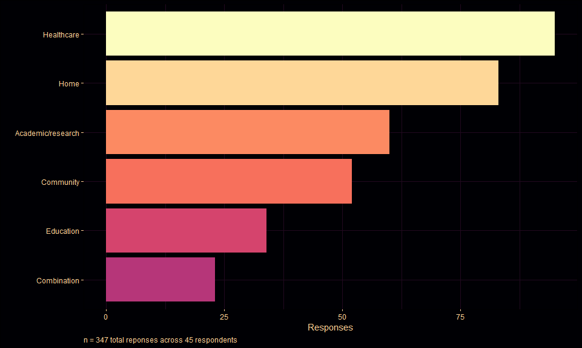<!-- -->

#### Figure: Method of administration - Healthcare

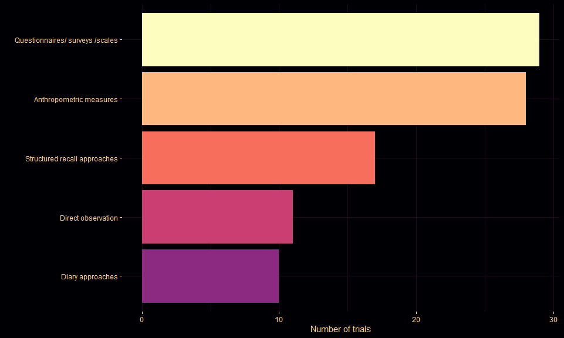<!-- -->

#### Figure: Method of administration - Home

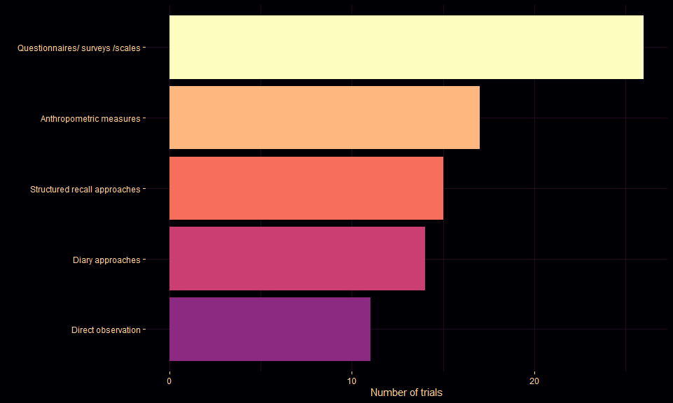<!-- -->

#### Figure: Method of administration - Community

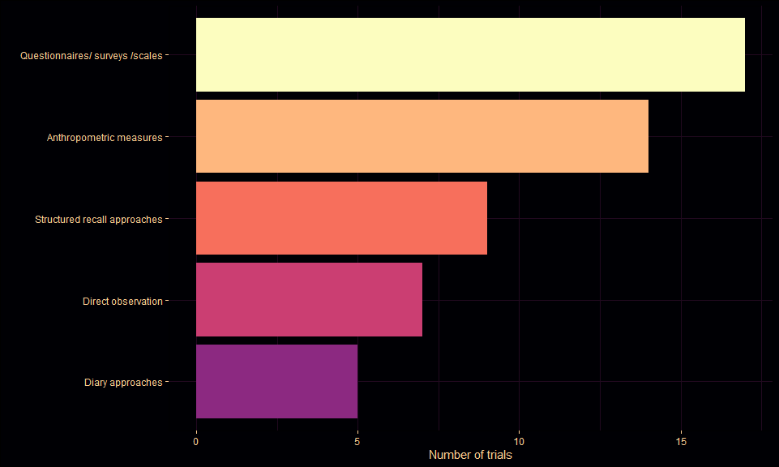<!-- -->

#### Figure: Method of administration - Educational

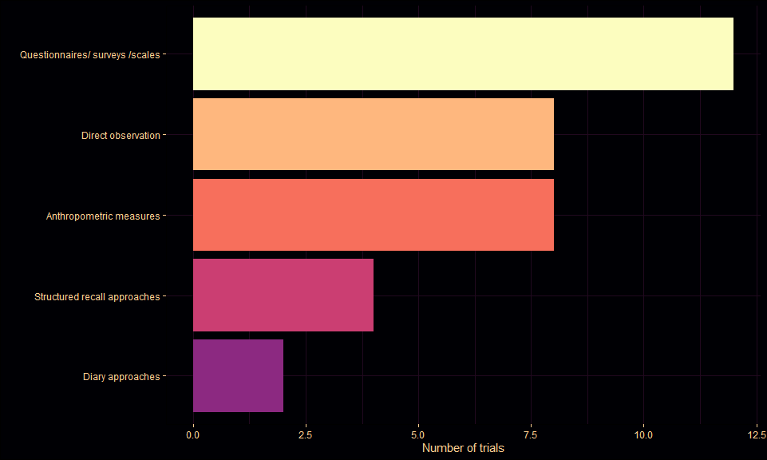<!-- -->

#### Figure: Method of administration - Academic/research

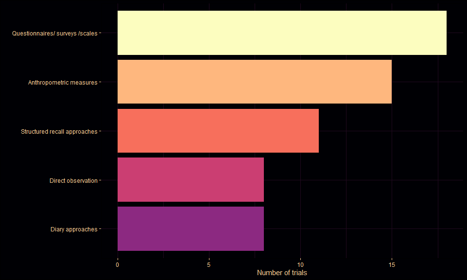<!-- -->

#### Figure: Method of administration - Combination

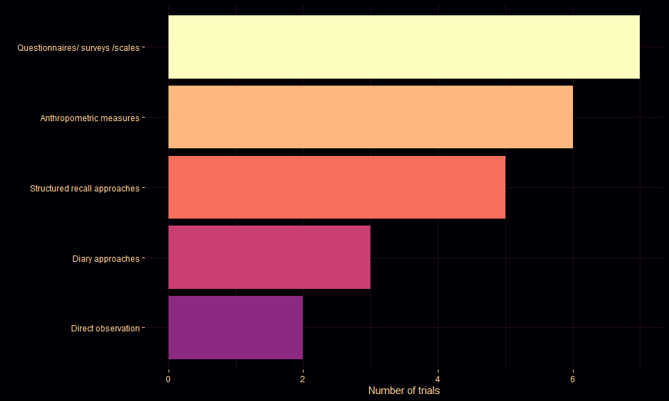<!-- -->

#### Free text


```
## [1] "Questionnaires/ surveys /scales" "Structured recall approaches"   
## [3] "Diary approaches"                "0"                              
## [5] "Anthropometric measures"         "Online so no location per say"
```

## (Q21) Importance 


```{=html}
<div id="imbmgnxhyr" style="padding-left:0px;padding-right:0px;padding-top:10px;padding-bottom:10px;overflow-x:auto;overflow-y:auto;width:auto;height:auto;">
<style>#imbmgnxhyr table {
  font-family: system-ui, 'Segoe UI', Roboto, Helvetica, Arial, sans-serif, 'Apple Color Emoji', 'Segoe UI Emoji', 'Segoe UI Symbol', 'Noto Color Emoji';
  -webkit-font-smoothing: antialiased;
  -moz-osx-font-smoothing: grayscale;
}

#imbmgnxhyr thead, #imbmgnxhyr tbody, #imbmgnxhyr tfoot, #imbmgnxhyr tr, #imbmgnxhyr td, #imbmgnxhyr th {
  border-style: none;
}

#imbmgnxhyr p {
  margin: 0;
  padding: 0;
}

#imbmgnxhyr .gt_table {
  display: table;
  border-collapse: collapse;
  line-height: normal;
  margin-left: auto;
  margin-right: auto;
  color: #333333;
  font-size: 16px;
  font-weight: normal;
  font-style: normal;
  background-color: #FFFFFF;
  width: auto;
  border-top-style: solid;
  border-top-width: 2px;
  border-top-color: #A8A8A8;
  border-right-style: none;
  border-right-width: 2px;
  border-right-color: #D3D3D3;
  border-bottom-style: solid;
  border-bottom-width: 2px;
  border-bottom-color: #A8A8A8;
  border-left-style: none;
  border-left-width: 2px;
  border-left-color: #D3D3D3;
}

#imbmgnxhyr .gt_caption {
  padding-top: 4px;
  padding-bottom: 4px;
}

#imbmgnxhyr .gt_title {
  color: #333333;
  font-size: 125%;
  font-weight: initial;
  padding-top: 4px;
  padding-bottom: 4px;
  padding-left: 5px;
  padding-right: 5px;
  border-bottom-color: #FFFFFF;
  border-bottom-width: 0;
}

#imbmgnxhyr .gt_subtitle {
  color: #333333;
  font-size: 85%;
  font-weight: initial;
  padding-top: 3px;
  padding-bottom: 5px;
  padding-left: 5px;
  padding-right: 5px;
  border-top-color: #FFFFFF;
  border-top-width: 0;
}

#imbmgnxhyr .gt_heading {
  background-color: #FFFFFF;
  text-align: center;
  border-bottom-color: #FFFFFF;
  border-left-style: none;
  border-left-width: 1px;
  border-left-color: #D3D3D3;
  border-right-style: none;
  border-right-width: 1px;
  border-right-color: #D3D3D3;
}

#imbmgnxhyr .gt_bottom_border {
  border-bottom-style: solid;
  border-bottom-width: 2px;
  border-bottom-color: #D3D3D3;
}

#imbmgnxhyr .gt_col_headings {
  border-top-style: solid;
  border-top-width: 2px;
  border-top-color: #D3D3D3;
  border-bottom-style: solid;
  border-bottom-width: 2px;
  border-bottom-color: #D3D3D3;
  border-left-style: none;
  border-left-width: 1px;
  border-left-color: #D3D3D3;
  border-right-style: none;
  border-right-width: 1px;
  border-right-color: #D3D3D3;
}

#imbmgnxhyr .gt_col_heading {
  color: #333333;
  background-color: #FFFFFF;
  font-size: 100%;
  font-weight: normal;
  text-transform: inherit;
  border-left-style: none;
  border-left-width: 1px;
  border-left-color: #D3D3D3;
  border-right-style: none;
  border-right-width: 1px;
  border-right-color: #D3D3D3;
  vertical-align: bottom;
  padding-top: 5px;
  padding-bottom: 6px;
  padding-left: 5px;
  padding-right: 5px;
  overflow-x: hidden;
}

#imbmgnxhyr .gt_column_spanner_outer {
  color: #333333;
  background-color: #FFFFFF;
  font-size: 100%;
  font-weight: normal;
  text-transform: inherit;
  padding-top: 0;
  padding-bottom: 0;
  padding-left: 4px;
  padding-right: 4px;
}

#imbmgnxhyr .gt_column_spanner_outer:first-child {
  padding-left: 0;
}

#imbmgnxhyr .gt_column_spanner_outer:last-child {
  padding-right: 0;
}

#imbmgnxhyr .gt_column_spanner {
  border-bottom-style: solid;
  border-bottom-width: 2px;
  border-bottom-color: #D3D3D3;
  vertical-align: bottom;
  padding-top: 5px;
  padding-bottom: 5px;
  overflow-x: hidden;
  display: inline-block;
  width: 100%;
}

#imbmgnxhyr .gt_spanner_row {
  border-bottom-style: hidden;
}

#imbmgnxhyr .gt_group_heading {
  padding-top: 8px;
  padding-bottom: 8px;
  padding-left: 5px;
  padding-right: 5px;
  color: #333333;
  background-color: #FFFFFF;
  font-size: 100%;
  font-weight: initial;
  text-transform: inherit;
  border-top-style: solid;
  border-top-width: 2px;
  border-top-color: #D3D3D3;
  border-bottom-style: solid;
  border-bottom-width: 2px;
  border-bottom-color: #D3D3D3;
  border-left-style: none;
  border-left-width: 1px;
  border-left-color: #D3D3D3;
  border-right-style: none;
  border-right-width: 1px;
  border-right-color: #D3D3D3;
  vertical-align: middle;
  text-align: left;
}

#imbmgnxhyr .gt_empty_group_heading {
  padding: 0.5px;
  color: #333333;
  background-color: #FFFFFF;
  font-size: 100%;
  font-weight: initial;
  border-top-style: solid;
  border-top-width: 2px;
  border-top-color: #D3D3D3;
  border-bottom-style: solid;
  border-bottom-width: 2px;
  border-bottom-color: #D3D3D3;
  vertical-align: middle;
}

#imbmgnxhyr .gt_from_md > :first-child {
  margin-top: 0;
}

#imbmgnxhyr .gt_from_md > :last-child {
  margin-bottom: 0;
}

#imbmgnxhyr .gt_row {
  padding-top: 8px;
  padding-bottom: 8px;
  padding-left: 5px;
  padding-right: 5px;
  margin: 10px;
  border-top-style: solid;
  border-top-width: 1px;
  border-top-color: #D3D3D3;
  border-left-style: none;
  border-left-width: 1px;
  border-left-color: #D3D3D3;
  border-right-style: none;
  border-right-width: 1px;
  border-right-color: #D3D3D3;
  vertical-align: middle;
  overflow-x: hidden;
}

#imbmgnxhyr .gt_stub {
  color: #333333;
  background-color: #FFFFFF;
  font-size: 100%;
  font-weight: initial;
  text-transform: inherit;
  border-right-style: solid;
  border-right-width: 2px;
  border-right-color: #D3D3D3;
  padding-left: 5px;
  padding-right: 5px;
}

#imbmgnxhyr .gt_stub_row_group {
  color: #333333;
  background-color: #FFFFFF;
  font-size: 100%;
  font-weight: initial;
  text-transform: inherit;
  border-right-style: solid;
  border-right-width: 2px;
  border-right-color: #D3D3D3;
  padding-left: 5px;
  padding-right: 5px;
  vertical-align: top;
}

#imbmgnxhyr .gt_row_group_first td {
  border-top-width: 2px;
}

#imbmgnxhyr .gt_row_group_first th {
  border-top-width: 2px;
}

#imbmgnxhyr .gt_summary_row {
  color: #333333;
  background-color: #FFFFFF;
  text-transform: inherit;
  padding-top: 8px;
  padding-bottom: 8px;
  padding-left: 5px;
  padding-right: 5px;
}

#imbmgnxhyr .gt_first_summary_row {
  border-top-style: solid;
  border-top-color: #D3D3D3;
}

#imbmgnxhyr .gt_first_summary_row.thick {
  border-top-width: 2px;
}

#imbmgnxhyr .gt_last_summary_row {
  padding-top: 8px;
  padding-bottom: 8px;
  padding-left: 5px;
  padding-right: 5px;
  border-bottom-style: solid;
  border-bottom-width: 2px;
  border-bottom-color: #D3D3D3;
}

#imbmgnxhyr .gt_grand_summary_row {
  color: #333333;
  background-color: #FFFFFF;
  text-transform: inherit;
  padding-top: 8px;
  padding-bottom: 8px;
  padding-left: 5px;
  padding-right: 5px;
}

#imbmgnxhyr .gt_first_grand_summary_row {
  padding-top: 8px;
  padding-bottom: 8px;
  padding-left: 5px;
  padding-right: 5px;
  border-top-style: double;
  border-top-width: 6px;
  border-top-color: #D3D3D3;
}

#imbmgnxhyr .gt_last_grand_summary_row_top {
  padding-top: 8px;
  padding-bottom: 8px;
  padding-left: 5px;
  padding-right: 5px;
  border-bottom-style: double;
  border-bottom-width: 6px;
  border-bottom-color: #D3D3D3;
}

#imbmgnxhyr .gt_striped {
  background-color: rgba(128, 128, 128, 0.05);
}

#imbmgnxhyr .gt_table_body {
  border-top-style: solid;
  border-top-width: 2px;
  border-top-color: #D3D3D3;
  border-bottom-style: solid;
  border-bottom-width: 2px;
  border-bottom-color: #D3D3D3;
}

#imbmgnxhyr .gt_footnotes {
  color: #333333;
  background-color: #FFFFFF;
  border-bottom-style: none;
  border-bottom-width: 2px;
  border-bottom-color: #D3D3D3;
  border-left-style: none;
  border-left-width: 2px;
  border-left-color: #D3D3D3;
  border-right-style: none;
  border-right-width: 2px;
  border-right-color: #D3D3D3;
}

#imbmgnxhyr .gt_footnote {
  margin: 0px;
  font-size: 90%;
  padding-top: 4px;
  padding-bottom: 4px;
  padding-left: 5px;
  padding-right: 5px;
}

#imbmgnxhyr .gt_sourcenotes {
  color: #333333;
  background-color: #FFFFFF;
  border-bottom-style: none;
  border-bottom-width: 2px;
  border-bottom-color: #D3D3D3;
  border-left-style: none;
  border-left-width: 2px;
  border-left-color: #D3D3D3;
  border-right-style: none;
  border-right-width: 2px;
  border-right-color: #D3D3D3;
}

#imbmgnxhyr .gt_sourcenote {
  font-size: 90%;
  padding-top: 4px;
  padding-bottom: 4px;
  padding-left: 5px;
  padding-right: 5px;
}

#imbmgnxhyr .gt_left {
  text-align: left;
}

#imbmgnxhyr .gt_center {
  text-align: center;
}

#imbmgnxhyr .gt_right {
  text-align: right;
  font-variant-numeric: tabular-nums;
}

#imbmgnxhyr .gt_font_normal {
  font-weight: normal;
}

#imbmgnxhyr .gt_font_bold {
  font-weight: bold;
}

#imbmgnxhyr .gt_font_italic {
  font-style: italic;
}

#imbmgnxhyr .gt_super {
  font-size: 65%;
}

#imbmgnxhyr .gt_footnote_marks {
  font-size: 75%;
  vertical-align: 0.4em;
  position: initial;
}

#imbmgnxhyr .gt_asterisk {
  font-size: 100%;
  vertical-align: 0;
}

#imbmgnxhyr .gt_indent_1 {
  text-indent: 5px;
}

#imbmgnxhyr .gt_indent_2 {
  text-indent: 10px;
}

#imbmgnxhyr .gt_indent_3 {
  text-indent: 15px;
}

#imbmgnxhyr .gt_indent_4 {
  text-indent: 20px;
}

#imbmgnxhyr .gt_indent_5 {
  text-indent: 25px;
}

#imbmgnxhyr .katex-display {
  display: inline-flex !important;
  margin-bottom: 0.75em !important;
}

#imbmgnxhyr div.Reactable > div.rt-table > div.rt-thead > div.rt-tr.rt-tr-group-header > div.rt-th-group:after {
  height: 0px !important;
}
</style>
<table class="gt_table" data-quarto-disable-processing="false" data-quarto-bootstrap="false">
  <thead>
    <tr class="gt_col_headings">
      <th class="gt_col_heading gt_columns_bottom_border gt_left" rowspan="1" colspan="1" scope="col" id="label"><span class='gt_from_md'><strong>Characteristic</strong></span></th>
      <th class="gt_col_heading gt_columns_bottom_border gt_center" rowspan="1" colspan="1" scope="col" id="stat_0"><span class='gt_from_md'><strong>N = 46</strong></span><span class="gt_footnote_marks" style="white-space:nowrap;font-style:italic;font-weight:normal;line-height:0;"><sup>1</sup></span></th>
    </tr>
  </thead>
  <tbody class="gt_table_body">
    <tr><td headers="label" class="gt_row gt_left">Ease of finding/identifying the outcome measurement instrument</td>
<td headers="stat_0" class="gt_row gt_center"><br /></td></tr>
    <tr><td headers="label" class="gt_row gt_left">    Very important</td>
<td headers="stat_0" class="gt_row gt_center">19/44 (43%)</td></tr>
    <tr><td headers="label" class="gt_row gt_left">    Important</td>
<td headers="stat_0" class="gt_row gt_center">18/44 (41%)</td></tr>
    <tr><td headers="label" class="gt_row gt_left">    Neutral</td>
<td headers="stat_0" class="gt_row gt_center">7/44 (16%)</td></tr>
    <tr><td headers="label" class="gt_row gt_left">    Not important</td>
<td headers="stat_0" class="gt_row gt_center">0/44 (0%)</td></tr>
    <tr><td headers="label" class="gt_row gt_left">    Not important at all</td>
<td headers="stat_0" class="gt_row gt_center">0/44 (0%)</td></tr>
    <tr><td headers="label" class="gt_row gt_left">    Missing or not applicable</td>
<td headers="stat_0" class="gt_row gt_center">2</td></tr>
    <tr><td headers="label" class="gt_row gt_left">Whether the measurement instrument has been used in similar trials previously</td>
<td headers="stat_0" class="gt_row gt_center"><br /></td></tr>
    <tr><td headers="label" class="gt_row gt_left">    Very important</td>
<td headers="stat_0" class="gt_row gt_center">25/45 (56%)</td></tr>
    <tr><td headers="label" class="gt_row gt_left">    Important</td>
<td headers="stat_0" class="gt_row gt_center">18/45 (40%)</td></tr>
    <tr><td headers="label" class="gt_row gt_left">    Neutral</td>
<td headers="stat_0" class="gt_row gt_center">2/45 (4.4%)</td></tr>
    <tr><td headers="label" class="gt_row gt_left">    Not important</td>
<td headers="stat_0" class="gt_row gt_center">0/45 (0%)</td></tr>
    <tr><td headers="label" class="gt_row gt_left">    Not important at all</td>
<td headers="stat_0" class="gt_row gt_center">0/45 (0%)</td></tr>
    <tr><td headers="label" class="gt_row gt_left">    Missing or not applicable</td>
<td headers="stat_0" class="gt_row gt_center">1</td></tr>
    <tr><td headers="label" class="gt_row gt_left">How the measurement instrument was developed</td>
<td headers="stat_0" class="gt_row gt_center"><br /></td></tr>
    <tr><td headers="label" class="gt_row gt_left">    Very important</td>
<td headers="stat_0" class="gt_row gt_center">20/44 (45%)</td></tr>
    <tr><td headers="label" class="gt_row gt_left">    Important</td>
<td headers="stat_0" class="gt_row gt_center">19/44 (43%)</td></tr>
    <tr><td headers="label" class="gt_row gt_left">    Neutral</td>
<td headers="stat_0" class="gt_row gt_center">2/44 (4.5%)</td></tr>
    <tr><td headers="label" class="gt_row gt_left">    Not important</td>
<td headers="stat_0" class="gt_row gt_center">3/44 (6.8%)</td></tr>
    <tr><td headers="label" class="gt_row gt_left">    Not important at all</td>
<td headers="stat_0" class="gt_row gt_center">0/44 (0%)</td></tr>
    <tr><td headers="label" class="gt_row gt_left">    Missing or not applicable</td>
<td headers="stat_0" class="gt_row gt_center">2</td></tr>
    <tr><td headers="label" class="gt_row gt_left">Who developed the measurement instrument</td>
<td headers="stat_0" class="gt_row gt_center"><br /></td></tr>
    <tr><td headers="label" class="gt_row gt_left">    Very important</td>
<td headers="stat_0" class="gt_row gt_center">4/43 (9.3%)</td></tr>
    <tr><td headers="label" class="gt_row gt_left">    Important</td>
<td headers="stat_0" class="gt_row gt_center">6/43 (14%)</td></tr>
    <tr><td headers="label" class="gt_row gt_left">    Neutral</td>
<td headers="stat_0" class="gt_row gt_center">20/43 (47%)</td></tr>
    <tr><td headers="label" class="gt_row gt_left">    Not important</td>
<td headers="stat_0" class="gt_row gt_center">12/43 (28%)</td></tr>
    <tr><td headers="label" class="gt_row gt_left">    Not important at all</td>
<td headers="stat_0" class="gt_row gt_center">1/43 (2.3%)</td></tr>
    <tr><td headers="label" class="gt_row gt_left">    Missing or not applicable</td>
<td headers="stat_0" class="gt_row gt_center">3</td></tr>
    <tr><td headers="label" class="gt_row gt_left">Relevance of the measurement instrument for your population</td>
<td headers="stat_0" class="gt_row gt_center"><br /></td></tr>
    <tr><td headers="label" class="gt_row gt_left">    Very important</td>
<td headers="stat_0" class="gt_row gt_center">34/45 (76%)</td></tr>
    <tr><td headers="label" class="gt_row gt_left">    Important</td>
<td headers="stat_0" class="gt_row gt_center">10/45 (22%)</td></tr>
    <tr><td headers="label" class="gt_row gt_left">    Neutral</td>
<td headers="stat_0" class="gt_row gt_center">1/45 (2.2%)</td></tr>
    <tr><td headers="label" class="gt_row gt_left">    Not important</td>
<td headers="stat_0" class="gt_row gt_center">0/45 (0%)</td></tr>
    <tr><td headers="label" class="gt_row gt_left">    Not important at all</td>
<td headers="stat_0" class="gt_row gt_center">0/45 (0%)</td></tr>
    <tr><td headers="label" class="gt_row gt_left">    Missing or not applicable</td>
<td headers="stat_0" class="gt_row gt_center">1</td></tr>
    <tr><td headers="label" class="gt_row gt_left">Whether the measurement instrument requires translation for your trial</td>
<td headers="stat_0" class="gt_row gt_center"><br /></td></tr>
    <tr><td headers="label" class="gt_row gt_left">    Very important</td>
<td headers="stat_0" class="gt_row gt_center">11/43 (26%)</td></tr>
    <tr><td headers="label" class="gt_row gt_left">    Important</td>
<td headers="stat_0" class="gt_row gt_center">19/43 (44%)</td></tr>
    <tr><td headers="label" class="gt_row gt_left">    Neutral</td>
<td headers="stat_0" class="gt_row gt_center">11/43 (26%)</td></tr>
    <tr><td headers="label" class="gt_row gt_left">    Not important</td>
<td headers="stat_0" class="gt_row gt_center">2/43 (4.7%)</td></tr>
    <tr><td headers="label" class="gt_row gt_left">    Not important at all</td>
<td headers="stat_0" class="gt_row gt_center">0/43 (0%)</td></tr>
    <tr><td headers="label" class="gt_row gt_left">    Missing or not applicable</td>
<td headers="stat_0" class="gt_row gt_center">3</td></tr>
    <tr><td headers="label" class="gt_row gt_left">Whether there is support for multiple languages when using the measurement instrument</td>
<td headers="stat_0" class="gt_row gt_center"><br /></td></tr>
    <tr><td headers="label" class="gt_row gt_left">    Very important</td>
<td headers="stat_0" class="gt_row gt_center">6/43 (14%)</td></tr>
    <tr><td headers="label" class="gt_row gt_left">    Important</td>
<td headers="stat_0" class="gt_row gt_center">18/43 (42%)</td></tr>
    <tr><td headers="label" class="gt_row gt_left">    Neutral</td>
<td headers="stat_0" class="gt_row gt_center">13/43 (30%)</td></tr>
    <tr><td headers="label" class="gt_row gt_left">    Not important</td>
<td headers="stat_0" class="gt_row gt_center">5/43 (12%)</td></tr>
    <tr><td headers="label" class="gt_row gt_left">    Not important at all</td>
<td headers="stat_0" class="gt_row gt_center">1/43 (2.3%)</td></tr>
    <tr><td headers="label" class="gt_row gt_left">    Missing or not applicable</td>
<td headers="stat_0" class="gt_row gt_center">3</td></tr>
    <tr><td headers="label" class="gt_row gt_left">Cultural sensitivity and appropriateness</td>
<td headers="stat_0" class="gt_row gt_center"><br /></td></tr>
    <tr><td headers="label" class="gt_row gt_left">    Very important</td>
<td headers="stat_0" class="gt_row gt_center">22/44 (50%)</td></tr>
    <tr><td headers="label" class="gt_row gt_left">    Important</td>
<td headers="stat_0" class="gt_row gt_center">19/44 (43%)</td></tr>
    <tr><td headers="label" class="gt_row gt_left">    Neutral</td>
<td headers="stat_0" class="gt_row gt_center">3/44 (6.8%)</td></tr>
    <tr><td headers="label" class="gt_row gt_left">    Not important</td>
<td headers="stat_0" class="gt_row gt_center">0/44 (0%)</td></tr>
    <tr><td headers="label" class="gt_row gt_left">    Not important at all</td>
<td headers="stat_0" class="gt_row gt_center">0/44 (0%)</td></tr>
    <tr><td headers="label" class="gt_row gt_left">    Missing or not applicable</td>
<td headers="stat_0" class="gt_row gt_center">2</td></tr>
    <tr><td headers="label" class="gt_row gt_left">Ease of administration</td>
<td headers="stat_0" class="gt_row gt_center"><br /></td></tr>
    <tr><td headers="label" class="gt_row gt_left">    Very important</td>
<td headers="stat_0" class="gt_row gt_center">34/44 (77%)</td></tr>
    <tr><td headers="label" class="gt_row gt_left">    Important</td>
<td headers="stat_0" class="gt_row gt_center">8/44 (18%)</td></tr>
    <tr><td headers="label" class="gt_row gt_left">    Neutral</td>
<td headers="stat_0" class="gt_row gt_center">2/44 (4.5%)</td></tr>
    <tr><td headers="label" class="gt_row gt_left">    Not important</td>
<td headers="stat_0" class="gt_row gt_center">0/44 (0%)</td></tr>
    <tr><td headers="label" class="gt_row gt_left">    Not important at all</td>
<td headers="stat_0" class="gt_row gt_center">0/44 (0%)</td></tr>
    <tr><td headers="label" class="gt_row gt_left">    Missing or not applicable</td>
<td headers="stat_0" class="gt_row gt_center">2</td></tr>
    <tr><td headers="label" class="gt_row gt_left">The number of items in the measurement instrument</td>
<td headers="stat_0" class="gt_row gt_center"><br /></td></tr>
    <tr><td headers="label" class="gt_row gt_left">    Very important</td>
<td headers="stat_0" class="gt_row gt_center">29/45 (64%)</td></tr>
    <tr><td headers="label" class="gt_row gt_left">    Important</td>
<td headers="stat_0" class="gt_row gt_center">14/45 (31%)</td></tr>
    <tr><td headers="label" class="gt_row gt_left">    Neutral</td>
<td headers="stat_0" class="gt_row gt_center">2/45 (4.4%)</td></tr>
    <tr><td headers="label" class="gt_row gt_left">    Not important</td>
<td headers="stat_0" class="gt_row gt_center">0/45 (0%)</td></tr>
    <tr><td headers="label" class="gt_row gt_left">    Not important at all</td>
<td headers="stat_0" class="gt_row gt_center">0/45 (0%)</td></tr>
    <tr><td headers="label" class="gt_row gt_left">    Missing or not applicable</td>
<td headers="stat_0" class="gt_row gt_center">1</td></tr>
    <tr><td headers="label" class="gt_row gt_left">Length of time for researcher to administer</td>
<td headers="stat_0" class="gt_row gt_center"><br /></td></tr>
    <tr><td headers="label" class="gt_row gt_left">    Very important</td>
<td headers="stat_0" class="gt_row gt_center">20/43 (47%)</td></tr>
    <tr><td headers="label" class="gt_row gt_left">    Important</td>
<td headers="stat_0" class="gt_row gt_center">18/43 (42%)</td></tr>
    <tr><td headers="label" class="gt_row gt_left">    Neutral</td>
<td headers="stat_0" class="gt_row gt_center">5/43 (12%)</td></tr>
    <tr><td headers="label" class="gt_row gt_left">    Not important</td>
<td headers="stat_0" class="gt_row gt_center">0/43 (0%)</td></tr>
    <tr><td headers="label" class="gt_row gt_left">    Not important at all</td>
<td headers="stat_0" class="gt_row gt_center">0/43 (0%)</td></tr>
    <tr><td headers="label" class="gt_row gt_left">    Missing or not applicable</td>
<td headers="stat_0" class="gt_row gt_center">3</td></tr>
    <tr><td headers="label" class="gt_row gt_left">Length of time for participants to complete</td>
<td headers="stat_0" class="gt_row gt_center"><br /></td></tr>
    <tr><td headers="label" class="gt_row gt_left">    Very important</td>
<td headers="stat_0" class="gt_row gt_center">34/44 (77%)</td></tr>
    <tr><td headers="label" class="gt_row gt_left">    Important</td>
<td headers="stat_0" class="gt_row gt_center">10/44 (23%)</td></tr>
    <tr><td headers="label" class="gt_row gt_left">    Neutral</td>
<td headers="stat_0" class="gt_row gt_center">0/44 (0%)</td></tr>
    <tr><td headers="label" class="gt_row gt_left">    Not important</td>
<td headers="stat_0" class="gt_row gt_center">0/44 (0%)</td></tr>
    <tr><td headers="label" class="gt_row gt_left">    Not important at all</td>
<td headers="stat_0" class="gt_row gt_center">0/44 (0%)</td></tr>
    <tr><td headers="label" class="gt_row gt_left">    Missing or not applicable</td>
<td headers="stat_0" class="gt_row gt_center">2</td></tr>
    <tr><td headers="label" class="gt_row gt_left">Participants comprehensibility of the measurement instrument</td>
<td headers="stat_0" class="gt_row gt_center"><br /></td></tr>
    <tr><td headers="label" class="gt_row gt_left">    Very important</td>
<td headers="stat_0" class="gt_row gt_center">28/44 (64%)</td></tr>
    <tr><td headers="label" class="gt_row gt_left">    Important</td>
<td headers="stat_0" class="gt_row gt_center">14/44 (32%)</td></tr>
    <tr><td headers="label" class="gt_row gt_left">    Neutral</td>
<td headers="stat_0" class="gt_row gt_center">2/44 (4.5%)</td></tr>
    <tr><td headers="label" class="gt_row gt_left">    Not important</td>
<td headers="stat_0" class="gt_row gt_center">0/44 (0%)</td></tr>
    <tr><td headers="label" class="gt_row gt_left">    Not important at all</td>
<td headers="stat_0" class="gt_row gt_center">0/44 (0%)</td></tr>
    <tr><td headers="label" class="gt_row gt_left">    Missing or not applicable</td>
<td headers="stat_0" class="gt_row gt_center">2</td></tr>
    <tr><td headers="label" class="gt_row gt_left">Clinicians comprehensibility of the measurement instrument</td>
<td headers="stat_0" class="gt_row gt_center"><br /></td></tr>
    <tr><td headers="label" class="gt_row gt_left">    Very important</td>
<td headers="stat_0" class="gt_row gt_center">10/42 (24%)</td></tr>
    <tr><td headers="label" class="gt_row gt_left">    Important</td>
<td headers="stat_0" class="gt_row gt_center">20/42 (48%)</td></tr>
    <tr><td headers="label" class="gt_row gt_left">    Neutral</td>
<td headers="stat_0" class="gt_row gt_center">7/42 (17%)</td></tr>
    <tr><td headers="label" class="gt_row gt_left">    Not important</td>
<td headers="stat_0" class="gt_row gt_center">4/42 (9.5%)</td></tr>
    <tr><td headers="label" class="gt_row gt_left">    Not important at all</td>
<td headers="stat_0" class="gt_row gt_center">1/42 (2.4%)</td></tr>
    <tr><td headers="label" class="gt_row gt_left">    Missing or not applicable</td>
<td headers="stat_0" class="gt_row gt_center">4</td></tr>
    <tr><td headers="label" class="gt_row gt_left">Participants mental ability to complete the measurement</td>
<td headers="stat_0" class="gt_row gt_center"><br /></td></tr>
    <tr><td headers="label" class="gt_row gt_left">    Very important</td>
<td headers="stat_0" class="gt_row gt_center">24/43 (56%)</td></tr>
    <tr><td headers="label" class="gt_row gt_left">    Important</td>
<td headers="stat_0" class="gt_row gt_center">16/43 (37%)</td></tr>
    <tr><td headers="label" class="gt_row gt_left">    Neutral</td>
<td headers="stat_0" class="gt_row gt_center">3/43 (7.0%)</td></tr>
    <tr><td headers="label" class="gt_row gt_left">    Not important</td>
<td headers="stat_0" class="gt_row gt_center">0/43 (0%)</td></tr>
    <tr><td headers="label" class="gt_row gt_left">    Not important at all</td>
<td headers="stat_0" class="gt_row gt_center">0/43 (0%)</td></tr>
    <tr><td headers="label" class="gt_row gt_left">    Missing or not applicable</td>
<td headers="stat_0" class="gt_row gt_center">3</td></tr>
    <tr><td headers="label" class="gt_row gt_left">Participants physical ability to complete the measurement</td>
<td headers="stat_0" class="gt_row gt_center"><br /></td></tr>
    <tr><td headers="label" class="gt_row gt_left">    Very important</td>
<td headers="stat_0" class="gt_row gt_center">19/42 (45%)</td></tr>
    <tr><td headers="label" class="gt_row gt_left">    Important</td>
<td headers="stat_0" class="gt_row gt_center">16/42 (38%)</td></tr>
    <tr><td headers="label" class="gt_row gt_left">    Neutral</td>
<td headers="stat_0" class="gt_row gt_center">6/42 (14%)</td></tr>
    <tr><td headers="label" class="gt_row gt_left">    Not important</td>
<td headers="stat_0" class="gt_row gt_center">1/42 (2.4%)</td></tr>
    <tr><td headers="label" class="gt_row gt_left">    Not important at all</td>
<td headers="stat_0" class="gt_row gt_center">0/42 (0%)</td></tr>
    <tr><td headers="label" class="gt_row gt_left">    Missing or not applicable</td>
<td headers="stat_0" class="gt_row gt_center">4</td></tr>
    <tr><td headers="label" class="gt_row gt_left">Whether the measurement instrument requires specialist training to administer</td>
<td headers="stat_0" class="gt_row gt_center"><br /></td></tr>
    <tr><td headers="label" class="gt_row gt_left">    Very important</td>
<td headers="stat_0" class="gt_row gt_center">13/42 (31%)</td></tr>
    <tr><td headers="label" class="gt_row gt_left">    Important</td>
<td headers="stat_0" class="gt_row gt_center">23/42 (55%)</td></tr>
    <tr><td headers="label" class="gt_row gt_left">    Neutral</td>
<td headers="stat_0" class="gt_row gt_center">5/42 (12%)</td></tr>
    <tr><td headers="label" class="gt_row gt_left">    Not important</td>
<td headers="stat_0" class="gt_row gt_center">1/42 (2.4%)</td></tr>
    <tr><td headers="label" class="gt_row gt_left">    Not important at all</td>
<td headers="stat_0" class="gt_row gt_center">0/42 (0%)</td></tr>
    <tr><td headers="label" class="gt_row gt_left">    Missing or not applicable</td>
<td headers="stat_0" class="gt_row gt_center">4</td></tr>
    <tr><td headers="label" class="gt_row gt_left">Whether the measurement instrument requires specialist equipment/device(s) to administer</td>
<td headers="stat_0" class="gt_row gt_center"><br /></td></tr>
    <tr><td headers="label" class="gt_row gt_left">    Very important</td>
<td headers="stat_0" class="gt_row gt_center">14/40 (35%)</td></tr>
    <tr><td headers="label" class="gt_row gt_left">    Important</td>
<td headers="stat_0" class="gt_row gt_center">21/40 (53%)</td></tr>
    <tr><td headers="label" class="gt_row gt_left">    Neutral</td>
<td headers="stat_0" class="gt_row gt_center">3/40 (7.5%)</td></tr>
    <tr><td headers="label" class="gt_row gt_left">    Not important</td>
<td headers="stat_0" class="gt_row gt_center">2/40 (5.0%)</td></tr>
    <tr><td headers="label" class="gt_row gt_left">    Not important at all</td>
<td headers="stat_0" class="gt_row gt_center">0/40 (0%)</td></tr>
    <tr><td headers="label" class="gt_row gt_left">    Missing or not applicable</td>
<td headers="stat_0" class="gt_row gt_center">6</td></tr>
    <tr><td headers="label" class="gt_row gt_left">If a designated place is needed to administer/complete the measurement instrument</td>
<td headers="stat_0" class="gt_row gt_center"><br /></td></tr>
    <tr><td headers="label" class="gt_row gt_left">    Very important</td>
<td headers="stat_0" class="gt_row gt_center">17/42 (40%)</td></tr>
    <tr><td headers="label" class="gt_row gt_left">    Important</td>
<td headers="stat_0" class="gt_row gt_center">16/42 (38%)</td></tr>
    <tr><td headers="label" class="gt_row gt_left">    Neutral</td>
<td headers="stat_0" class="gt_row gt_center">7/42 (17%)</td></tr>
    <tr><td headers="label" class="gt_row gt_left">    Not important</td>
<td headers="stat_0" class="gt_row gt_center">2/42 (4.8%)</td></tr>
    <tr><td headers="label" class="gt_row gt_left">    Not important at all</td>
<td headers="stat_0" class="gt_row gt_center">0/42 (0%)</td></tr>
    <tr><td headers="label" class="gt_row gt_left">    Missing or not applicable</td>
<td headers="stat_0" class="gt_row gt_center">4</td></tr>
    <tr><td headers="label" class="gt_row gt_left">The mode of administration (i.e., in person, online, by phone)</td>
<td headers="stat_0" class="gt_row gt_center"><br /></td></tr>
    <tr><td headers="label" class="gt_row gt_left">    Very important</td>
<td headers="stat_0" class="gt_row gt_center">14/43 (33%)</td></tr>
    <tr><td headers="label" class="gt_row gt_left">    Important</td>
<td headers="stat_0" class="gt_row gt_center">20/43 (47%)</td></tr>
    <tr><td headers="label" class="gt_row gt_left">    Neutral</td>
<td headers="stat_0" class="gt_row gt_center">9/43 (21%)</td></tr>
    <tr><td headers="label" class="gt_row gt_left">    Not important</td>
<td headers="stat_0" class="gt_row gt_center">0/43 (0%)</td></tr>
    <tr><td headers="label" class="gt_row gt_left">    Not important at all</td>
<td headers="stat_0" class="gt_row gt_center">0/43 (0%)</td></tr>
    <tr><td headers="label" class="gt_row gt_left">    Missing or not applicable</td>
<td headers="stat_0" class="gt_row gt_center">3</td></tr>
    <tr><td headers="label" class="gt_row gt_left">When the measurement instrument is completed</td>
<td headers="stat_0" class="gt_row gt_center"><br /></td></tr>
    <tr><td headers="label" class="gt_row gt_left">    Very important</td>
<td headers="stat_0" class="gt_row gt_center">9/43 (21%)</td></tr>
    <tr><td headers="label" class="gt_row gt_left">    Important</td>
<td headers="stat_0" class="gt_row gt_center">18/43 (42%)</td></tr>
    <tr><td headers="label" class="gt_row gt_left">    Neutral</td>
<td headers="stat_0" class="gt_row gt_center">13/43 (30%)</td></tr>
    <tr><td headers="label" class="gt_row gt_left">    Not important</td>
<td headers="stat_0" class="gt_row gt_center">3/43 (7.0%)</td></tr>
    <tr><td headers="label" class="gt_row gt_left">    Not important at all</td>
<td headers="stat_0" class="gt_row gt_center">0/43 (0%)</td></tr>
    <tr><td headers="label" class="gt_row gt_left">    Missing or not applicable</td>
<td headers="stat_0" class="gt_row gt_center">3</td></tr>
    <tr><td headers="label" class="gt_row gt_left">Acceptability of the measurement instrument to clinicians/practice staff</td>
<td headers="stat_0" class="gt_row gt_center"><br /></td></tr>
    <tr><td headers="label" class="gt_row gt_left">    Very important</td>
<td headers="stat_0" class="gt_row gt_center">16/44 (36%)</td></tr>
    <tr><td headers="label" class="gt_row gt_left">    Important</td>
<td headers="stat_0" class="gt_row gt_center">19/44 (43%)</td></tr>
    <tr><td headers="label" class="gt_row gt_left">    Neutral</td>
<td headers="stat_0" class="gt_row gt_center">8/44 (18%)</td></tr>
    <tr><td headers="label" class="gt_row gt_left">    Not important</td>
<td headers="stat_0" class="gt_row gt_center">1/44 (2.3%)</td></tr>
    <tr><td headers="label" class="gt_row gt_left">    Not important at all</td>
<td headers="stat_0" class="gt_row gt_center">0/44 (0%)</td></tr>
    <tr><td headers="label" class="gt_row gt_left">    Missing or not applicable</td>
<td headers="stat_0" class="gt_row gt_center">2</td></tr>
    <tr><td headers="label" class="gt_row gt_left">Acceptability of the measurement instrument to participants</td>
<td headers="stat_0" class="gt_row gt_center"><br /></td></tr>
    <tr><td headers="label" class="gt_row gt_left">    Very important</td>
<td headers="stat_0" class="gt_row gt_center">29/43 (67%)</td></tr>
    <tr><td headers="label" class="gt_row gt_left">    Important</td>
<td headers="stat_0" class="gt_row gt_center">11/43 (26%)</td></tr>
    <tr><td headers="label" class="gt_row gt_left">    Neutral</td>
<td headers="stat_0" class="gt_row gt_center">3/43 (7.0%)</td></tr>
    <tr><td headers="label" class="gt_row gt_left">    Not important</td>
<td headers="stat_0" class="gt_row gt_center">0/43 (0%)</td></tr>
    <tr><td headers="label" class="gt_row gt_left">    Not important at all</td>
<td headers="stat_0" class="gt_row gt_center">0/43 (0%)</td></tr>
    <tr><td headers="label" class="gt_row gt_left">    Missing or not applicable</td>
<td headers="stat_0" class="gt_row gt_center">3</td></tr>
    <tr><td headers="label" class="gt_row gt_left">Costs associated with using the measurement instrument</td>
<td headers="stat_0" class="gt_row gt_center"><br /></td></tr>
    <tr><td headers="label" class="gt_row gt_left">    Very important</td>
<td headers="stat_0" class="gt_row gt_center">19/43 (44%)</td></tr>
    <tr><td headers="label" class="gt_row gt_left">    Important</td>
<td headers="stat_0" class="gt_row gt_center">24/43 (56%)</td></tr>
    <tr><td headers="label" class="gt_row gt_left">    Neutral</td>
<td headers="stat_0" class="gt_row gt_center">0/43 (0%)</td></tr>
    <tr><td headers="label" class="gt_row gt_left">    Not important</td>
<td headers="stat_0" class="gt_row gt_center">0/43 (0%)</td></tr>
    <tr><td headers="label" class="gt_row gt_left">    Not important at all</td>
<td headers="stat_0" class="gt_row gt_center">0/43 (0%)</td></tr>
    <tr><td headers="label" class="gt_row gt_left">    Missing or not applicable</td>
<td headers="stat_0" class="gt_row gt_center">3</td></tr>
    <tr><td headers="label" class="gt_row gt_left">How the instrument handles sensitive information</td>
<td headers="stat_0" class="gt_row gt_center"><br /></td></tr>
    <tr><td headers="label" class="gt_row gt_left">    Very important</td>
<td headers="stat_0" class="gt_row gt_center">24/44 (55%)</td></tr>
    <tr><td headers="label" class="gt_row gt_left">    Important</td>
<td headers="stat_0" class="gt_row gt_center">13/44 (30%)</td></tr>
    <tr><td headers="label" class="gt_row gt_left">    Neutral</td>
<td headers="stat_0" class="gt_row gt_center">4/44 (9.1%)</td></tr>
    <tr><td headers="label" class="gt_row gt_left">    Not important</td>
<td headers="stat_0" class="gt_row gt_center">3/44 (6.8%)</td></tr>
    <tr><td headers="label" class="gt_row gt_left">    Not important at all</td>
<td headers="stat_0" class="gt_row gt_center">0/44 (0%)</td></tr>
    <tr><td headers="label" class="gt_row gt_left">    Missing or not applicable</td>
<td headers="stat_0" class="gt_row gt_center">2</td></tr>
    <tr><td headers="label" class="gt_row gt_left">Risk of adverse outcomes following use of the measurement instrument</td>
<td headers="stat_0" class="gt_row gt_center"><br /></td></tr>
    <tr><td headers="label" class="gt_row gt_left">    Very important</td>
<td headers="stat_0" class="gt_row gt_center">21/42 (50%)</td></tr>
    <tr><td headers="label" class="gt_row gt_left">    Important</td>
<td headers="stat_0" class="gt_row gt_center">16/42 (38%)</td></tr>
    <tr><td headers="label" class="gt_row gt_left">    Neutral</td>
<td headers="stat_0" class="gt_row gt_center">4/42 (9.5%)</td></tr>
    <tr><td headers="label" class="gt_row gt_left">    Not important</td>
<td headers="stat_0" class="gt_row gt_center">1/42 (2.4%)</td></tr>
    <tr><td headers="label" class="gt_row gt_left">    Not important at all</td>
<td headers="stat_0" class="gt_row gt_center">0/42 (0%)</td></tr>
    <tr><td headers="label" class="gt_row gt_left">    Missing or not applicable</td>
<td headers="stat_0" class="gt_row gt_center">4</td></tr>
    <tr><td headers="label" class="gt_row gt_left">Ease of score calculation</td>
<td headers="stat_0" class="gt_row gt_center"><br /></td></tr>
    <tr><td headers="label" class="gt_row gt_left">    Very important</td>
<td headers="stat_0" class="gt_row gt_center">3/44 (6.8%)</td></tr>
    <tr><td headers="label" class="gt_row gt_left">    Important</td>
<td headers="stat_0" class="gt_row gt_center">22/44 (50%)</td></tr>
    <tr><td headers="label" class="gt_row gt_left">    Neutral</td>
<td headers="stat_0" class="gt_row gt_center">12/44 (27%)</td></tr>
    <tr><td headers="label" class="gt_row gt_left">    Not important</td>
<td headers="stat_0" class="gt_row gt_center">5/44 (11%)</td></tr>
    <tr><td headers="label" class="gt_row gt_left">    Not important at all</td>
<td headers="stat_0" class="gt_row gt_center">2/44 (4.5%)</td></tr>
    <tr><td headers="label" class="gt_row gt_left">    Missing or not applicable</td>
<td headers="stat_0" class="gt_row gt_center">2</td></tr>
    <tr><td headers="label" class="gt_row gt_left">The types of analyses that can be conducted with the data obtained</td>
<td headers="stat_0" class="gt_row gt_center"><br /></td></tr>
    <tr><td headers="label" class="gt_row gt_left">    Very important</td>
<td headers="stat_0" class="gt_row gt_center">19/44 (43%)</td></tr>
    <tr><td headers="label" class="gt_row gt_left">    Important</td>
<td headers="stat_0" class="gt_row gt_center">20/44 (45%)</td></tr>
    <tr><td headers="label" class="gt_row gt_left">    Neutral</td>
<td headers="stat_0" class="gt_row gt_center">5/44 (11%)</td></tr>
    <tr><td headers="label" class="gt_row gt_left">    Not important</td>
<td headers="stat_0" class="gt_row gt_center">0/44 (0%)</td></tr>
    <tr><td headers="label" class="gt_row gt_left">    Not important at all</td>
<td headers="stat_0" class="gt_row gt_center">0/44 (0%)</td></tr>
    <tr><td headers="label" class="gt_row gt_left">    Missing or not applicable</td>
<td headers="stat_0" class="gt_row gt_center">2</td></tr>
    <tr><td headers="label" class="gt_row gt_left">Likelihood of significant findings from using the measurement instrument</td>
<td headers="stat_0" class="gt_row gt_center"><br /></td></tr>
    <tr><td headers="label" class="gt_row gt_left">    Very important</td>
<td headers="stat_0" class="gt_row gt_center">17/41 (41%)</td></tr>
    <tr><td headers="label" class="gt_row gt_left">    Important</td>
<td headers="stat_0" class="gt_row gt_center">12/41 (29%)</td></tr>
    <tr><td headers="label" class="gt_row gt_left">    Neutral</td>
<td headers="stat_0" class="gt_row gt_center">10/41 (24%)</td></tr>
    <tr><td headers="label" class="gt_row gt_left">    Not important</td>
<td headers="stat_0" class="gt_row gt_center">1/41 (2.4%)</td></tr>
    <tr><td headers="label" class="gt_row gt_left">    Not important at all</td>
<td headers="stat_0" class="gt_row gt_center">1/41 (2.4%)</td></tr>
    <tr><td headers="label" class="gt_row gt_left">    Missing or not applicable</td>
<td headers="stat_0" class="gt_row gt_center">5</td></tr>
    <tr><td headers="label" class="gt_row gt_left">The response format of the measurement instrument</td>
<td headers="stat_0" class="gt_row gt_center"><br /></td></tr>
    <tr><td headers="label" class="gt_row gt_left">    Very important</td>
<td headers="stat_0" class="gt_row gt_center">2/44 (4.5%)</td></tr>
    <tr><td headers="label" class="gt_row gt_left">    Important</td>
<td headers="stat_0" class="gt_row gt_center">21/44 (48%)</td></tr>
    <tr><td headers="label" class="gt_row gt_left">    Neutral</td>
<td headers="stat_0" class="gt_row gt_center">12/44 (27%)</td></tr>
    <tr><td headers="label" class="gt_row gt_left">    Not important</td>
<td headers="stat_0" class="gt_row gt_center">8/44 (18%)</td></tr>
    <tr><td headers="label" class="gt_row gt_left">    Not important at all</td>
<td headers="stat_0" class="gt_row gt_center">1/44 (2.3%)</td></tr>
    <tr><td headers="label" class="gt_row gt_left">    Missing or not applicable</td>
<td headers="stat_0" class="gt_row gt_center">2</td></tr>
    <tr><td headers="label" class="gt_row gt_left">The recall period for the measurement instrument</td>
<td headers="stat_0" class="gt_row gt_center"><br /></td></tr>
    <tr><td headers="label" class="gt_row gt_left">    Very important</td>
<td headers="stat_0" class="gt_row gt_center">5/44 (11%)</td></tr>
    <tr><td headers="label" class="gt_row gt_left">    Important</td>
<td headers="stat_0" class="gt_row gt_center">22/44 (50%)</td></tr>
    <tr><td headers="label" class="gt_row gt_left">    Neutral</td>
<td headers="stat_0" class="gt_row gt_center">12/44 (27%)</td></tr>
    <tr><td headers="label" class="gt_row gt_left">    Not important</td>
<td headers="stat_0" class="gt_row gt_center">5/44 (11%)</td></tr>
    <tr><td headers="label" class="gt_row gt_left">    Not important at all</td>
<td headers="stat_0" class="gt_row gt_center">0/44 (0%)</td></tr>
    <tr><td headers="label" class="gt_row gt_left">    Missing or not applicable</td>
<td headers="stat_0" class="gt_row gt_center">2</td></tr>
    <tr><td headers="label" class="gt_row gt_left">How well the measurement instrument reflects the construct being measured</td>
<td headers="stat_0" class="gt_row gt_center"><br /></td></tr>
    <tr><td headers="label" class="gt_row gt_left">    Very important</td>
<td headers="stat_0" class="gt_row gt_center">34/43 (79%)</td></tr>
    <tr><td headers="label" class="gt_row gt_left">    Important</td>
<td headers="stat_0" class="gt_row gt_center">8/43 (19%)</td></tr>
    <tr><td headers="label" class="gt_row gt_left">    Neutral</td>
<td headers="stat_0" class="gt_row gt_center">1/43 (2.3%)</td></tr>
    <tr><td headers="label" class="gt_row gt_left">    Not important</td>
<td headers="stat_0" class="gt_row gt_center">0/43 (0%)</td></tr>
    <tr><td headers="label" class="gt_row gt_left">    Not important at all</td>
<td headers="stat_0" class="gt_row gt_center">0/43 (0%)</td></tr>
    <tr><td headers="label" class="gt_row gt_left">    Missing or not applicable</td>
<td headers="stat_0" class="gt_row gt_center">3</td></tr>
    <tr><td headers="label" class="gt_row gt_left">The degree to which the measurement instrument is free from measurement error</td>
<td headers="stat_0" class="gt_row gt_center"><br /></td></tr>
    <tr><td headers="label" class="gt_row gt_left">    Very important</td>
<td headers="stat_0" class="gt_row gt_center">29/43 (67%)</td></tr>
    <tr><td headers="label" class="gt_row gt_left">    Important</td>
<td headers="stat_0" class="gt_row gt_center">14/43 (33%)</td></tr>
    <tr><td headers="label" class="gt_row gt_left">    Neutral</td>
<td headers="stat_0" class="gt_row gt_center">0/43 (0%)</td></tr>
    <tr><td headers="label" class="gt_row gt_left">    Not important</td>
<td headers="stat_0" class="gt_row gt_center">0/43 (0%)</td></tr>
    <tr><td headers="label" class="gt_row gt_left">    Not important at all</td>
<td headers="stat_0" class="gt_row gt_center">0/43 (0%)</td></tr>
    <tr><td headers="label" class="gt_row gt_left">    Missing or not applicable</td>
<td headers="stat_0" class="gt_row gt_center">3</td></tr>
    <tr><td headers="label" class="gt_row gt_left">The ability of the measurement instrument to detect change over time</td>
<td headers="stat_0" class="gt_row gt_center"><br /></td></tr>
    <tr><td headers="label" class="gt_row gt_left">    Very important</td>
<td headers="stat_0" class="gt_row gt_center">34/43 (79%)</td></tr>
    <tr><td headers="label" class="gt_row gt_left">    Important</td>
<td headers="stat_0" class="gt_row gt_center">7/43 (16%)</td></tr>
    <tr><td headers="label" class="gt_row gt_left">    Neutral</td>
<td headers="stat_0" class="gt_row gt_center">2/43 (4.7%)</td></tr>
    <tr><td headers="label" class="gt_row gt_left">    Not important</td>
<td headers="stat_0" class="gt_row gt_center">0/43 (0%)</td></tr>
    <tr><td headers="label" class="gt_row gt_left">    Not important at all</td>
<td headers="stat_0" class="gt_row gt_center">0/43 (0%)</td></tr>
    <tr><td headers="label" class="gt_row gt_left">    Missing or not applicable</td>
<td headers="stat_0" class="gt_row gt_center">3</td></tr>
    <tr><td headers="label" class="gt_row gt_left">The degree that the measurement instrument reflects a gold standard</td>
<td headers="stat_0" class="gt_row gt_center"><br /></td></tr>
    <tr><td headers="label" class="gt_row gt_left">    Very important</td>
<td headers="stat_0" class="gt_row gt_center">28/42 (67%)</td></tr>
    <tr><td headers="label" class="gt_row gt_left">    Important</td>
<td headers="stat_0" class="gt_row gt_center">9/42 (21%)</td></tr>
    <tr><td headers="label" class="gt_row gt_left">    Neutral</td>
<td headers="stat_0" class="gt_row gt_center">5/42 (12%)</td></tr>
    <tr><td headers="label" class="gt_row gt_left">    Not important</td>
<td headers="stat_0" class="gt_row gt_center">0/42 (0%)</td></tr>
    <tr><td headers="label" class="gt_row gt_left">    Not important at all</td>
<td headers="stat_0" class="gt_row gt_center">0/42 (0%)</td></tr>
    <tr><td headers="label" class="gt_row gt_left">    Missing or not applicable</td>
<td headers="stat_0" class="gt_row gt_center">4</td></tr>
    <tr><td headers="label" class="gt_row gt_left">The degree that a culturally adapted measurement instrument reflects the original version</td>
<td headers="stat_0" class="gt_row gt_center"><br /></td></tr>
    <tr><td headers="label" class="gt_row gt_left">    Very important</td>
<td headers="stat_0" class="gt_row gt_center">14/42 (33%)</td></tr>
    <tr><td headers="label" class="gt_row gt_left">    Important</td>
<td headers="stat_0" class="gt_row gt_center">25/42 (60%)</td></tr>
    <tr><td headers="label" class="gt_row gt_left">    Neutral</td>
<td headers="stat_0" class="gt_row gt_center">3/42 (7.1%)</td></tr>
    <tr><td headers="label" class="gt_row gt_left">    Not important</td>
<td headers="stat_0" class="gt_row gt_center">0/42 (0%)</td></tr>
    <tr><td headers="label" class="gt_row gt_left">    Not important at all</td>
<td headers="stat_0" class="gt_row gt_center">0/42 (0%)</td></tr>
    <tr><td headers="label" class="gt_row gt_left">    Missing or not applicable</td>
<td headers="stat_0" class="gt_row gt_center">4</td></tr>
    <tr><td headers="label" class="gt_row gt_left">The degree of interrelatedness among the items in the measure</td>
<td headers="stat_0" class="gt_row gt_center"><br /></td></tr>
    <tr><td headers="label" class="gt_row gt_left">    Very important</td>
<td headers="stat_0" class="gt_row gt_center">14/43 (33%)</td></tr>
    <tr><td headers="label" class="gt_row gt_left">    Important</td>
<td headers="stat_0" class="gt_row gt_center">22/43 (51%)</td></tr>
    <tr><td headers="label" class="gt_row gt_left">    Neutral</td>
<td headers="stat_0" class="gt_row gt_center">6/43 (14%)</td></tr>
    <tr><td headers="label" class="gt_row gt_left">    Not important</td>
<td headers="stat_0" class="gt_row gt_center">1/43 (2.3%)</td></tr>
    <tr><td headers="label" class="gt_row gt_left">    Not important at all</td>
<td headers="stat_0" class="gt_row gt_center">0/43 (0%)</td></tr>
    <tr><td headers="label" class="gt_row gt_left">    Missing or not applicable</td>
<td headers="stat_0" class="gt_row gt_center">3</td></tr>
    <tr><td headers="label" class="gt_row gt_left">The degree that the measurement instrument reflects the dimensionality of the construct</td>
<td headers="stat_0" class="gt_row gt_center"><br /></td></tr>
    <tr><td headers="label" class="gt_row gt_left">    Very important</td>
<td headers="stat_0" class="gt_row gt_center">13/43 (30%)</td></tr>
    <tr><td headers="label" class="gt_row gt_left">    Important</td>
<td headers="stat_0" class="gt_row gt_center">24/43 (56%)</td></tr>
    <tr><td headers="label" class="gt_row gt_left">    Neutral</td>
<td headers="stat_0" class="gt_row gt_center">6/43 (14%)</td></tr>
    <tr><td headers="label" class="gt_row gt_left">    Not important</td>
<td headers="stat_0" class="gt_row gt_center">0/43 (0%)</td></tr>
    <tr><td headers="label" class="gt_row gt_left">    Not important at all</td>
<td headers="stat_0" class="gt_row gt_center">0/43 (0%)</td></tr>
    <tr><td headers="label" class="gt_row gt_left">    Missing or not applicable</td>
<td headers="stat_0" class="gt_row gt_center">3</td></tr>
  </tbody>
  
  <tfoot class="gt_footnotes">
    <tr>
      <td class="gt_footnote" colspan="2"><span class="gt_footnote_marks" style="white-space:nowrap;font-style:italic;font-weight:normal;line-height:0;"><sup>1</sup></span> <span class='gt_from_md'>n/N Non-missing (%)</span></td>
    </tr>
  </tfoot>
</table>
</div>
```


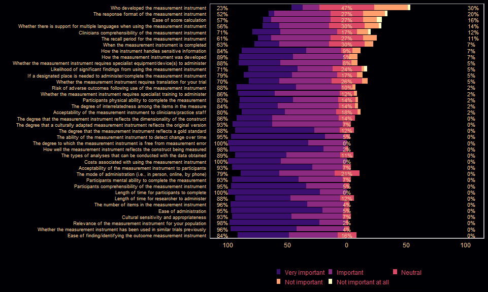<!-- -->

## (Q22) Other influences on use of core outcome sets 

#### Free text


```
##  [1] "nothing to add"                                                                                                                                                                                                         
##  [2] "Need for better measurement of breast/chestfeeding and use/timing of commercial milk formula; move beyond breastfeeding duration and EBF through 3 or 6 months (yes/no)"                                                
##  [3] "The accessibility of the measures and appropriateness for use in children with learning difficulties or disability is important and guides whether I would use depending on the population in question."                
##  [4] "No"                                                                                                                                                                                                                     
##  [5] "I have never used the term \\x93core outcome set\\x94 but have used them for years so tried to reflect that in my responses."                                                                                           
##  [6] "What is most appropriate for my context, study, hypothesis, etc"                                                                                                                                                        
##  [7] "I need to remember it by the time I undertake intervention planning - so the COS needs to be searchable (and top of mind! - good SEO) when I review the current literature in the field to develop outcome assessments."
##  [8] "Participant burden should be considered, and trial setting (e.g., hospital, primary health care, online) affects participants attention."                                                                               
##  [9] "Main factors are\\nOutcomes should reflect intervention targets & inform efficacy\\nShould be feasible to use (valid, acceptable & affordable)\\n"                                                                      
## [10] "Nothing to report"                                                                                                                                                                                                      
## [11] "You are lacking health related quality of life."                                                                                                                                                                        
## [12] "The availability (or lack thereof) of cultural adaptation of validated instruments (e.g., questionnaire) is a key barrier for use of core outcomes in my trial."                                                        
## [13] "Thank you. No The survey is very comprehensive"
```

## (Q23) Other influences on choice of outcomes 

#### Free text


```
## [1] "No\\n"                                                                                                                                                                                                                                                                                                                                                                                                          
## [2] "The importance of objective measurement of health parameters/domains beyond just anthropometry....eg blood pressure, respiratory function, functional capacity."                                                                                                                                                                                                                                                
## [3] "No"                                                                                                                                                                                                                                                                                                                                                                                                             
## [4] "Participant feedback from previous trials on uncertainty about how to answer specific questions, questions are not applicable, or caregiver states that they respond variably in different situations not captured by questionnaire, etc. Additionally, lack of findings from existing measures considered core outcomes throughout the literature. Would love to learn more about the results from this study!"
## [5] "Depends on the specific aims of the project. Within obesity prevention there can be many many areas of focus, so my choice of outcome measures depends more on what the overall goal is than on any the criteria you asked about."                                                                                                                                                                              
## [6] "Funding and human resources available for data collection and analysis.\\n\\n"                                                                                                                                                                                                                                                                                                                                  
## [7] "Age-appropriateness to specific stages of childhood obesity, e.g. age where children are expected to have transitioned from bottles to cups."                                                                                                                                                                                                                                                                   
## [8] "Nothing to report"                                                                                                                                                                                                                                                                                                                                                                                              
## [9] "You have to better describe different anthropometric methods."
```

## Where respondents learned about the survey (Q24)


#### Table: Where respondents learned about the survey.


```{=html}
<div id="ydaokqdkmu" style="padding-left:0px;padding-right:0px;padding-top:10px;padding-bottom:10px;overflow-x:auto;overflow-y:auto;width:auto;height:auto;">
<style>#ydaokqdkmu table {
  font-family: system-ui, 'Segoe UI', Roboto, Helvetica, Arial, sans-serif, 'Apple Color Emoji', 'Segoe UI Emoji', 'Segoe UI Symbol', 'Noto Color Emoji';
  -webkit-font-smoothing: antialiased;
  -moz-osx-font-smoothing: grayscale;
}

#ydaokqdkmu thead, #ydaokqdkmu tbody, #ydaokqdkmu tfoot, #ydaokqdkmu tr, #ydaokqdkmu td, #ydaokqdkmu th {
  border-style: none;
}

#ydaokqdkmu p {
  margin: 0;
  padding: 0;
}

#ydaokqdkmu .gt_table {
  display: table;
  border-collapse: collapse;
  line-height: normal;
  margin-left: auto;
  margin-right: auto;
  color: #333333;
  font-size: 16px;
  font-weight: normal;
  font-style: normal;
  background-color: #FFFFFF;
  width: auto;
  border-top-style: solid;
  border-top-width: 2px;
  border-top-color: #A8A8A8;
  border-right-style: none;
  border-right-width: 2px;
  border-right-color: #D3D3D3;
  border-bottom-style: solid;
  border-bottom-width: 2px;
  border-bottom-color: #A8A8A8;
  border-left-style: none;
  border-left-width: 2px;
  border-left-color: #D3D3D3;
}

#ydaokqdkmu .gt_caption {
  padding-top: 4px;
  padding-bottom: 4px;
}

#ydaokqdkmu .gt_title {
  color: #333333;
  font-size: 125%;
  font-weight: initial;
  padding-top: 4px;
  padding-bottom: 4px;
  padding-left: 5px;
  padding-right: 5px;
  border-bottom-color: #FFFFFF;
  border-bottom-width: 0;
}

#ydaokqdkmu .gt_subtitle {
  color: #333333;
  font-size: 85%;
  font-weight: initial;
  padding-top: 3px;
  padding-bottom: 5px;
  padding-left: 5px;
  padding-right: 5px;
  border-top-color: #FFFFFF;
  border-top-width: 0;
}

#ydaokqdkmu .gt_heading {
  background-color: #FFFFFF;
  text-align: center;
  border-bottom-color: #FFFFFF;
  border-left-style: none;
  border-left-width: 1px;
  border-left-color: #D3D3D3;
  border-right-style: none;
  border-right-width: 1px;
  border-right-color: #D3D3D3;
}

#ydaokqdkmu .gt_bottom_border {
  border-bottom-style: solid;
  border-bottom-width: 2px;
  border-bottom-color: #D3D3D3;
}

#ydaokqdkmu .gt_col_headings {
  border-top-style: solid;
  border-top-width: 2px;
  border-top-color: #D3D3D3;
  border-bottom-style: solid;
  border-bottom-width: 2px;
  border-bottom-color: #D3D3D3;
  border-left-style: none;
  border-left-width: 1px;
  border-left-color: #D3D3D3;
  border-right-style: none;
  border-right-width: 1px;
  border-right-color: #D3D3D3;
}

#ydaokqdkmu .gt_col_heading {
  color: #333333;
  background-color: #FFFFFF;
  font-size: 100%;
  font-weight: normal;
  text-transform: inherit;
  border-left-style: none;
  border-left-width: 1px;
  border-left-color: #D3D3D3;
  border-right-style: none;
  border-right-width: 1px;
  border-right-color: #D3D3D3;
  vertical-align: bottom;
  padding-top: 5px;
  padding-bottom: 6px;
  padding-left: 5px;
  padding-right: 5px;
  overflow-x: hidden;
}

#ydaokqdkmu .gt_column_spanner_outer {
  color: #333333;
  background-color: #FFFFFF;
  font-size: 100%;
  font-weight: normal;
  text-transform: inherit;
  padding-top: 0;
  padding-bottom: 0;
  padding-left: 4px;
  padding-right: 4px;
}

#ydaokqdkmu .gt_column_spanner_outer:first-child {
  padding-left: 0;
}

#ydaokqdkmu .gt_column_spanner_outer:last-child {
  padding-right: 0;
}

#ydaokqdkmu .gt_column_spanner {
  border-bottom-style: solid;
  border-bottom-width: 2px;
  border-bottom-color: #D3D3D3;
  vertical-align: bottom;
  padding-top: 5px;
  padding-bottom: 5px;
  overflow-x: hidden;
  display: inline-block;
  width: 100%;
}

#ydaokqdkmu .gt_spanner_row {
  border-bottom-style: hidden;
}

#ydaokqdkmu .gt_group_heading {
  padding-top: 8px;
  padding-bottom: 8px;
  padding-left: 5px;
  padding-right: 5px;
  color: #333333;
  background-color: #FFFFFF;
  font-size: 100%;
  font-weight: initial;
  text-transform: inherit;
  border-top-style: solid;
  border-top-width: 2px;
  border-top-color: #D3D3D3;
  border-bottom-style: solid;
  border-bottom-width: 2px;
  border-bottom-color: #D3D3D3;
  border-left-style: none;
  border-left-width: 1px;
  border-left-color: #D3D3D3;
  border-right-style: none;
  border-right-width: 1px;
  border-right-color: #D3D3D3;
  vertical-align: middle;
  text-align: left;
}

#ydaokqdkmu .gt_empty_group_heading {
  padding: 0.5px;
  color: #333333;
  background-color: #FFFFFF;
  font-size: 100%;
  font-weight: initial;
  border-top-style: solid;
  border-top-width: 2px;
  border-top-color: #D3D3D3;
  border-bottom-style: solid;
  border-bottom-width: 2px;
  border-bottom-color: #D3D3D3;
  vertical-align: middle;
}

#ydaokqdkmu .gt_from_md > :first-child {
  margin-top: 0;
}

#ydaokqdkmu .gt_from_md > :last-child {
  margin-bottom: 0;
}

#ydaokqdkmu .gt_row {
  padding-top: 8px;
  padding-bottom: 8px;
  padding-left: 5px;
  padding-right: 5px;
  margin: 10px;
  border-top-style: solid;
  border-top-width: 1px;
  border-top-color: #D3D3D3;
  border-left-style: none;
  border-left-width: 1px;
  border-left-color: #D3D3D3;
  border-right-style: none;
  border-right-width: 1px;
  border-right-color: #D3D3D3;
  vertical-align: middle;
  overflow-x: hidden;
}

#ydaokqdkmu .gt_stub {
  color: #333333;
  background-color: #FFFFFF;
  font-size: 100%;
  font-weight: initial;
  text-transform: inherit;
  border-right-style: solid;
  border-right-width: 2px;
  border-right-color: #D3D3D3;
  padding-left: 5px;
  padding-right: 5px;
}

#ydaokqdkmu .gt_stub_row_group {
  color: #333333;
  background-color: #FFFFFF;
  font-size: 100%;
  font-weight: initial;
  text-transform: inherit;
  border-right-style: solid;
  border-right-width: 2px;
  border-right-color: #D3D3D3;
  padding-left: 5px;
  padding-right: 5px;
  vertical-align: top;
}

#ydaokqdkmu .gt_row_group_first td {
  border-top-width: 2px;
}

#ydaokqdkmu .gt_row_group_first th {
  border-top-width: 2px;
}

#ydaokqdkmu .gt_summary_row {
  color: #333333;
  background-color: #FFFFFF;
  text-transform: inherit;
  padding-top: 8px;
  padding-bottom: 8px;
  padding-left: 5px;
  padding-right: 5px;
}

#ydaokqdkmu .gt_first_summary_row {
  border-top-style: solid;
  border-top-color: #D3D3D3;
}

#ydaokqdkmu .gt_first_summary_row.thick {
  border-top-width: 2px;
}

#ydaokqdkmu .gt_last_summary_row {
  padding-top: 8px;
  padding-bottom: 8px;
  padding-left: 5px;
  padding-right: 5px;
  border-bottom-style: solid;
  border-bottom-width: 2px;
  border-bottom-color: #D3D3D3;
}

#ydaokqdkmu .gt_grand_summary_row {
  color: #333333;
  background-color: #FFFFFF;
  text-transform: inherit;
  padding-top: 8px;
  padding-bottom: 8px;
  padding-left: 5px;
  padding-right: 5px;
}

#ydaokqdkmu .gt_first_grand_summary_row {
  padding-top: 8px;
  padding-bottom: 8px;
  padding-left: 5px;
  padding-right: 5px;
  border-top-style: double;
  border-top-width: 6px;
  border-top-color: #D3D3D3;
}

#ydaokqdkmu .gt_last_grand_summary_row_top {
  padding-top: 8px;
  padding-bottom: 8px;
  padding-left: 5px;
  padding-right: 5px;
  border-bottom-style: double;
  border-bottom-width: 6px;
  border-bottom-color: #D3D3D3;
}

#ydaokqdkmu .gt_striped {
  background-color: rgba(128, 128, 128, 0.05);
}

#ydaokqdkmu .gt_table_body {
  border-top-style: solid;
  border-top-width: 2px;
  border-top-color: #D3D3D3;
  border-bottom-style: solid;
  border-bottom-width: 2px;
  border-bottom-color: #D3D3D3;
}

#ydaokqdkmu .gt_footnotes {
  color: #333333;
  background-color: #FFFFFF;
  border-bottom-style: none;
  border-bottom-width: 2px;
  border-bottom-color: #D3D3D3;
  border-left-style: none;
  border-left-width: 2px;
  border-left-color: #D3D3D3;
  border-right-style: none;
  border-right-width: 2px;
  border-right-color: #D3D3D3;
}

#ydaokqdkmu .gt_footnote {
  margin: 0px;
  font-size: 90%;
  padding-top: 4px;
  padding-bottom: 4px;
  padding-left: 5px;
  padding-right: 5px;
}

#ydaokqdkmu .gt_sourcenotes {
  color: #333333;
  background-color: #FFFFFF;
  border-bottom-style: none;
  border-bottom-width: 2px;
  border-bottom-color: #D3D3D3;
  border-left-style: none;
  border-left-width: 2px;
  border-left-color: #D3D3D3;
  border-right-style: none;
  border-right-width: 2px;
  border-right-color: #D3D3D3;
}

#ydaokqdkmu .gt_sourcenote {
  font-size: 90%;
  padding-top: 4px;
  padding-bottom: 4px;
  padding-left: 5px;
  padding-right: 5px;
}

#ydaokqdkmu .gt_left {
  text-align: left;
}

#ydaokqdkmu .gt_center {
  text-align: center;
}

#ydaokqdkmu .gt_right {
  text-align: right;
  font-variant-numeric: tabular-nums;
}

#ydaokqdkmu .gt_font_normal {
  font-weight: normal;
}

#ydaokqdkmu .gt_font_bold {
  font-weight: bold;
}

#ydaokqdkmu .gt_font_italic {
  font-style: italic;
}

#ydaokqdkmu .gt_super {
  font-size: 65%;
}

#ydaokqdkmu .gt_footnote_marks {
  font-size: 75%;
  vertical-align: 0.4em;
  position: initial;
}

#ydaokqdkmu .gt_asterisk {
  font-size: 100%;
  vertical-align: 0;
}

#ydaokqdkmu .gt_indent_1 {
  text-indent: 5px;
}

#ydaokqdkmu .gt_indent_2 {
  text-indent: 10px;
}

#ydaokqdkmu .gt_indent_3 {
  text-indent: 15px;
}

#ydaokqdkmu .gt_indent_4 {
  text-indent: 20px;
}

#ydaokqdkmu .gt_indent_5 {
  text-indent: 25px;
}

#ydaokqdkmu .katex-display {
  display: inline-flex !important;
  margin-bottom: 0.75em !important;
}

#ydaokqdkmu div.Reactable > div.rt-table > div.rt-thead > div.rt-tr.rt-tr-group-header > div.rt-th-group:after {
  height: 0px !important;
}
</style>
<table class="gt_table" data-quarto-disable-processing="false" data-quarto-bootstrap="false">
  <thead>
    <tr class="gt_col_headings">
      <th class="gt_col_heading gt_columns_bottom_border gt_left" rowspan="1" colspan="1" scope="col" id="label"><span class='gt_from_md'><strong>Characteristic</strong></span></th>
      <th class="gt_col_heading gt_columns_bottom_border gt_center" rowspan="1" colspan="1" scope="col" id="stat_0"><span class='gt_from_md'><strong>N = 45</strong></span><span class="gt_footnote_marks" style="white-space:nowrap;font-style:italic;font-weight:normal;line-height:0;"><sup>1</sup></span></th>
    </tr>
  </thead>
  <tbody class="gt_table_body">
    <tr><td headers="label" class="gt_row gt_left">How did you hear about this survey?</td>
<td headers="stat_0" class="gt_row gt_center"><br /></td></tr>
    <tr><td headers="label" class="gt_row gt_left">    Received information from organisation/society</td>
<td headers="stat_0" class="gt_row gt_center">1/45 (2.2%)</td></tr>
    <tr><td headers="label" class="gt_row gt_left">    Direct email invitation</td>
<td headers="stat_0" class="gt_row gt_center">44/45 (98%)</td></tr>
  </tbody>
  
  <tfoot class="gt_footnotes">
    <tr>
      <td class="gt_footnote" colspan="2"><span class="gt_footnote_marks" style="white-space:nowrap;font-style:italic;font-weight:normal;line-height:0;"><sup>1</sup></span> <span class='gt_from_md'>n/N Non-missing (%)</span></td>
    </tr>
  </tfoot>
</table>
</div>
```

